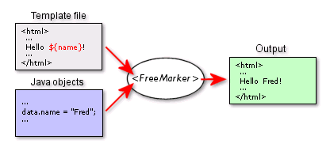

# FreeMarker


## 主要内容


## FreeMarker概述

### FreeMarker概念

FreeMarker 是一款 模板引擎： 即一种基于模板和要改变的数据， 并用来生成输出文本(HTML网页， 电子邮件，配置

文件，源代码等)的通用工具。 是一个Java类库。 

​	FreeMarker 被设计用来生成 HTML Web 页面，特别是基于 MVC 模式的应用程序，将视图从业务逻 辑中抽离处理，业务中不再包括视图的展示，而是将视图交给 FreeMarker 来输出。虽然 FreeMarker  具有一些编程的能力，但通常由 Java 程序准备要显示的数据，由 FreeMarker 生成页面，通过模板显示 准备的数据（如下图）：



FreeMarker不是一个Web应用框架，而适合作为Web应用框架一个组件。 

FreeMarker与容器无关，因为它并不知道HTTP或Servlet。FreeMarker同样可以应用 于非Web应用程序环境。 

FreeMarker更适合作为Model2框架（如Struts）的视图组件，你也可以在模板中使用 JSP标记库。

### FreeMarker特性

#### 通用目标

- 能够生成各种文本：HTML、XML、RTF、Java 源代码等等 

- 易于嵌入到你的产品中：轻量级；不需要 Servlet 环境 

- 插件式模板载入器：可以从任何源载入模板，如本地文件、数据库等等 

- 你可以按你所需生成文本：保存到本地文件；作为 Email 发送；从 Web 应用程序发送它返回给 Web  浏览器

#### 强大的模板语言 

- 所有常用的指令：include、if/elseif/else、循环结构 

- 在模板中创建和改变变量 

- 几乎在任何地方都可以使用复杂表达式来指定值 

- 命名的宏，可以具有位置参数和嵌套内容 

- 名字空间有助于建立和维护可重用的宏库，或将大工程分成模块，而不必担心名字冲突 

- 输出转换块：在嵌套模板片段生成输出时，转换HTML转义、压缩、语法高亮等等；你可以定义自己 的转换 

#### 通用数据模型 

- FreeMarker不是直接反射到Java对象，Java对象通过插件式对象封装，以变量方式在模板中显示 

- 你可以使用抽象（接口）方式表示对象（JavaBean、XML文档、SQL查询结果集等等），告诉模板开发者使用方法，使其不受技术细节的打扰 

- 为Web准备 在模板语言中内建处理典型Web相关任务（如HTML转义）的结构 

- 能够集成到Model2 Web应用框架中作为JSP的替代 

- 支持JSP标记库 为MVC模式设计：分离可视化设计和应用程序逻辑；分离页面设计员和程序员 

#### 智能的国际化和本地化 

- 字符集智能化（内部使用UNICODE） 

- 数字格式本地化敏感 

- 日期和时间格式本地化敏感 

- 非US字符集可以用作标识（如变量名） 

- 多种不同语言的相同模板

#### 强大的XML处理能力 

- <#recurse> 和 <#visit> 指令（2.3版本）用于递归遍历XML树。在模板中清楚和直接的访问XML对象 模型。开源论坛 JForum 就是使用了 FreeMarker 做为页面模板。

### FreeMarker环境搭建

#### 新建 Maven Web项目

#### 配置坐标依赖和部署

pom.xml

```xml
<?xml version="1.0" encoding="UTF-8"?>
<project xmlns="http://maven.apache.org/POM/4.0.0"
xmlns:xsi="http://www.w3.org/2001/XMLSchema-instance"
  xsi:schemaLocation="http://maven.apache.org/POM/4.0.0 
http://maven.apache.org/xsd/maven-4.0.0.xsd">
  <modelVersion>4.0.0</modelVersion>
  <groupId>com.xxxx</groupId>
  <artifactId>freemarker</artifactId>
  <version>1.0-SNAPSHOT</version>
  <packaging>war</packaging>
  <name>freemarker Maven Webapp</name>
  <!-- FIXME change it to the project's website -->
  <url>http://www.example.com</url>
  <properties>
    <project.build.sourceEncoding>UTF-8</project.build.sourceEncoding>
    <maven.compiler.source>1.8</maven.compiler.source>
    <maven.compiler.target>1.8</maven.compiler.target>
  </properties>
  <dependencies>
    <!-- freemarker的坐标依赖 -->
    <dependency>
      <groupId>org.freemarker</groupId>
      <artifactId>freemarker</artifactId>
      <version>2.3.23</version>
    </dependency>
    <!-- servlet-api的坐标依赖 -->
    <dependency>
      <groupId>javax.servlet</groupId>
      <artifactId>javax.servlet-api</artifactId>
      <version>3.0.1</version>
    </dependency>
  </dependencies>
  <build>
    <finalName>freemarker</finalName>
    <!--
        插件地址：
          Tomcat
            http://tomcat.apache.org/maven-plugin-2.2/
          Jetty
            https://www.eclipse.org/jetty/documentation/current/jetty-mavenplugin.html
    -->
    <plugins>
      <!-- 配置jetty插件 -->
      <plugin>
        <groupId>org.eclipse.jetty</groupId>
        <artifactId>jetty-maven-plugin</artifactId>
        <version>9.2.1.v20140609</version>
      </plugin>
    </plugins>
  </build>
</project>
```

#### 修改配置文件 web.xml 

在项目的webapp/WEB-INF目录下的web.xml文件中，添加freemarker 相关 servlet 配置

```xml
<?xml version="1.0" encoding="UTF-8"?>
<web-app id="WebApp_ID" version="3.0"
         xmlns="http://java.sun.com/xml/ns/javaee"
         xmlns:xsi="http://www.w3.org/2001/XMLSchema-instance"
         xsi:schemaLocation="http://java.sun.com/xml/ns/javaee
http://java.sun.com/xml/ns/javaee/web-app_3_0.xsd">
  <!-- FreeMarker 的Servlet配置 -->
  <servlet>
    <servlet-name>freemarker</servlet-name>
    <servlet-class>freemarker.ext.servlet.FreemarkerServlet</servlet-class>
    <init-param>
      <!-- 模板路径 -->
      <param-name>TemplatePath</param-name>
      <!-- 默认在webapp目录下查找对应的模板文件 -->
      <param-value>/</param-value>
    </init-param>
    <init-param>
      <!-- 模板默认的编码：UTF-8 -->
      <param-name>default_encoding</param-name>
      <param-value>UTF-8</param-value>
   </init-param>
  </servlet>
  <!-- 处理所有以.ftl结尾的文件；ftl是freemarker默认的文件后缀 -->
  <servlet-mapping>
    <servlet-name>freemarker</servlet-name>
    <url-pattern>*.ftl</url-pattern>
  </servlet-mapping>
</web-app>
```

#### 编写Servlet类

```java
@WebServlet("/f01")
public class FreeMarker01 extends HttpServlet {
    @Override
    protected void service(HttpServletRequest request, HttpServletResponse
response) throws ServletException, IOException {
        // 添加数据
        request.setAttribute("msg","Hello FreeMarker!");
        // 请求转发跳转到ftl文件中
       
request.getRequestDispatcher("template/f01.ftl").forward(request,response);
   }
}
```

#### 新建模板文件 ftl

在webapp目录下新建template文件夹，创建f01.ftl文件


#### 启动项目


#### 访问项目

浏览器地址栏输入：http://localhost:9090/f01

## FreeMarker 数据类型

Freemarker 模板中的数据类型由如下几种： 

- 布尔型：等价于 Java 的 Boolean 类型，不同的是不能直接输出，可转换为字符串输出 

- 日期型：等价于 java 的 Date 类型，不同的是不能直接输出，需要转换成字符串再输出 

- 数值型：等价于 java 中的 int,float,double 等数值类型 

​		   有三种显示形式：数值型(默认)、货币型、百分比型 

- 字符型：等价于 java 中的字符串，有很多内置函数 

- sequence 类型：等价于 java 中的数组，list，set 等集合类型 

- hash 类型：等价于 java 中的 Map 类型

### 布尔类型

1. 在Servlet中设置布尔类型的数据

```java
// 布尔类型
request.setAttribute("flag", true);
```

2. 获取数据

```html
<#--
    数据类型：布尔类型
        在freemarker中布尔类型不能直接输出；如果输出要先转成字符串
        方式一：?c
        方式二：?string 或 ?string("true时的文本","false时的文本")
-->
${flag?c} <br>
${flag?string} <br>
${flag?string("yes","no")} <br>
```

### 日期类型

1. 在Servlet中设置日期类型的数据

```java
// 日期类型
request.setAttribute("createDate",new Date());
```

2. 获取数据

```html
<#--
    数据类型：日期类型
        在freemarker中日期类型不能直接输出；如果输出要先转成日期型或字符串
        1. 年月日          ?date
        2. 时分秒          ?time
        3. 年月日时分秒     ?datetime
        4. 指定格式        ?string("自定义格式")
                           y：年  M：月  d：日
                           H：时  m：分  s：秒
-->
<#-- 输出日期格式 -->
${createDate?date} <br>  
<#-- 输出时间格式 -->
${createDate?time} <br>
<#-- 输出日期时间格式 -->
${createDate?datetime} <br>   
<#-- 输出格式化日期格式 -->
${createDate?string("yyyy年MM月dd日 HH:mm:ss")} <br> 
```

### 数值类型

1. 在Servlet设置数值型的数据

```java
// 数值类型
request.setAttribute("age",18); // 数值型
request.setAttribute("salary",10000); // 数值型
request.setAttribute("avg",0.545); // 浮点型
```

2. 获取数据

```html
<#--
    数据类型：数值类型
        在freemarker中数值类型可以直接输出；
        1. 转字符串
            普通字符串       ?c
            货币型字符串     ?string.currency
            百分比型字符串   ?string.percent
        2. 保留浮点型数值指定小数位（#表示一个小数位）
            ?string["0.##"]
-->
<#-- 直接输出数值型 -->
${age} <br>
${salary} <br>
<#-- 将数值转换成字符串输出 -->
${salary?c} <br>
<#-- 将数值转换成货币类型的字符串输出 -->
${salary?string.currency} <br>
<#-- 将数值转换成百分比类型的字符串输出 -->
${avg?string.percent} <br>
<#-- 将浮点型数值保留指定小数位输出 （##表示保留两位小数） -->
${avg?string["0.##"]} <br>
```


### 字符串类型

1. 在Servlet中设置字符串类型的数据

```java
// 字符串类型
request.setAttribute("msg","Hello ");
request.setAttribute("msg2","freemarker");
```

2. 获取数据

```html
<#--
    数据类型：字符串类型
        在freemarker中字符串类型可以直接输出；
        1. 截取字符串（左闭右开） ?substring(start,end)
        2. 首字母小写输出  ?uncap_first
        3. 首字母大写输出  ?cap_first
        4. 字母转小写输出  ?lower_case
        5. 字母转大写输出  ?upper_case
        6. 获取字符串长度  ?length
        7. 是否以指定字符开头（boolean类型） ?starts_with("xx")?string
        8. 是否以指定字符结尾（boolean类型） ?ends_with("xx")?string
        9. 获取指定字符的索引  ?index_of("xx")
        10. 去除字符串前后空格 ?trim
        11. 替换指定字符串  ?replace("xx","xx")
-->
<#-- 直接输出 -->
${msg} - ${msg2} <br>
${msg?string} - ${msg2?string} <br>
<#-- 1. 截取字符串（左闭右开） ?substring(start,end) -->
${msg2?substring(1,4)} <br>
<#-- 2. 首字母小写输出  ?uncap_first -->
${msg?uncap_first} <br>
    <#-- 3. 首字母大写输出  ?cap_first -->
${msg2?cap_first} <br>
<#-- 4. 字母转小写输出  ?lower_case -->
${msg?lower_case} <br>
<#-- 5. 字母转大写输出  ?upper_case -->
${msg?upper_case} <br>
<#-- 6. 获取字符串长度  ?length -->
${msg?length} <br>
<#-- 7. 是否以指定字符开头（boolean类型） ?starts_with("xx")?string -->
${msg?starts_with("H")?string} <br>
<#-- 8. 是否以指定字符结尾（boolean类型） ?ends_with("xx")?string -->
${msg?ends_with("h")?string} <br>
<#-- 9. 获取指定字符的索引  ?index_of("xxx") -->
${msg?index_of("e")} <br>
<#-- 10. 去除字符串前后空格 ?trim -->
${msg?trim?length} <br>
<#-- 11. 替换指定字符串  ?replace("xx","xxx") -->
${msg?replace("o","a")}<br>
```

#### 字符串空值情况处理

​	FreeMarker 的变量必须赋值，否则就会抛出异常。而对于 FreeMarker 来说，null 值和不存在的变 量是完全一样的，因为 FreeMarker 无法理解 null 值。

​	FreeMarker 提供两个运算符来避免空值：

- ! ：指定缺失变量的默认值 

​		${value!}：如果value值为空，则默认值是空字符串 

​		${value!"默认值"}：如果value值为空，则默认值是字符串"默认值" 

- ?? ：判断变量是否存在 

​		如果变量存在，返回 true，否则返回 false 

​		${(value??)?string}

```html
<#-- 如果值不存在，直接输出会报错 -->
<#--${str}-->
<#-- 使用!，当值不存在时，默认显示空字符串 -->
${str!}<br>
<#-- 使用!"xx"，当值不存在时，默认显示指定字符串 -->
${str!"这是一个默认值"}<br>
<#-- 使用??，判断字符串是否为空；返回布尔类型。如果想要输出，需要将布尔类型转换成字符串 -->
${(str??)?string}<br>
```

### sequence 类型

1. 在Servlet中设置序列类型的数据

```java
// 序列类型 （数组、List、Set）
// 数组操作
String[] stars = new String[]{"周杰伦","林俊杰","陈奕迅","五月天"};
request.setAttribute("stars",stars);
// List操作
List<String> citys = Arrays.asList("上海","北京","杭州","深圳");
request.setAttribute("cityList",citys);
// JavaBean集合
List<User> userList = new ArrayList<>();
userList.add(new User(1,"zhangsan",22));
userList.add(new User(2,"lisi",18));
userList.add(new User(3,"wangwu",20));
request.setAttribute("userList",userList);
```

2. 获取数据

```html
<#--
    数据类型：序列类型 （数组、List、Set）
        通过list指令输出序列
            <#list 序列名 as 元素名>
               ${名称}
            </#list>
        获取序列的长度       ${序列名?size}
        获取序列元素的下标     ${元素名?index}
        获取第一个元素       ${序列名?first}
        获取最后一个元素     ${序列名?last}
        倒序输出   序列名?reverse
        升序输出   序列名?sort
        降序输出   序列名?sort?reverse
        指定字段名排序    序列名?sort_by("字段名")
           注：一般是JavaBean集合，对应的字段名需要提供get方法
-->
<#-- 数组操作 -->
<#list stars as star>
    下标：${star?index} -- 名字：${star} <br>
</#list>
数组的长度：${stars?size}  <br>
<#-- 获取第一个元素 -->
第一个元素：${stars?first} <br>
<#-- 获取最后一个元素 -->
最后一个元素：${stars?last} <br>
<hr>
<#-- List操作 -->
<#list cityList as city >
   ${city} <br>
</#list>
List的size：${cityList?size} <br>
<#-- 倒序输出 -->
<#list cityList?reverse as city >
   ${city} -
</#list>
<br>
<#-- 升序输出 -->
<#list cityList?sort as city >
   ${city} -
</#list>
<br>
<#-- 降序输出 -->
    <#list cityList?sort?reverse as city >
   ${city} -
</#list>
<hr>
<#-- JavaBean集合 -->
<#list userList as user>
    编号：${user.userId}&nbsp;&nbsp;
    姓名：${user.uname}&nbsp;&nbsp;
    年龄：${user.uage}&nbsp;&nbsp;
    <br>
</#list>
<#-- 按照指定字段名排序 -->
<#list userList?sort_by("uage") as user>
   ${user.uname} |
</#list>
```

### hash 类型

1. 在Servlet中设置hash类型的数据

```java
// Map操作
Map<String,String> cityMap = new HashMap<>();
cityMap.put("sh","上海");
cityMap.put("bj","北京");
cityMap.put("sz","深圳");
request.setAttribute("cityMap",cityMap);
```

2. 获取数据

```html
<#--
    数据类型：hash类型
         key遍历输出
            <#list hash?keys as key>
               ${key} -- ${hash[key]}
            </#list>
         value遍历输出
            <#list hash?values as value>
               ${value}
            </#list>
-->
<#-- key遍历输出 -->
<#list cityMap?keys as key>
   ${key} -- ${cityMap[key]} <br>
</#list>
<#-- value遍历输出 -->
<#list cityMap?values as value>
   ${value} |
</#list>
```


## FreeMarker 常见指令

### assign 自定义变量指令

​	使用 assign 指令你可以创建一个新的变量， 或者替换一个已经存在的变量。

```html
<#--
    assign 自定义变量指令
        语法：
            <#assign 变量名=值>
            <#assign 变量名=值 变量名=值> （定义多个变量）
-->
<#assign str="hello">
${str} <br>
<#assign num=1 names=["zhangsan","lisi","wangwu"] >
${num} -- ${names?join(",")}
```

### if elseif else 逻辑判断指令

​	可以使用 if ， elseif 和 else 指令来条件判断是否满足某些条件。

```html
<#--
    if, else, elseif 逻辑判断指令
        格式：
            <#if condition>
             ...
            <#elseif condition2>
             ...
            <#elseif condition3>
             ...
            <#else>
             ...
            </#if>
        注：
            1. condition, condition2等：将被计算成布尔值的表达式。
            2. elseif 和 else 指令 是可选的。
-->
<#assign score = 80>
<#if score < 60>
    你个小渣渣！
    <#elseif score == 60>
        分不在高，及格就行！
    <#elseif score gt 60 && score lt 80>
        哎哟不错哦！
    <#else>
        你很棒棒哦！
</#if>
<br>
<#-- 判断数据是否存在 -->
<#assign list="">
<#if list??>
    数据存在
    <#else>
    数据不存在
</#if>
```
### list 遍历指令

​	可以使用 list 指令来对序列进行遍历。

```html
<#--
    list指令
        格式1：
            <#list sequence as item>
            </#list>
        格式2：
            <#list sequence as item>
            <#else>
                当没有选项时，执行else指令
            </#list>
        注：
            1. else 部分是可选的
            2. sequence： 想要迭代的项，可以是序列或集合的表达式
            3. item： 循环变量 的名称
            4. 当没有迭代项时，才使用 else 指令， 可以输出一些特殊的内容而不只是空在那里
-->
<#assign users = ["张三","李四","王五"]>
<#-- 遍历序列 -->
<#list users as user>
   ${user}
</#list>
<br>
<#--判断数据不为空，再执行遍历 （如果序列不存在，直接遍历会报错）-->
<#if users2??>
    <#list users2 as user>
       ${user}
    </#list>
</#if>
<br>
<#assign users3 = []>
<#-- 当序列没有数据项时，使用默认信息 -->
<#list users3 as user>
   ${user}
    <#else>
        当前没有数据！
</#list>
```


### macro 自定义指令

​	可以使用 macro 指令来自定义一些自定义指令。

```html
<#--
    macro 自定义指令 （宏）
        1. 基本使用
            格式：
                <#macro 指令名>
                    指令内容
                </#macro>
            使用：
                <@指令名></@指令名>
        2. 有参数的自定义指令
            格式：
                 <#macro 指令名 参数名1 参数名2>
                    指令内容
                </#macro>
            使用：
                <@指令名 参数名1=参数值1 参数名2=参数值2></@指令名>
        注：
            1. 指令可以被多次使用。
            2. 自定义指令中可以包含字符串，也可包含内置指令
-->
<#-- 定义基本的自定义指令 -->
<#macro address>
    © 1999–2015 The FreeMarker Project. All rights reserved.
</#macro>
<#-- 使用指令 -->
<@address></@address> <br>
<@address></@address>
<hr>
<#-- 定义有参数的自定义指令 -->
<#macro queryUserByName uname>
    通过用户名查询用户信息 - ${uname}
</#macro>
<#-- 使用指令，并传递参数 -->
<@queryUserByName uname="admin"></@queryUserByName> <br>
<#-- 定义有多个参数的自定义指令 -->
<#macro queryUserByParams uname uage>
    通过多个餐宿查询用户信息 - ${uname} - ${uage}
</#macro>
<#-- 使用指令，并传递多个参数 -->
<@queryUserByParams uname="admin" uage=18></@queryUserByParams> <br>
<hr>
<#-- 自定义指令中包含内置指令 -->
<#macro cfb>
    <#list 1..9 as i>
        <#list 1..i as j>
           ${j}*${i}=${j*i}&nbsp;
        </#list>
        <br>
    </#list>
    </#macro>
<@cfb></@cfb>
<@cfb></@cfb>
<#-- 动态数据 -->
<#macro cfb2 num>
    <#list 1..num as i>
        <#list 1..i as j>
           ${j}*${i}=${j*i}&nbsp;
        </#list>
        <br>
    </#list>
</#macro>
<@cfb2 num=5></@cfb2>
```
### nested 占位指令

​	nested 指令执行自定义指令开始和结束标签中间的模板片段。嵌套的片段可以包含模板中任意合法的内容。

```html
<#--
    nested 占位指令
        nested 相当于占位符,一般结合macro指令一起使用。
        可以将自定义指令中的内容通过nested指令占位，当使用自定义指令时，会将占位内容显示。
-->
<#macro test>
    这是一段文本！
    <#nested>
    <#nested>
</#macro>
<@test><h4>这是文本后面的内容！</h4></@test>
```


### import 导入指令

​	import 指令可以引入一个库。也就是说，它创建一个新的命名空间， 然后在那个命名空间中执行给定路径的模板。可以使用引入的空间中的指令。

​	commons.ftl

```html
<#macro cfb>
    <#list 1..9 as i>
        <#list 1..i as j>
           ${j}*${i}=${j*i}&nbsp;
        </#list>
        <br>
    </#list>
</#macro>
```

​	在其他ftl页面中通过import导入commons.ftl的命名空间，使用该命名空间中的指令

​	test.ftl

```html
<#-- 导入命名空间 -->
<#import "commons.ftl" as common>
<#-- 使用命名空间中的指令 -->
<@common.cfb></@common.cfb>
```
### include 包含指令

​	可以使用 include 指令在你的模板中插入另外一个 FreeMarker 模板文件 。 被包含模板的输出格式是在 include 标签出现的位置插入的。 被包含的文件和包含它的模板共享变量，就像是被复制粘贴进去的一样。

```html
<#--包含指令(引入其他页面文件) include-->
<#--html文件-->
<#include "test.html">
<#--freemarker文件-->
<#include "test.ftl">
<#--text文件-->
<#include "test.txt">
```


## FreeMarker 页面静态化

​	通过上述介绍可知 Freemarker 是一种基于模板的、用来生成输出文本的通用工具,所以我们必须要定制符合自己业务的模板，然后生成自己的 html 页面。Freemarker 是通过freemarker.template.Configuration 这个对象对模板进行加载的（它也处理创建和缓存预解析模板的工作），然后我们通过 getTemplate 方法获得你想要的模板，有一点要记住freemarker.template.Configuration 在你整个应用必须保证唯一实例。

### 定义模板

news.ftl

```html
<#-- 新闻标题 -->
<h1>${title}</h1>
<p>
    新闻来源：${source} &nbsp; 发布时间：${pubTime?sring("yyyy-MM-dd HH:mm")}
</p>
<#-- 新闻内容 -->
<p>
   ${content}
</p>
```


### 加载模板

```java
@WebServlet("/news")
public class NewsServlet extends HttpServlet {
    @Override
    protected void service(HttpServletRequest request, HttpServletResponse
response) throws ServletException, IOException {
        // 实例化模板配置对象
        Configuration configuration = new Configuration();
        // 设置加载模板的上下文 以及 设置加载模板路径（模板存放的路径）
       
configuration.setServletContextForTemplateLoading(getServletContext(),"/templat
e");
        // 设置模板的编码格式
        configuration.setDefaultEncoding("UTF-8");
        // 加载模板文件，获取模板对象
        Template template = configuration.getTemplate("news.ftl");
         // 设置模型数据
        Map<String,Object> map = new HashMap<>();
        map.put("title", "特别就业季：稳就业情况如何? 哪些问题待解?");
        map.put("source", "人民日报");
        map.put("pubTime", new Date());
        map.put("content", "中共中央政治局常务委员会近日召开会议强调，" +
                "要有针对性地开展援企、稳岗、扩就业工作，" +
                "做好高校毕业生、农民工等重点群体就业工作，" +
                "积极帮助个体工商户纾困。疫情期间，稳就业情况如何？还有哪些问题待解？" +
                "记者采访了不同群体，记录这个特别的就业季。");
        // 获取项目所在的根目录
        String basePath = request.getServletContext().getRealPath("/");
        // 设置页面存放的目录
        File htmlFile = new File(basePath + "/html");
        // 判断目录是否存在
        if (!htmlFile.exists()) {
            // 如果目录不存在，则新建目录
            htmlFile.mkdir();
       }
        // 获取文件名（随机生成不重复的文件名）
        String fileName = System.currentTimeMillis() + ".html";
        // 创建html文件
        File file = new File(htmlFile, fileName);
        // 获取文件输出流
        FileWriter writer = new FileWriter(file);
        try {
            // 输出html 将模型数据填充到模板中
            template.process(map, writer);
            // 输出成功
            System.out.println("新闻创建成功！");
       } catch (TemplateException e) {
            e.printStackTrace();
       } finally {
            writer.flush();
            writer.close();
       }
   }
}  
```

### 生成对应的html文件

​	浏览器地址栏输入：

​	[http://localhost:9090/news](http://localhost:9090/news)

​	生成的文件存放在当前项目的webapp目录下的html目录中。

## FreeMarker 运算符

### 算术运算符

```html
<!--
    算术运算
        +、-、*、/、%
-->
<#assign a1 = 8 a2 = 2 >
${a1} + ${a2} = ${a1 + a2} <br/>
${a1} - ${a2} = ${a1 - a2} <br/>
${a1} * ${a2} = ${a1 * a2} <br/>
${a1} / ${a2} = ${a1 / a2} <br/>
${a1} % ${a2} = ${a1 % a2} <br/>
<!--字符串运算-->
${"hello" + "," + "freemarker"}
```

### 逻辑运算符

```html
<#--
    逻辑运算符
     &&、||、!
-->
```

### 比较运算符

```html
<#--
    比较运算符
        > (gt): 大于号，推荐使用 gt
        < (lt)： 小于号，推荐使用 lt
        >= (gte): 大于等于， 推荐是用 gte
        <= (lte): 小于等于，推荐使用 lte
        == ： 等于
        != : 不等于
-->
```

### 空值运算符

```html
<#--
    空值运算符
     1. ??:判断是否为空，返回布尔类型
        如果不为空返回 false， 如果为空返回 true，不能直接输出
       ${(name??)?string}
     2. !: 设置默认值，如果为空，则设置默认值
         1. 设置默认为空字符串：
         ${name!}
         2. 设置指定默认值
         ${name!'zhangsan'}
-->
```
