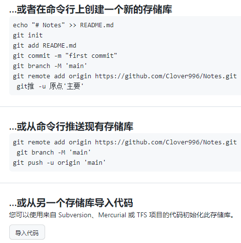

## git运作机制

....。。。

## `.git` 结构

### 1.COMMIT_EDITMSG


此文件是一个临时文件，存储最后一次提交的信息内容，`git commit` 命令之后打开的编辑器就是在编辑此文件，而你退出编辑器后，`git` 会把此文件内容写入 commit 记录。

实际应用： `git pull` 远程仓库后，新增了很多提交，淹没了本地提交记录，直接 `cat .git/COMMIT_EDITMSG` 就可以弄清楚最后工作的位置了

### 2.index 

暂存区

### 3.object

 commit后，通过 ANSI[扩展自 ASCII 的编码方式] 编码 后的文件 （本地仓库）


## 新建仓库




### init

`git init` #初始化  

### status

`git status` #获取状态  

### add

`git add file` #.或*代表全部添加
 `git rm --cached ` 在commit之前撤销git add操作
 `git reset head` 好像比上面`git rm --cached`更方便  

### commit

`git commit -m "message"` #此处注意乱码  

### remote

`git remote add origin git@github.com:JSLite/test.git` #添加源  

### push

```
git push -u origin master` #push同事设置默认跟踪分支
 `git push origin master
```

## 从现有仓库克隆

`git clone git://github.com/JSLite/JSLite.js.git`
 `git clone git://github.com/JSLite/JSLite.js.git mypro` #克隆到自定义文件夹
 `git clone [user@]example.com:path/to/repo.git/` #SSH协议还有另一种写法。  

git clone支持多种协议，除了HTTP(s)以外，还支持SSH、Git、本地文件协议等，下面是一些例子。`$ git clone <版本库的网址> <本地目录名>`  

```
$ git clone http[s]://example.com/path/to/repo.git/
$ git clone ssh://example.com/path/to/repo.git/
$ git clone git://example.com/path/to/repo.git/
$ git clone /opt/git/project.git 
$ git clone file:///opt/git/project.git
$ git clone ftp[s]://example.com/path/to/repo.git/
$ git clone rsync://example.com/path/to/repo.git/
复制代码
```

## 本地

### add

`git add *` #跟踪新文件
 `git add -u [path]` #添加[指定路径下]已跟踪文件   

### rm

`rm *&git rm *` #移除文件
 `git rm -f *` #移除文件
 `git rm --cached *` #取消跟踪
 `git mv file_from file_to` #重命名跟踪文件
 `git log` #查看提交记录  

### commit

`git commit` #提交更新
 `git commit -m 'message'` #提交说明
 `git commit -a` #跳过使用暂存区域，把所有已经跟踪过的文件暂存起来一并提交
 `git commit --amend` #修改最后一次提交
 `git commit log` #查看所有提交，包括没有push的commit
 `git commit -m "#133"` #关联issue 任意位置带上`#` 符号加上issue号码
 `git commit -m "fix #133"` commit关闭issue
 `git commit -m '概要描述'$'\n\n''1.详细描述'$'\n''2.详细描述'` #提交简要描述和详细描述  

### reset

`git reset HEAD` *#取消已经暂存的文件
 `git reset --mixed HEAD` *#同上
 `git reset --soft HEAD` *#重置到指定状态，不会修改索引区和工作树
 `git reset --hard HEAD` *#重置到指定状态，会修改索引区和工作树
 `git reset -- files` *#重置index区文件
 那么如何跟随着commit关闭一个issue呢? 在confirm merge的时候可以使用一下命令来关闭相关issue:
 \1. fixes #xxx 1. fixed #xxx 1. fix #xxx 1. closes #xxx 1. close #xxx 1. closed #xxx

### revert

`git revert HEAD` #撤销前一次操作
 `git revert HEAD~` #撤销前前一次操作
 `git revert commit` ##撤销指定操作   

### checkout

`git checkout -- file` #取消对文件的修改（从暂存区——覆盖worktree file）
 `git checkout branch|tag|commit -- file_name` #从仓库取出file覆盖当前分支
 `git checkout HEAD~1 [文件]` #将会更新 working directory 去匹配某次 commit
 `git checkout -- .` #从暂存区取出文件覆盖工作区
 `git checkout -b gh-pages  0c304c9`  这个表示 从当前分支 commit 哈希值为 0c304c9 的节点，分一个新的分支gh-pages出来，并切换到 gh-pages   

### diff

`git diff file` #查看指定文件的差异
 `git diff --stat` #查看简单的diff结果
 `git diff` #比较Worktree和Index之间的差异
 `git diff --cached` #比较Index和HEAD之间的差异
 `git diff HEAD` #比较Worktree和HEAD之间的差异
 `git diff branch` #比较Worktree和branch之间的差异
 `git diff branch1 branch2` #比较两次分支之间的差异
 `git diff commit commit` #比较两次提交之间的差异
 `$ git diff master..test` #上面这条命令只显示两个分支间的差异
 `git diff master...test` #你想找出‘master’,‘test’的共有 父分支和'test'分支之间的差异，你用3个‘.'来取代前面的两个'.'  

### stash

`git stash` #将工作区现场（已跟踪文件）储藏起来，等以后恢复后继续工作。
 `git stash list` #查看保存的工作现场
 `git stash apply` #恢复工作现场
 `git stash drop` #删除stash内容
 `git stash pop` #恢复的同时直接删除stash内容
 `git stash apply stash@{0}` #恢复指定的工作现场，当你保存了不只一份工作现场时。   

### merge

`git merge --squash test` ##合并压缩，将test上的commit压缩为一条   

### cherry-pick

`git cherry-pick commit` #拣选合并，将commit合并到当前分支
 `git cherry-pick -n commit` #拣选多个提交，合并完后可以继续拣选下一个提交   

### rebase

`git rebase master` #将master分之上超前的提交，变基到当前分支
 `git rebase --onto master 169a6` #限制回滚范围，rebase当前分支从169a6以后的提交
 `git rebase --interactive` #交互模式，修改commit
 `git rebase --continue` #处理完冲突继续合并
 `git rebase --skip` #跳过
 `git rebase --abort` #取消合并    

## 分支branch

### 删除

`git push origin :branchName` #删除远程分支
 `git push origin --delete new` #删除远程分支`new`
 `git branch -d branchName` #删除本地分支，强制删除用-D
 `git branch -d test` #删除本地test分支
 `git branch -D test` #强制删除本地test分支   

### 提交

`git push -u origin branchName` #提交分支到远程origin主机中  

### 拉取

`git fetch -p` #拉取远程分支时，自动清理 远程分支已删除，本地还存在的对应同名分支。  

### 分支合并

`git merge branchName` #合并分支 - 将分支branchName和当前所在分支合并
 `git merge origin/master` #在本地分支上合并远程分支。
 `git rebase origin/master` #在本地分支上合并远程分支。
 `git merge test` #将test分支合并到当前分支   

### 重命名

`git branch -m old new` #重命名分支  

### 查看

`git branch` #列出本地分支
 `git branch -r` #列出远端分支
 `git branch -a` #列出所有分支
 `git branch -v` #查看各个分支最后一个提交对象的信息
 `git branch --merge` #查看已经合并到当前分支的分支
 `git branch --no-merge` #查看为合并到当前分支的分支   

### 新建

`git branch test` #新建test分支
 `git checkout -b newBrach origin/master` #取回远程主机的更新以后，在它的基础上创建一个新的分支  

### 连接

`git branch --set-upstream dev origin/dev` #将本地dev分支与远程dev分支之间建立链接
 `git branch --set-upstream master origin/next` #手动建立追踪关系  

### 分支切换

`git checkout test` #切换到test分支
 `git checkout -b test` #新建+切换到test分支
 `git checkout -b test dev` #基于dev新建test分支，并切换   

## 远端

`git fetch <远程主机名> <分支名>`  #fetch取回所有分支（branch）的更新
 `git fetch origin remotebranch[:localbranch]` # 从远端拉去分支[到本地指定分支]
 `git merge origin/branch` #合并远端上指定分支
 `git pull origin remotebranch:localbranch` # 拉去远端分支到本地分支
 `git push origin branch` #将当前分支，推送到远端上指定分支
 `git push origin localbranch:remotebranch` #推送本地指定分支，到远端上指定分支
 `git push origin :remotebranch` #删除远端指定分支
 `git checkout -b [--track] test origin/dev` 基于远端dev分支，新建本地test分支[同时设置跟踪]  

## 忽略文件

```
echo node_modules/ >> .gitignore
```

## 打造自己的git命令

```
git config --global alias.st status
git config --global alias.br branch
git config --global alias.co checkout
git config --global alias.ci commit复制代码
```

配置好后再输入git命令的时候就不用再输入一大段了，例如我们要查看状态，只需：

```
git st复制代码
```

## 总结

`git help *` #获取命令的帮助信息
 `git status` #获取当前的状态，非常有用，因为git会提示接下来的能做的操作  


