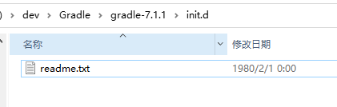
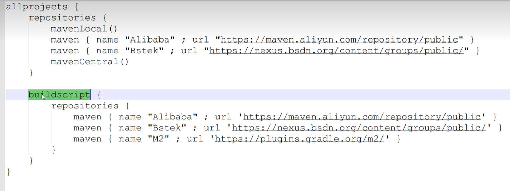
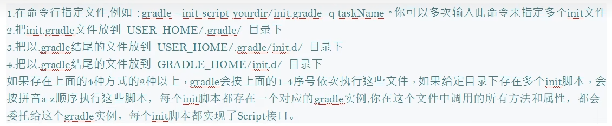

# Gradle

## Gradle常用命令

`gradle clean` ： 清空build目录

`gradle classes` : 编译业务代码和配置文件

`gradle test` : 编译测试代码，生成测试报告

`gradle build` ： 构建目录

`gradle build -x test` ： 跳过测试构建进行构建

**注意**：gradle的指令要在含有build.gradle的目录执行

## 修改Maven 下载源

在该目录下添加初始化脚本

init.gradle

启用init.gradle文件的方法有

