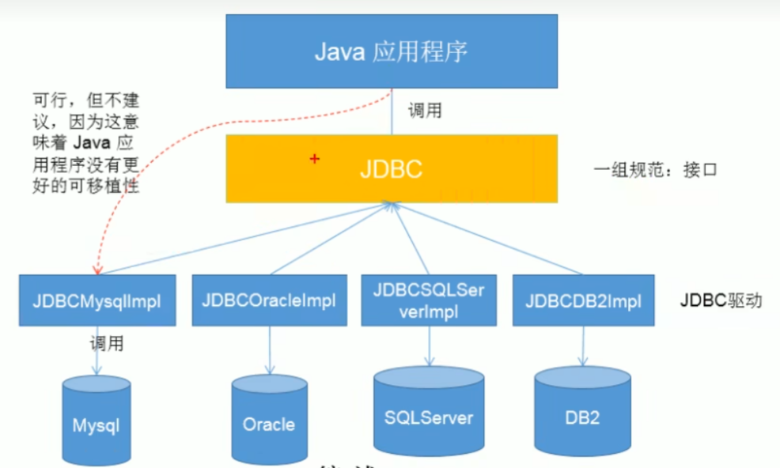
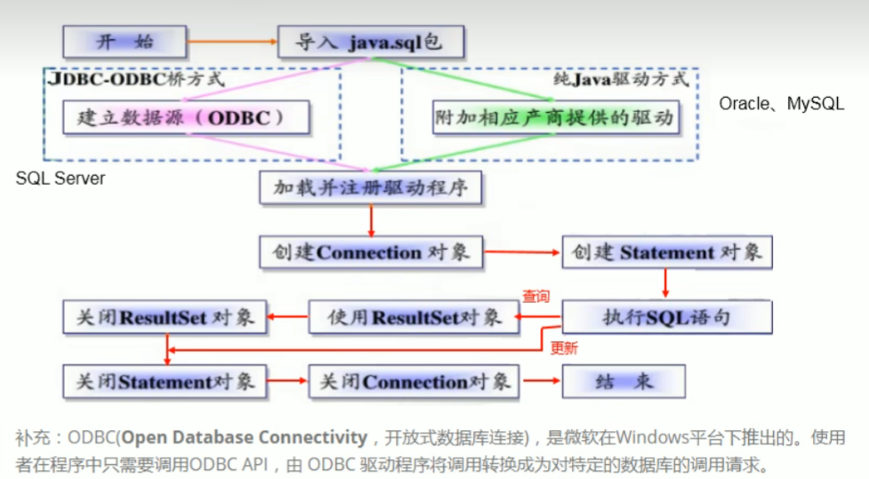
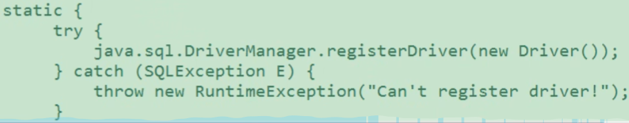

*2022.8.2*

# Java Database Connectivity

> JDBC是一个独立于特定数据库管理系统、通用的SQL数据库存取和操作的公共接口（一组API）
>
> JDBC为访问不同的数据库提供了一种统一的途径，为开发者屏蔽了一些细节问题。
>
> JDBC是sun公司提供的一套用于数据库操作的接口，java程序员只需要面向这套接口编程即可。
>
> 不同的数据库厂商，需要针对这套接口，提供不同实现。不同的实现的集合，即为不同数据库的驱动。




## JDBC编写步骤




## 获取数据库连接


### 方式一

#### 要素一：Driver接口实现类

下载导入   这种包

```java
public void testConnection1() throws SQLException {
    // 获取Driver实现类对象
    Driver driver = new com.mysql.jdbc.Driver;
    String url = null;
    Properties info = null;
    Connection conn = driver.connect(url, info);
}
```

#### 要素二：URL

```java
public void testConnection1() throws SQLException {
    // 获取Driver实现类对象
    Driver driver = new com.mysql.jdbc.Driver;

    // jdbc:mysql  协议
    // localhost   ip地址
    // 3306        默认mysql的端口号
    // test        数据库名称
    String url = "jdbc:mysql://localhost:3306/test";

    // 将用户名和密码封装在Properties中
    Properties info = new Properties();
    info.setProperty("user", "root");
    info.setProperty("password", "root");

    Connection conn = driver.connect(url, info);
}
```


### 方式二

> 对方式一的迭代，避免出现第三方API，增强移植性

```java
public void testConnection2() throws Exception {
    // 1.获取Driver实现类对象，使用反射
	Classs clazz = Class.forName("com.mysql.jdbc.Driver");
    Driver driver = (Driver) clazz.newInstance();
    
    // 2.提供要连接的数据库
    String url = "jdbc:mysql://localhost:3306/test";
    
    // 3.提供连接需要的用户名和密码
    Properties info = new Properties();
    info.setProperty("user", "root");
    info.setProperty("password", "root");
    
    // 4.获取连接
    Connection conn = driver.connect(url, info);
}
```


### 方式三

> 使用DriverManager替换Driver

```java
public void testConnection() {
    // 1.获取Driver实现类对象，使用反射
    Classs clazz = Class.forName("com.mysql.jdbc.Driver");
    Driver driver = (Driver) clazz.newInstance();
    
    // 2.提供另外三个连接的基本信息
    String url = "jdbc:mysql://localhost:3306/test";
    String user = "root";
    String password = "root";
    
	// 注册驱动
    DriverManager.registerDriver(driver);
    
    // 获取连接
    Connection conn = DriverManager.getConnection(url, user, password);   
}
```


### 方式四

>  可以只是加载驱动，不用显示地注册驱动

```java
public void testConnection4() {

    
    // 1.提供另外三个连接的基本信息
    String url = "jdbc:mysql://localhost:3306/test";
    String user = "root";
    String password = "root";
    
    // 2.获取Driver实现类对象，使用反射
    Class.forName("com.mysql.jdbc.Driver");
    //iver driver = (Driver) clazz.newInstance();
	// 注册驱动
    //iverManager.registerDriver(driver);
    
    // 获取连接
    Connection conn = DriverManager.getConnection(url, user, password);   
}
```

mysql的Driver实现类中的静态代码块部分，声明了注册驱动相关操作。




### 方式五

> 将数据库连接需要的4个基本信息声明在配置文件中，通过读取配置文件的方式，获取连接

jdbc.properties

```
user=root
password=root
url=jdbc:mysql://localhost:3306/test
driverClass=com.mysql.jdbc.Driver
```


ConnectionTest.java

```java
public void testConnection5() {
	// 1.读取配置文件中的4个基本信息
    InputStream is = ConnectionTest.class.getClassLoader().getResourceAsStream("jdbc.preperties")
        
    Properties props = new Properties();
    pros.load(is);
    
    String user = pros,getProperty("user")
    String password = pros,getProperty("password")
    String url = pros,getProperty("url")
    String driverClass = pros,getProperty("driverClass")
    
    // 2.加载驱动
    Class.forName("com.mysql.jdbc.Driver");
    
    // 3.获取连接
    Connection conn = DriverManager.getConnection(url, user, password);   
}
```

