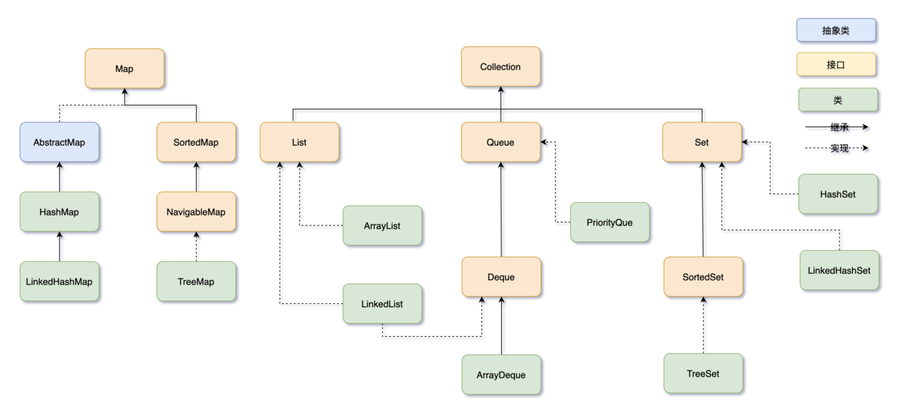
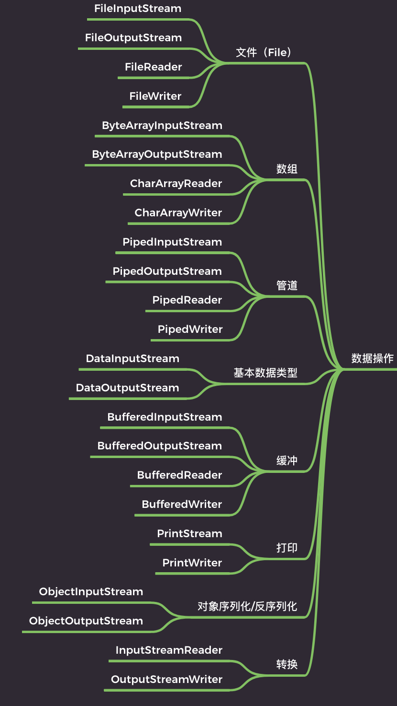
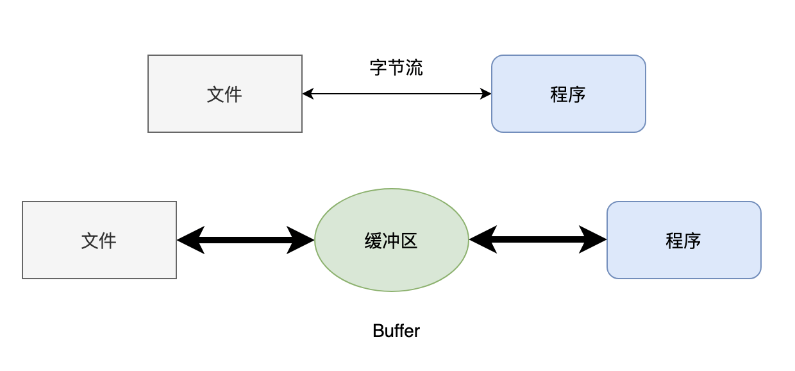
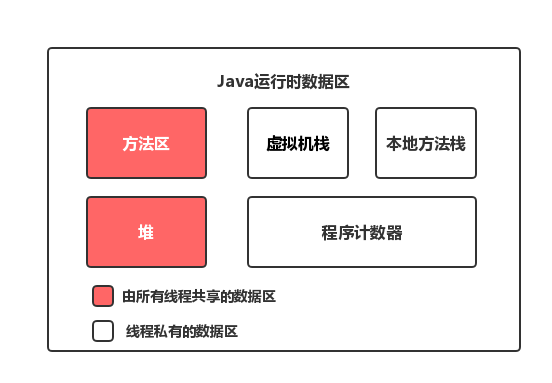

# Java

## 00-原文链接

**[Tobebetterjavaer](https://tobebetterjavaer.com/home.html)** 

**[JavaGuide](https://javaguide.cn)**

**[Java教程 - 廖雪峰](https://www.liaoxuefeng.com/wiki/1252599548343744)**

## 01-面对对象基础

### 方法重载

**定义：**

在一个类中，我们可以定义多个方法。如果有一系列方法，它们的功能都是类似的，只有参数有所不同，那么，可以把这一组方法名做成*同名*方法。例如，在`Hello`类中，定义多个`hello()`方法：

```java
class Hello {
    public void hello() {
        System.out.println("Hello, world!");
    }

    public void hello(String name) {
        System.out.println("Hello, " + name + "!");
    }

    public void hello(String name, int age) {
        if (age < 18) {
            System.out.println("Hi, " + name + "!");
        } else {
            System.out.println("Hello, " + name + "!");
        }
    }
}
```

这种方法名相同，但各自的参数不同，称为方法重载（`Overload`）。

**注意**：方法重载的返回值类型通常都是相同的。

方法重载的目的是，功能类似的方法使用同一名字，更容易记住，因此，调用起来更简单

举个**例子**，`String`类提供了多个重载方法`indexOf()`，可以查找子串：

- `int indexOf(int ch)`：根据字符的Unicode码查找；
- `int indexOf(String str)`：根据字符串查找；
- `int indexOf(int ch, int fromIndex)`：根据字符查找，但指定起始位置；
- `int indexOf(String str, int fromIndex)`根据字符串查找，但指定起始位置。


### 继承

Java使用`extends`关键字来实现继承：

```java
class Person {
    private String name;
    private int age;

    public String getName() {...}
    public void setName(String name) {...}
    public int getAge() {...}
    public void setAge(int age) {...}
}

class Student extends Person {
    // 不要重复name和age字段/方法,
    // 只需要定义新增score字段/方法:
    private int score;

    public int getScore() { … }
    public void setScore(int score) { … }
}
```

可见，通过继承，`Student`只需要编写额外的功能，不再需要重复代码。

 注意：子类自动获得了父类的所有字段，严禁定义与父类重名的字段！

在OOP的术语中，我们把`Person`称为**超类**（super class），**父类**（parent class），**基类**（base class），把`Student`称为**子类**（subclass），扩展类**（extended class）。

#### 继承树

注意到我们在定义`Person`的时候，没有写`extends`。在Java中，没有明确写`extends`的类，编译器会自动加上`extends Object`。所以，任何类，除了`Object`，都会继承自某个类。下图是`Person`、`Student`的继承树：

```ascii
┌───────────┐
│  Object   │
└───────────┘
      ▲
      │
┌───────────┐
│  Person   │
└───────────┘
      ▲
      │
┌───────────┐
│  Student  │
└───────────┘
```

Java只允许一个class继承自一个类，因此，一个类有且仅有一个父类。只有`Object`特殊，它没有父类。


为了让子类可以访问父类的字段，我们需要把`private`改为`protected`。用`protected`修饰的字段可以被子类访问：

```java
class Person {
    protected String name;
    protected int age;
}

class Student extends Person {
    public String hello() {
        return "Hello, " + name; // OK!
    }
}
```

因此，`protected`关键字可以把字段和方法的访问权限控制在继承树内部，一个`protected`字段和方法可以被其子类，以及子类的子类所访问.


子类的构造方法可以通过`super()`调用父类的构造方法；

```java
    public Student(String name, int age, int score) {
        super(name, age); // 调用父类的构造方法Person(String, int)
        this.score = score;
    }
```


可以安全地向上转型为更抽象的类型；

如果`Student`是从`Person`继承下来的，那么，一个引用类型为`Person`的变量，能否指向`Student`类型的实例？

```
Person p = new Student(); // ???
```

测试一下就可以发现，这种指向是允许的！


可以强制向下转型，最好借助`instanceof`判断；

从Java 14开始，判断`instanceof`后，可以直接转型为指定变量，避免再次强制转型。例如，对于以下代码：

```java
Object obj = "hello";
if (obj instanceof String) {
    String s = (String) obj;
    System.out.println(s.toUpperCase());
}
```

可以改写如下:

```java
public class Main {
    public static void main(String[] args) {
        Object obj = "hello";
        if (obj instanceof String s) {
            // 可以直接使用变量s:
            System.out.println(s.toUpperCase());
        }
    }
}
```

这种使用`instanceof`的写法更加简洁。


子类和父类的关系是is，has关系不能用继承。


### 多态

多态是指，针对某个类型的方法调用，其真正执行的方法取决于运行时期实际类型的方法。

```java
public void runTwice(Person p) {
    p.run();
    p.run();
}
```

它传入的参数类型是`Person`，我们是无法知道传入的参数实际类型究竟是`Person`，还是`Student`，还是`Person`的其他子类，因此，也无法确定调用的是不是`Person`类定义的`run()`方法。

所以，多态的特性就是，运行期才能动态决定调用的子类方法。对某个类型调用某个方法，执行的实际方法可能是某个子类的覆写方法。

```java
// 假设我们定义一种收入，需要给它报税，那么先定义一个Income类：
class Income {
    protected double income;

    public Income(double income) {
        this.income = income;
    }

    public double getTax() {
        return income * 0.1; // 税率10%
    }
}

// 对于工资收入，可以减去一个基数，那么我们可以从Income派生出SalaryIncome，并覆写getTax()：
class Salary extends Income {
    public Salary(double income) {
        super(income);
    }

    @Override
    public double getTax() {
        if (income <= 5000) {
            return 0;
        }
        return (income - 5000) * 0.2;
    }
}

// 如果你享受国务院特殊津贴，那么按照规定，可以全部免税：
class StateCouncilSpecialAllowance extends Income {
    public StateCouncilSpecialAllowance(double income) {
        super(income);
    }

    @Override
    public double getTax() {
        return 0;
    }
}

// 现在，我们要编写一个报税的财务软件，对于一个人的所有收入进行报税，可以这么写：
public class Main {
    public static void main(String[] args) {
        // 给一个有普通收入、工资收入和享受国务院特殊津贴的小伙伴算税:
        Income[] incomes = new Income[] {
            new Income(3000),
            new Salary(7500),
            new StateCouncilSpecialAllowance(15000)
        };
        System.out.println(totalTax(incomes));
    }

    public static double totalTax(Income... incomes) {
        double total = 0;
        for (Income income: incomes) {
            total = total + income.getTax();
        }
        return total;
    }
}


```


## 01-字符串

### String

在Java中，`String`是一个引用类型，它本身也是一个`class`。但是，Java编译器对`String`有特殊处理，即可以直接用`"..."`来表示一个字符串：

```
String s1 = "Hello!";
```

实际上字符串在`String`内部是通过一个`char[]`数组表示的，因此，按下面的写法也是可以的：

```java
String s2 = new String(new char[] {'H', 'e', 'l', 'l', 'o', '!'});
```


### 源码

```java
public final class String
    implements java.io.Serializable, Comparable<String>, CharSequence {
    @Stable
    private final byte[] value;
    private final byte coder;
    private int hash;
}
```

“第一，String 类是 final 的，意味着它不能被子类继承。”

“第二，String 类实现了 Serializable 接口，意味着它可以序列化。”

“第三，String 类实现了 Comparable 接口，意味着最好不要用‘==’来比较两个字符串是否相等，而应该用 `compareTo()` 方法去比较。”

“第四，StringBuffer、StringBuilder 和 String 一样，都实现了 CharSequence 接口，所以它们仨属于近亲。由于 String 是不可变的，所以遇到字符串拼接的时候就可以考虑一下 String 的另外两个好兄弟，StringBuffer 和 StringBuilder，它俩是可变的。”

“第五，Java 9 以前，String 是用 char 型数组实现的，之后改成了 byte 型数组实现，并增加了 coder 来表示编码。在 Latin1 字符为主的程序里，可以把 String 占用的内存减少一半。当然，天下没有免费的午餐，这个改进在节省内存的同时引入了编码检测的开销。”

“第六，每一个字符串都会有一个 hash 值，这个哈希值在很大概率是不会重复的，因此 String 很适合来作为 HashMap 的键值。”

### 字符串不可变性

- String 类被 final 关键字修饰，所以它不会有子类，这就意味着没有子类可以重写它的方法，改变它的行为。
- String 类的数据存储在 `byte[]` 数组中，而这个数组也被 final 关键字修饰了，这就表示 String 对象是没法被修改的，只要初始化一次，值就确定了。

#### 这样设计的好处

第一，可以保证 String 对象的安全性，避免被篡改，毕竟像密码这种隐私信息一般就是用字符串存储的。

第二，保证哈希值不会频繁变更。毕竟要经常作为哈希表的键值，经常变更的话，哈希表的性能就会很差劲。

第三，可以实现字符串常量池。

“由于字符串的不可变性，String 类的一些方法实现最终都返回了新的字符串对象。

不管是截取、拼接，还是替换，都不是在原有的字符串上进行的，而是重新生成了新的字符串对象。也就是说，这些操作执行过后，**原来的字符串对象并没有发生改变**。

String 对象一旦被创建后就固定不变了，对 String 对象的任何修改都不会影响到原来的字符串对象，都会生成新的字符串对象。


### 字符串常量池

```java
String s = new String("二哥");
```

“使用 new 关键字创建一个字符串对象时，Java 虚拟机会先在字符串常量池中查找有没有‘二哥’这个字符串对象，如果有，就不会在字符串常量池中创建‘二哥’这个对象了，直接在堆中创建一个‘二哥’的字符串对象，然后将堆中这个‘二哥’的对象地址返回赋值给变量 s。”

“如果没有，先在字符串常量池中创建一个‘二哥’的字符串对象，然后再在堆中创建一个‘二哥’的字符串对象，然后将堆中这个‘二哥’的字符串对象地址返回赋值给变量 s。”

由于字符串的使用频率实在是太高了，所以 Java 虚拟机为了提高性能和减少内存开销，在创建字符串对象的时候进行了一些优化，特意为字符串开辟了一个字符串常量池。

```java
String s = "三妹";
```

当执行 `String s = "三妹"` 时，Java 虚拟机会先在字符串常量池中查找有没有“三妹”这个字符串对象，如果有，则不创建任何对象，直接将字符串常量池中这个“三妹”的对象地址返回，赋给变量 s；如果没有，在字符串常量池中创建“三妹”这个对象，然后将其地址返回，赋给变量 s。


来看下面这个例子：

```java
String s = new String("二哥");
String s1 = new String("二哥");
```

按照我们之前的分析，这两行代码会创建三个对象，字符串常量池中一个，堆上两个。

再来看下面这个例子：

```java
String s = "三妹";
String s1 = "三妹";
```

这两行代码只会创建一个对象，就是字符串常量池中的那个。这样的话，性能肯定就提高了！

#### 内存位置

在 Java 8 之前，字符串常量池在永久代中。


Java 8 之后，移除了永久代，字符串常量池就移到了堆中。


- 方法区是 Java 虚拟机规范中的一个概念，就像是一个接口吧；
- 永久代是 HotSpot 虚拟机中对方法的一个实现，就像是接口的实现类；
- Java 8 的时候，移除了永久代，取而代之的是元空间，是方法区的另外一个实现。

永久代是放在运行时数据区中的，所以它的大小受到 Java 虚拟机本身大小的限制，所以 Java 8 之前，会经常遇到 `java.lang.OutOfMemoryError: PremGen Space` 的异常，PremGen Space 就是方法区的意思；而元空间是直接放在内存中的，所以只受本机可用内存的限制，虽然也会发生内存溢出，但出现的几率相对之前就小了很多。

#### intern()

猜猜这段代码输出的结果

```java
String s1 = new String("二哥三妹");
String s2 = s1.intern();
System.out.println(s1 == s2);
```

第一行代码，字符串常量池中会先创建一个“二哥三妹”的对象，然后堆中会再创建一个“二哥三妹”的对象，s1 引用的是堆中的对象。

第二行代码，对 s1 执行 `intern()` 方法，该方法会从字符串常量池中查找“二哥三妹”这个字符串是否存在，此时是存在的，所以 s2 引用的是字符串常量池中的对象。

也就意味着 s1 和 s2 的引用地址是不同的，一个来自堆，一个来自字符串常量池，所以输出的结果为 false。


```java
String s1 = new String("二哥") + new String("三妹");
String s2 = s1.intern();
System.out.println(s1 == s2);
```

第一行代码，会在字符串常量池中创建两个对象，一个是“二哥”，一个是“三妹”，然后在堆中会创建两个匿名对象“二哥”和“三妹”（可以暂时忽略），最后还有一个“二哥三妹”的对象，s1 引用的是堆中“二哥三妹”这个对象。

第二行代码，对 s1 执行 `intern()` 方法，该方法会从字符串常量池中查找“二哥三妹”这个对象是否存在，此时不存在的，但堆中已经存在了，所以字符串常量池中保存的是堆中这个“二哥三妹”对象的引用，也就是说，s2 和 s1 的引用地址是相同的，所以输出的结果为 true。


### 字符串比较

- `==`操作符用于比较两个对象的地址是否相等。
- `.equals()` 方法用于比较两个对象的内容是否相等。

两个字符串比较，必须总是使用`equals()`方法。

要忽略大小写比较，使用`equalsIgnoreCase()`方法。

#### equals()源码

```java
public boolean equals(Object anObject) {
    if (this == anObject) {
        return true;
    }
    if (anObject instanceof String) {
        String aString = (String)anObject;
        if (coder() == aString.coder()) {
            return isLatin1() ? StringLatin1.equals(value, aString.value)
                    : StringUTF16.equals(value, aString.value);
        }
    }
    return false;
}
```

首先，如果两个字符串对象的可以“==”，那就直接返回 true 了，因为这种情况下，字符串内容是必然相等的。否则就按照字符编码进行比较，分为 UTF16 和 Latin1，差别不是很大，就拿 Latin1 的来说吧。

```java
@HotSpotIntrinsicCandidate
public static boolean equals(byte[] value, byte[] other) {
    if (value.length == other.length) {
        for (int i = 0; i < value.length; i++) {
            if (value[i] != other[i]) {
                return false;
            }
        }
        return true;
    }
    return false;
}
```

String 类使用字节数组实现的，所以比较两个字符串的内容是否相等时，可以先比较字节数组的长度是否相等，不相等就直接返回 false；否则就遍历两个字符串的字节数组，只有有一个字节不相等，就返回 false。

#### 例题

第一题：


```java
new String("小萝莉").equals("小萝莉")
```

“输出什么呢？”我问。

“`.equals()` 比较的是两个字符串对象的内容是否相等，所以结果为 true。”三妹答。

第二题：


```java
new String("小萝莉") == "小萝莉"
```

“==操作符左侧的是在堆中创建的对象，右侧是在字符串常量池中的对象，尽管内容相同，但内存地址不同，所以返回 false。”三妹答。

第三题：


```java
new String("小萝莉") == new String("小萝莉")
```

“new 出来的对象肯定是完全不同的内存地址，所以返回 false。”三妹答。

第四题：


```java
"小萝莉" == "小萝莉"
```

“字符串常量池中只会有一个相同内容的对象，所以返回 true。”三妹答。

第五题：


```java
"小萝莉" == "小" + "萝莉"
```

“由于‘小’和‘萝莉’都在字符串常量池，所以编译器在遇到‘+’操作符的时候将其自动优化为“小萝莉”，所以返回 true。”

第六题：


```java
new String("小萝莉").intern() == "小萝莉"
```

“`new String("小萝莉")` 在执行的时候，会先在字符串常量池中创建对象，然后再在堆中创建对象；执行 `intern()` 方法的时候发现字符串常量池中已经有了‘小萝莉’这个对象，所以就直接返回字符串常量池中的对象引用了，那再与字符串常量池中的‘小萝莉’比较，当然会返回 true 了。


另外还有两个方案

“如果要进行两个字符串对象的内容比较，除了 `.equals()` 方法，还有其他两个可选的方案。”

#### 1）`Objects.equals()`

`Objects.equals()` 这个静态方法的优势在于不需要在调用之前判空。


```java
public static boolean equals(Object a, Object b) {
    return (a == b) || (a != null && a.equals(b));
}
```

如果直接使用 `a.equals(b)`，则需要在调用之前对 a 进行判空，否则可能会抛出空指针 `java.lang.NullPointerException`。`Objects.equals()` 用起来就完全没有这个担心。


```java
Objects.equals("小萝莉", new String("小" + "萝莉")) // --> true
Objects.equals(null, new String("小" + "萝莉")); // --> false
Objects.equals(null, null) // --> true

String a = null;
a.equals(new String("小" + "萝莉")); // throw exception
```


#### 2）String 类的 `.contentEquals()`

`.contentEquals()` 的优势在于可以将字符串与任何的字符序列（StringBuffer、StringBuilder、String、CharSequence）进行比较。


```java
public boolean contentEquals(CharSequence cs) {
    // Argument is a StringBuffer, StringBuilder
    if (cs instanceof AbstractStringBuilder) {
        if (cs instanceof StringBuffer) {
            synchronized(cs) {
                return nonSyncContentEquals((AbstractStringBuilder)cs);
            }
        } else {
            return nonSyncContentEquals((AbstractStringBuilder)cs);
        }
    }
    // Argument is a String
    if (cs instanceof String) {
        return equals(cs);
    }
    // Argument is a generic CharSequence
    int n = cs.length();
    if (n != length()) {
        return false;
    }
    byte[] val = this.value;
    if (isLatin1()) {
        for (int i = 0; i < n; i++) {
            if ((val[i] & 0xff) != cs.charAt(i)) {
                return false;
            }
        }
    } else {
        if (!StringUTF16.contentEquals(val, cs, n)) {
            return false;
        }
    }
    return true;
}
```

从源码上可以看得出，如果 cs 是 StringBuffer，该方法还会进行同步，非常的智能化；如果是 String 的话，其实调用的还是 `equals()` 方法。当然了，这也就意味着使用该方法进行比较的时候，多出来了很多步骤，性能上有些损失。


### 


### 字符串其他常用方法

#### 去除首尾空白字符

- 使用`trim()`方法可以移除字符串首尾空白字符。空白字符包括空格，`\t`，`\r`，`\n`

- 注意：`trim()`并没有改变字符串的内容，而是返回了一个新字符串。

  另一个`strip()`方法也可以移除字符串首尾空白字符。它和`trim()`不同的是，类似中文的空格字符`\u3000`也会被移除

#### 空字符串判断

`String`还提供了`isEmpty()`和`isBlank()`来判断字符串是否为空和空白字符串：

```java
"".isEmpty(); // true，因为字符串长度为0
"  ".isEmpty(); // false，因为字符串长度不为0
"  \n".isBlank(); // true，因为只包含空白字符
" Hello ".isBlank(); // false，因为包含非空白字符
```

#### 替换字符串

要在字符串中替换子串，有两种方法。一种是根据字符或字符串替换：

```java
String s = "hello";
s.replace('l', 'w'); // "hewwo"，所有字符'l'被替换为'w'
s.replace("ll", "~~"); // "he~~o"，所有子串"ll"被替换为"~~"
```

另一种是通过正则表达式替换：

```
String s = "A,,B;C ,D";
s.replaceAll("[\\,\\;\\s]+", ","); // "A,B,C,D"
```

上面的代码通过正则表达式，把匹配的子串统一替换为`","`。

#### 拼接字符串

拼接字符串使用静态方法`join()`，它用指定的字符串连接字符串数组：

```
String[] arr = {"A", "B", "C"};
String s = String.join("***", arr); // "A***B***C"
```

#### 分割字符串

要分割字符串，使用`split()`方法，并且传入的也是正则表达式：

```
String s = "A,B,C,D";
String[] ss = s.split("\\,"); // {"A", "B", "C", "D"}
```

#### 格式化字符串

字符串提供了`formatted()`方法和`format()`静态方法，可以传入其他参数，替换占位符，然后生成新的字符串：

```java
public class Main {
    public static void main(String[] args) {
        String s = "Hi %s, your score is %d!";
        System.out.println(s.formatted("Alice", 80));
        System.out.println(String.format("Hi %s, your score is %.2f!", "Bob", 59.5));
    }
}
```

有几个占位符，后面就传入几个参数。参数类型要和占位符一致。我们经常用这个方法来格式化信息。常用的占位符有：

- `%s`：显示字符串；
- `%d`：显示整数；
- `%x`：显示十六进制整数；
- `%f`：显示浮点数。

占位符还可以带格式，例如`%.2f`表示显示两位小数。如果你不确定用啥占位符，那就始终用`%s`，因为`%s`可以显示任何数据类型。要查看完整的格式化语法，请参考[JDK文档](https://docs.oracle.com/en/java/javase/14/docs/api/java.base/java/util/Formatter.html#syntax)。

#### 类型转换

要把任意基本类型或引用类型转换为字符串，可以使用静态方法`valueOf()`。这是一个重载方法，编译器会根据参数自动选择合适的方法：

```java
String.valueOf(123); // "123"
String.valueOf(45.67); // "45.67"
String.valueOf(true); // "true"
String.valueOf(new Object()); // 类似java.lang.Object@636be97c
```

要把字符串转换为其他类型，就需要根据情况。例如，把字符串转换为`int`类型：

```java
int n1 = Integer.parseInt("123"); // 123
int n2 = Integer.parseInt("ff", 16); // 按十六进制转换，255
```

把字符串转换为`boolean`类型：

```java
boolean b1 = Boolean.parseBoolean("true"); // true
boolean b2 = Boolean.parseBoolean("FALSE"); // false
```

要特别注意，`Integer`有个`getInteger(String)`方法，它不是将字符串转换为`int`，而是把该字符串对应的系统变量转换为`Integer`：

```java
Integer.getInteger("java.version"); // 版本号，11
```

#### 转换为char[]

`String`和`char[]`类型可以互相转换，方法是：

```
char[] cs = "Hello".toCharArray(); // String -> char[]
String s = new String(cs); // char[] -> String
```

如果修改了`char[]`数组，`String`并不会改变：

```java
// String <-> char[]
public class Main {
    public static void main(String[] args) {
        char[] cs = "Hello".toCharArray();
        String s = new String(cs);
        System.out.println(s);
        cs[0] = 'X';
        System.out.println(s);
    }
}
```

**小结**

- Java字符串`String`是不可变对象；
- 字符串操作不改变原字符串内容，而是返回新字符串；
- 常用的字符串操作：提取子串、查找、替换、大小写转换等；
- Java使用Unicode编码表示`String`和`char`；
- 转换编码就是将`String`和`byte[]`转换，需要指定编码；
- 转换为`byte[]`时，始终优先考虑`UTF-8`编码。


## 02-集合





Java 集合框架可以分为两条大的支线：

- **Collection**，主要由 List、Set、Queue 组成，List 代表有序、可重复的集合，典型代表就是封装了动态数组的 **ArrayList** 和封装了链表的 **LinkedList**；Set 代表无序、不可重复的集合，典型代表就是 **HashSet** 和 **TreeSet**；Queue 代表队列，典型代表就是双端队列 **ArrayDeque**，以及优先级队列 **PriorityQue**。
- **Map**，代表键值对的集合，典型代表就是 **HashMap**。

### 概述

#### 01、List

> List 的特点是存取有序，可以存放重复的元素，可以用下标对元素进行操作

**1）ArrayList**

- ArrayList 是由数组实现的，支持随机存取，也就是可以通过下标直接存取元素；
- 从尾部插入和删除元素会比较快捷，从中间插入和删除元素会比较低效，因为涉及到数组元素的复制和移动；
- 如果内部数组的容量不足时会自动扩容，因此当元素非常庞大的时候，效率会比较低。

**2）LinkedList**

- LinkedList 是由双向链表实现的，不支持随机存取，只能从一端开始遍历，直到找到需要的元素后返回；
- 任意位置插入和删除元素都很方便，因为只需要改变前一个节点和后一个节点的引用即可，不像 ArrayList 那样需要复制和移动数组元素；
- 因为每个元素都存储了前一个和后一个节点的引用，所以相对来说，占用的内存空间会比 ArrayList 多一些。

**3）Vector 和 Stack**

List 的实现类还有一个 Vector，是一个元老级的类，比 ArrayList 出现得更早。ArrayList 和 Vector 非常相似，只不过 Vector 是线程安全的，像 get、set、add 这些方法都加了 `synchronized` 关键字，就导致执行执行效率会比较低，所以现在已经很少用了。

更好的选择是并发包下的 CopyOnWriteArrayList。

Stack 是 Vector 的一个子类，本质上也是由动态数组实现的，只不过还实现了先进后出的功能（在 get、set、add 方法的基础上追加了 pop、peek 等方法），所以叫栈。

不过，由于 Stack 执行效率比较低（方法上同样加了 synchronized 关键字），就被双端队列 ArrayDeque 取代了。

#### 02、Set

> Set 的特点是存取无序，不可以存放重复的元素，不可以用下标对元素进行操作，和 List 有很多不同

**1）HashSet**

HashSet 其实是由 HashMap 实现的，只不过值由一个固定的 Object 对象填充，而键用于操作。


```java
public class HashSet<E>
    extends AbstractSet<E>
    implements Set<E>, Cloneable, java.io.Serializable
{
    private transient HashMap<E,Object> map;

    // Dummy value to associate with an Object in the backing Map
    private static final Object PRESENT = new Object();

    public HashSet() {
        map = new HashMap<>();
    }

    public boolean add(E e) {
        return map.put(e, PRESENT)==null;
    }

    public boolean remove(Object o) {
        return map.remove(o)==PRESENT;
    }
}
```

**2）LinkedHashSet**

LinkedHashSet 继承自 HashSet，其实是由 LinkedHashMap 实现的，LinkedHashSet 的构造方法调用了 HashSet 的一个特殊的构造方法：


```java
HashSet(int initialCapacity, float loadFactor, boolean dummy) {
   map = new LinkedHashMap<>(initialCapacity, loadFactor);
}
```

**3）TreeSet**

“二哥，不用你讲了，我能猜到，TreeSet 是由 TreeMap 实现的，只不过同样操作的键位，值由一个固定的 Object 对象填充。”


#### 03、Queue

> Queue，也就是队列，通常遵循先进先出（FIFO）的原则，新元素插入到队列的尾部，访问元素返回队列的头部。

**1）ArrayDeque**

从名字上可以看得出，ArrayDeque 是一个基于数组实现的双端队列，为了满足可以同时在数组两端插入或删除元素的需求，数组必须是循环的，也就是说数组的任何一点都可以被看作是起点或者终点。

这是一个包含了 4 个元素的双端队列，和一个包含了 5 个元素的双端队列。


head 指向队首的第一个有效的元素，tail 指向队尾第一个可以插入元素的空位，因为是循环数组，所以 head 不一定从是从 0 开始，tail 也不一定总是比 head 大。

**2）LinkedList**

LinkedList 一般都归在 List 下，只不过，它也实现了 Deque 接口，可以作为队列来使用。等于说，LinkedList 同时实现了 Stack、Queue、PriorityQueue 的所有功能。

**3）PriorityQueue**

PriorityQueue 是一种优先级队列，它的出队顺序与元素的优先级有关，执行 remove 或者 poll 方法，返回的总是优先级最高的元素。

要想有优先级，元素就需要实现 Comparable 接口或者 Comparator 接口。

#### 04、Map

> Map 保存的是键值对，键要求保持唯一性，值可以重复。

**1）HashMap**

HashMap 实现了 Map 接口，根据键的 HashCode 值来存储数据，具有很快的访问速度，最多允许一个 null 键。

HashMap 不论是在学习还是工作当中，使用频率都是相当高的。随着 JDK 版本的不断更新，HashMap 的底层也优化了很多次，JDK 8 的时候引入了红黑树。


```java
final V putVal(int hash, K key, V value, boolean onlyIfAbsent,
               boolean evict) {
    HashMap.Node<K,V>[] tab; HashMap.Node<K,V> p; int n, i;
    if ((tab = table) == null || (n = tab.length) == 0)
        n = (tab = resize()).length;
    if ((p = tab[i = (n - 1) & hash]) == null)
        tab[i] = newNode(hash, key, value, null);
    else {
        HashMap.Node<K,V> e; K k;
        if (p.hash == hash &&
                ((k = p.key) == key || (key != null && key.equals(k))))
            e = p;
        else if (p instanceof HashMap.TreeNode)
            e = ((HashMap.TreeNode<K,V>)p).putTreeVal(this, tab, hash, key, value);
        else {
            for (int binCount = 0; ; ++binCount) {
                if ((e = p.next) == null) {
                    p.next = newNode(hash, key, value, null);
                    if (binCount >= TREEIFY_THRESHOLD - 1) // -1 for 1st
                        treeifyBin(tab, hash);
                    break;
                }
                if (e.hash == hash &&
                        ((k = e.key) == key || (key != null && key.equals(k))))
                    break;
                p = e;
            }
        }
    return null;
}
```

一旦 HashMap 发生哈希冲突，就把相同键位的地方改成链表，如果链表的长度超过 8，就该用红黑树。

**2）LinkedHashMap**

大多数情况下，只要不涉及线程安全问题，Map基本都可以使用HashMap，不过HashMap有一个问题，就是迭代HashMap的顺序并不是HashMap放置的顺序，也就是无序。HashMap的这一缺点往往会带来困扰，因为有些场景，我们期待一个有序的Map。

大多数情况下，只要不涉及到线程安全的问题，有需要键值对的时候就会使用 HashMap，但 HashMap 有一个问题，就是 HashMap 是无序的。在某些场景下，我们需要一个有序的 Map。

于是 LinkedHashMap 就闪亮登场了。LinkedHashMap 是 HashMap 的子类，内部使用链表来记录插入/访问元素的顺序。

LinkedHashMap 可以看作是 HashMap + LinkedList 的合体，它使用了 哈希表来存储数据，又用了双向链表来维持顺序。

**3）TreeMap**

HashMap 是无序的，所以遍历的时候元素的顺序也是不可测的。TreeMap 是有序的，它在内部会对键进行排序，所以遍历的时候就可以得到预期的顺序。

为了保证顺序，TreeMap 的键必须要实现 Comparable 接口或者 Comparator 接口


### ArrayList

从名字就可以看得出来，ArrayList 实现了 List 接口，并且是基于数组实现的。

数组的大小是固定的，一旦创建的时候指定了大小，就不能再调整了。也就是说，如果数组满了，就不能再添加任何元素了。ArrayList 在数组的基础上实现了自动扩容，并且提供了比数组更丰富的预定义方法（各种增删改查），非常灵活。

**如何创建一个 ArrayList**

```java
ArrayList<String> alist = new ArrayList<String>();
```

可以通过上面的语句来创建一个字符串类型的 ArrayList（通过尖括号来限定 ArrayList 中元素的类型，如果尝试添加其他类型的元素，将会产生编译错误），更简化的写法如下：


```java
List<String> alist = new ArrayList<>();
```

由于 ArrayList 实现了 List 接口，所以 alist 变量的类型可以是 List 类型；new 关键字声明后的尖括号中可以不再指定元素的类型，因为编译器可以通过前面尖括号中的类型进行智能推断。

如果非常确定 ArrayList 中元素的个数，在创建的时候还可以指定初始大小。


```java
List<String> alist = new ArrayList<>(20);
```

这样做的好处是，可以有效地避免在添加新的元素时进行不必要的扩容。但通常情况下，我们很难确定 ArrayList 中元素的个数，因此一般不指定初始大小。

**向 ArrayList 中添加一个元素**

可以通过 `add()` 方法向 ArrayList 中添加一个元素，如果不指定下标的话，就默认添加在末尾。

```java
alist.add("沉默王二");
```

研究一下 `add()` 方法的源码（基于 JDK 8 会好一点），它在添加元素的时候会判断需不需要进行扩容，如果需要的话，会执行 `grow()` 方法进行扩容，这个也是面试官特别喜欢考察的一个重点。”我叮嘱道。

**更新 ArrayList 中的元素**

可以使用 `set()` 方法来更改 ArrayList 中的元素，需要提供下标和新元素。

```java
alist.set(0, "沉默王四");
```

假设原来 0 位置上的元素为“沉默王三”，现在可以将其更新为“沉默王四”。

**删除 ArrayList 中的元素**

`remove(int index)` 方法用于删除指定下标位置上的元素，`remove(Object o)` 方法用于删除指定值的元素。

```java
alist.remove(1);
alist.remove("沉默王四");
```

**查找 ArrayList 中的元素**

如果要正序查找一个元素，可以使用 `indexOf()` 方法；如果要倒序查找一个元素，可以使用 `lastIndexOf()` 方法。

```java
alist.indexOf("沉默王二");
alist.lastIndexOf("沉默王二");
```


### LinkeList

链表大致分为三个层次：

- 第一层叫做“**单向链表**”，我只有一个后指针，指向下一个数据；
- 第二层叫做“**双向链表**”，我有两个指针，后指针指向下一个数据，前指针指向上一个数据。
- 第三层叫做“**二叉树**”，把后指针去掉，换成左右指针。

**初始化:**

```java
LinkedList<String> list = new LinkedList();
```

**增**

可以调用 add 方法添加元素：

```java
list.add("沉默王二");
list.add("沉默王三");
list.add("沉默王四");
```

- `addFirst()` 方法将元素添加到第一位；
- `addLast()` 方法将元素添加到末尾。

**删**

- `remove()`：删除第一个节点
- `remove(int)`：删除指定位置的节点
- `remove(Object)`：删除指定元素的节点
- `removeFirst()`：删除第一个节点
- `removeLast()`：删除最后一个节点

**改**

可以调用 `set()` 方法来更新元素：

```java
list.set(0, "沉默王五");
```

**查**

- `indexOf(Object)`：查找某个元素所在的位置
- `get(int)`：查找某个位置上的元素

- `getFirst()` 方法用于获取第一个元素；
- `getLast()` 方法用于获取最后一个元素；
- `poll()` 和 `pollFirst()` 方法用于删除并返回第一个元素（两个方法尽管名字不同，但方法体是完全相同的）；
- `pollLast()` 方法用于删除并返回最后一个元素；
- `peekFirst()` 方法用于返回但不删除第一个元素。


### Iterator和Iterable

在 Java 中，我们对 List 进行遍历的时候，主要有这么三种方式。

第一种：**for 循环**。

```java
for (int i = 0; i < list.size(); i++) {
    System.out.print(list.get(i) + "，");
}
```

第二种：**迭代器**。

```java
Iterator it = list.iterator();
while (it.hasNext()) {
    System.out.print(it.next() + "，");
}
```

第三种：**for-each**。(语法糖)

```java
for (String str : list) {
    System.out.print(str + "，");
}
```

第一种我们略过，第二种用的是 Iterator，第三种看起来是 for-each，其实背后也是 Iterator


- 允许删除元素（ remove 方法）


### HashMap

```java
static final int hash(Object key) {
    int h;
    return (key == null) ? 0 : (h = key.hashCode()) ^ (h >>> 16);
}
```

- `put(key,value)`: 可以单次向HashMap中添加一个键值对。

- `putAll(hashMap)`: 可以把一个HashMap集合对象，整体加入到另外一个HashMap对象中。

- `remove(key)`:  可以单次删除一个元素。

- `get(key)`:  用来取map中存储的数据，我们根据其key值，可以取到对应的value值，没有该key对应的值则返回null。

- `clear()`: 清空map中的数据

- `containsKey(key)`: 判断map集合中是否包含某个key。

- `containsKey(value)`: 判断map集合中是否包含某个value。

- `entrySet()`：hashmap.entrySet().iterator()，entrySet()的效率比keySet()要高。key和value存储在entry对象里面，遍历的时候，拿到entry对象就可以取到value了。

- `keySet()`：hashmap.keySet().iterator()，keySet是把key放到一个set集合中，通过迭代器遍历，再用hashmap.get(key)来取到value的值。

  

## 03-IO

### 基础

#### 传输方式划分


**字节**（byte）是计算机中用来表示存储容量的一个计量单位，通常情况下，一个字节有 8 位（bit）。

**字符**（char）可以是计算机中使用的字母、数字、和符号，比如说 A 1 $ 这些。

通常来说，一个字母或者一个字符占用一个字节，一个汉字占用两个字节。

在 UTF-8 编码下，一个英文字母（不分大小写）为一个字节，一个中文汉字为三个字节

**字节流**用来处理二进制文件，比如说图片啊、MP3 啊、视频啊。

**字符流**用来处理文本文件，文本文件可以看作是一种特殊的二进制文件，只不过经过了编码，便于人们阅读。

换句话说就是，**字节流可以处理一切文件，而字符流只能处理文本**。

虽然 IO 类很多，但核心的就是 4 个抽象类：`InputStream`、`OutputStream`、`Reader`、`Writer`。

虽然 IO 类的方法也很多，但核心的也就 2 个：`read` 和 `write`。

##### **InputStream 类**

- `int read()`：读取数据
- `int read(byte b[], int off, int len)`：从第 off 位置开始读，读取 len 长度的字节，然后放入数组 b 中
- `long skip(long n)`：跳过指定个数的字节
- `int available()`：返回可读的字节数
- `void close()`：关闭流，释放资源

##### **OutputStream 类**

- `void write(int b)`： 写入一个字节，虽然参数是一个 int 类型，但只有低 8 位才会写入，高 24 位会舍弃（这块后面再讲）
- `void write(byte b[], int off, int len)`： 将数组 b 中的从 off 位置开始，长度为 len 的字节写入
- `void flush()`： 强制刷新，将缓冲区的数据写入
- `void close()`：关闭流

##### **Reader 类**

- `int read()`：读取单个字符
- `int read(char cbuf[], int off, int len)`：从第 off 位置开始读，读取 len 长度的字符，然后放入数组 b 中
- `long skip(long n)`：跳过指定个数的字符
- `int ready()`：是否可以读了
- `void close()`：关闭流，释放资源

##### **Writer 类**

- `void write(int c)`： 写入一个字符
- `void write( char cbuf[], int off, int len)`： 将数组 cbuf 中的从 off 位置开始，长度为 len 的字符写入
- `void flush()`： 强制刷新，将缓冲区的数据写入
- `void close()`：关闭流

理解了上面这些方法，基本上 IO 的灵魂也就全部掌握了


#### 操作对象划分




所有的程序，在执行的时候，都是在内存上进行的，一旦关机，内存中的数据就没了，那如果想要**持久化**，就需要把内存中的数据输出到外部，比如说文件。

文件操作算是 IO 中最典型的操作了，也是最频繁的操作。那其实你可以换个角度来思考，比如说按照 IO 的操作对象来思考，IO 就可以分类为：文件、数组、管道、基本数据类型、缓冲、打印、对象序列化/反序列化，以及转换等。

##### **1）文件**

文件流也就是直接操作文件的流，可以细分为字节流（FileInputStream 和 FileOuputStream）和字符流（FileReader 和 FileWriter）。

FileInputStream 的例子：


```java
int b;
FileInputStream fis1 = new FileInputStream("fis.txt");
// 循环读取
while ((b = fis1.read())!=-1) {
    System.out.println((char)b);
}
// 关闭资源
fis1.close();
```

FileOutputStream 的例子：


```java
FileOutputStream fos = new FileOutputStream("fos.txt");
fos.write("沉默王二".getBytes());
fos.close();
```

FileReader 的例子：


```java
int b = 0;
FileReader fileReader = new FileReader("read.txt");
// 循环读取
while ((b = fileReader.read())!=-1) {
    // 自动提升类型提升为 int 类型，所以用 char 强转
    System.out.println((char)b);
}
// 关闭流
fileReader.close();
```

FileWriter 的例子：


```java
FileWriter fileWriter = new FileWriter("fw.txt");
char[] chars = "沉默王二".toCharArray();
fileWriter.write(chars, 0, chars.length);
fileWriter.close();
```

当掌握了文件的输入输出，其他的自然也就掌握了，都大差不差。


##### **2）数组**

通常来说，针对文件的读写操作，使用文件流配合缓冲流就够用了，但为了提升效率，频繁地读写文件并不是太好，那么就出现了数组流，有时候也称为内存流。

ByteArrayInputStream 的例子：


```java
InputStream is =new BufferedInputStream(
        new ByteArrayInputStream(
                "沉默王二".getBytes(StandardCharsets.UTF_8)));
//操作
byte[] flush =new byte[1024];
int len =0;
while(-1!=(len=is.read(flush))){
    System.out.println(new String(flush,0,len));
}
//释放资源
is.close();
```

ByteArrayOutputStream 的例子：

```java
ByteArrayOutputStream bos =new ByteArrayOutputStream();
byte[] info ="沉默王二".getBytes();
bos.write(info, 0, info.length);
//获取数据
byte[] dest =bos.toByteArray();
//释放资源
bos.close();
```

##### **3）管道**


##### **4）基本数据类型**


##### **5）缓冲**

CPU 很快，它比内存快 100 倍，比磁盘快百万倍。那也就意味着，程序和内存交互会很快，和硬盘交互相对就很慢，这样就会导致性能问题。

为了减少程序和硬盘的交互，提升程序的效率，就引入了缓冲流，也就是类名前缀带有 Buffer 的那些，比如说 BufferedInputStream、BufferedOutputStream、BufferedReader、BufferedWriter。



缓冲流在内存中设置了一个缓冲区，只有缓冲区存储了足够多的带操作的数据后，才会和内存或者硬盘进行交互。简单来说，就是一次多读/写点，少读/写几次，这样程序的性能就会提高。

##### **6）打印**


##### **7）对象序列化/反序列化**


##### **8）转换**


### BIO | NIO | AIO

**BIO （Blocking I/O）：同步阻塞 I/O 模式。**

**NIO （New I/O）：同步非阻塞模式。**

**AIO （Asynchronous I/O）：异步非阻塞 I/O 模型。**


## 04-并发编程

### 多线程

现代操作系统（Windows，macOS，Linux）都可以执行多任务。多任务就是同时运行多个任务，例如：

CPU执行代码都是一条一条顺序执行的，但是，即使是单核cpu，也可以同时运行多个任务。因为操作系统执行多任务实际上就是让CPU对多个任务轮流交替执行。

例如，假设我们有语文、数学、英语3门作业要做，每个作业需要30分钟。我们把这3门作业看成是3个任务，可以做1分钟语文作业，再做1分钟数学作业，再做1分钟英语作业：

> **即使是多核CPU，因为通常任务的数量远远多于CPU的核数，所以任务也是交替执行的。**


Java语言内置了多线程支持：一个Java程序实际上是一个JVM进程，JVM进程用一个主线程来执行`main()`方法，在`main()`方法内部，我们又可以启动多个线程。此外，JVM还有负责垃圾回收的其他工作线程等。

因此，对于大多数Java程序来说，我们说多任务，实际上是说如何使用多线程实现多任务。

和单线程相比，多线程编程的特点在于：多线程经常需要读写共享数据，并且需要同步。例如，播放电影时，就必须由一个线程播放视频，另一个线程播放音频，两个线程需要协调运行，否则画面和声音就不同步。因此，多线程编程的复杂度高，调试更困难。

Java多线程编程的特点又在于：

- 多线程模型是Java程序最基本的并发模型；
- 后续读写网络、数据库、Web开发等都依赖Java多线程模型。


#### 进程

在计算机中，我们把一个任务称为一个进程，浏览器就是一个进程，视频播放器是另一个进程，类似的，音乐播放器和Word都是进程。

某些进程内部还需要同时执行多个子任务。例如，我们在使用Word时，Word可以让我们一边打字，一边进行拼写检查，同时还可以在后台进行打印，我们把子任务称为线程。

进程和线程的关系就是：一个进程可以包含一个或多个线程，但至少会有一个线程。

> **常用的Windows、Linux等操作系统都采用`抢占式`多任务，如何调度线程完全由操作系统决定，程序自己不能决定什么时候执行，以及执行多长时间。**

#### 线程


Java语言内置了多线程支持。当Java程序启动的时候，实际上是启动了一个JVM进程，然后，JVM启动主线程来执行`main()`方法。在`main()`方法中，我们又可以启动其他线程。


##### 创建线程

创建一个新线程非常容易，我们需要实例化一个`Thread`实例，然后调用它的`start()`方法

```java
public class Main {
    public static void main(String[] args) {
        Thread t = new Thread();
        t.start(); // 启动新线程
    }
}
```

但是这个线程启动后实际上什么也不做就立刻结束了。我们希望新线程能执行指定的代码，有以下几种方法：

- 方法一：从`Thread`派生一个自定义类，然后覆写`run()`方法：

```java
public class Main {
    public static void main(String[] args) {
        Thread t = new MyThread();
        t.start(); // 启动新线程
    }
}

class MyThread extends Thread {
    @Override
    public void run() {
        System.out.println("start new thread!");
    }
}
```

> 注意 : `start()`方法会在内部自动调用实例的`run()`方法。

方法二：创建`Thread`实例时，传入一个`Runnable`实例：

```java
public class Main {
    public static void main(String[] args) {
        Thread t = new Thread(new MyRunnable());
        t.start(); // 启动新线程
    }
}

class MyRunnable implements Runnable {
    @Override
    public void run() {
        System.out.println("start new thread!");
    }
}
```

或者用Java8引入的lambda语法进一步简写为：(也可以实现相同的效果)

```java
public class Main {
    public static void main(String[] args) {
        Thread t = new Thread(() -> {
            System.out.println("start new thread!");
        });
        t.start(); // 启动新线程
    }
}
```


♠②：实现 Callable 接口；

```java
public class MyCallable implements Callable<Integer> {
   public Integer call() {
      return 123;
   }
}
```


**实现接口 VS 继承 Thread**
实现接口会更好一些，因为：

- Java 不支持多重继承，因此继承了 Thread 类就无法继承其它类，但是可以实现多个接口
- 类可能只要求可执行就行，继承整个 Thread 类开销过大

##### 线程控制

1）`sleep()`：使当前正在执行的线程暂停指定的毫秒数，也就是进入休眠的状态。

需要注意的是，sleep 的时候要对异常进行处理。

```java
try {//sleep会发生异常要显示处理
    Thread.sleep(20);//暂停20毫秒
} catch (InterruptedException e) {
    e.printStackTrace();
}
```

2）`join()`：等待这个线程执行完才会轮到后续线程得到cpu的执行权，使用这个也要抛出异常。

```java
//创建MyRunnable类
MyRunnable mr = new MyRunnable();
//创建Thread类的有参构造,并设置线程名
Thread t1 = new Thread(mr, "张飞");
Thread t2 = new Thread(mr, "貂蝉");
Thread t3 = new Thread(mr, "吕布");
//启动线程
t1.start();
try {
    t1.join(); //等待t1执行完才会轮到t2，t3抢
} catch (InterruptedException e) {
    e.printStackTrace();
}
t2.start();
t3.start();
```

3）`setDaemon()`：将此线程标记为守护线程，准确来说，就是服务其他的线程，像 Java 中的垃圾回收线程，就是典型的守护线程。

```java
//创建MyRunnable类
MyRunnable mr = new MyRunnable();
//创建Thread类的有参构造,并设置线程名
Thread t1 = new Thread(mr, "张飞");
Thread t2 = new Thread(mr, "貂蝉");
Thread t3 = new Thread(mr, "吕布");

t1.setDaemon(true);
t2.setDaemon(true);

//启动线程
t1.start();
t2.start();
t3.start();
```

如果其他线程都执行完毕，main 方法（主线程）也执行完毕，JVM 就会退出，也就是停止运行。如果 JVM 都停止运行了，守护线程自然也就停止了。

4) `Executor`:  管理多个异步任务的执⾏，⽽⽆需程序员显式地管理线程的⽣命周期。这⾥的异步是指多个任 务的执⾏互不⼲扰，不需要进⾏同步操作。

主要有三种 Executor： 

- CachedThreadPool：⼀个任务创建⼀个线程； 

- FixedThreadPool：所有任务只能使⽤固定⼤⼩的线程； 

- SingleThreadExecutor：相当于⼤⼩为 1 的 FixedThreadPool。


##### 线程状态

操作系统线程主要有以下三个状态：

- 就绪状态(**ready**)：线程正在等待使用CPU，经调度程序调用之后可进入running状态。
- 执行状态(**running**)：线程正在使用CPU。
- 等待状态(**waiting**): 线程经过等待事件的调用或者正在等待其他资源（如I/O）


**线程状态转换图：**

> 在现在的操作系统中，线程是被视为轻量级进程的，所以**操作系统线程的状态其实和操作系统进程的状态是一致的**。


**Java线程的6个状态**

```java
// Thread.State 源码
public enum State {
    NEW,
    RUNNABLE,
    BLOCKED,
    WAITING,
    TIMED_WAITING,
    TERMINATED;
}
```


`NEW`

处于NEW状态的线程此时尚未启动。这里的尚未启动指的是还没调用Thread实例的start()方法。

```java
private void testStateNew() {
    Thread thread = new Thread(() -> {});
    System.out.println(thread.getState()); // 输出 NEW 
}
```

从上面可以看出，只是创建了线程而并没有调用start()方法，此时线程处于NEW状态

 `RUNNABLE`

表示当前线程正在运行中。处于RUNNABLE状态的线程在Java虚拟机中运行，也有可能在等待CPU分配资源。

看了操作系统线程的几个状态之后我们来看看Thread源码里对RUNNABLE状态的定义：

```text
/**
 * Thread state for a runnable thread.  A thread in the runnable
 * state is executing in the Java virtual machine but it may
 * be waiting for other resources from the operating system
 * such as processor.
 */
```

> Java线程的**RUNNABLE**状态其实是包括了传统操作系统线程的**ready**和**running**两个状态的。

`BLOCKED`

阻塞状态。处于BLOCKED状态的线程正等待锁的释放以进入同步区。

`WAITING`

等待状态。处于等待状态的线程变成RUNNABLE状态需要其他线程唤醒。

调用如下3个方法会使线程进入等待状态：

- Object.wait()：使当前线程处于等待状态直到另一个线程唤醒它；
- Thread.join()：等待线程执行完毕，底层调用的是Object实例的wait方法；
- LockSupport.park()：除非获得调用许可，否则禁用当前线程进行线程调度。


`TIMED_WAITING`

超时等待状态。线程等待一个具体的时间，时间到后会被自动唤醒。

调用如下方法会使线程进入超时等待状态：

- Thread.sleep(long millis)：使当前线程睡眠指定时间；
- Object.wait(long timeout)：线程休眠指定时间，等待期间可以通过notify()/notifyAll()唤醒；
- Thread.join(long millis)：等待当前线程最多执行millis毫秒，如果millis为0，则会一直执行；
- LockSupport.parkNanos(long nanos)： 除非获得调用许可，否则禁用当前线程进行线程调度指定时间；
- LockSupport.parkUntil(long deadline)：同上，也是禁止线程进行调度指定时间；

`TERMINATED`

终止状态。此时线程已执行完毕


##### 线程组

`ThreadGroup`

Java中用ThreadGroup来表示线程组，我们可以使用线程组对线程进行批量控制。

如果在new Thread时没有显式指定，那么默认将父线程（当前执行new Thread的线程）线程组设置为自己的线程组。

ThreadGroup管理着它下面的Thread，ThreadGroup是一个标准的**向下引用**的树状结构，这样设计的原因是**防止"上级"线程被"下级"线程引用而无法有效地被GC回收**

**线程组常用方法**

- 获取当前的线程组名

```java
Thread.currentThread().getThreadGroup().getName()
```

- 复制线程组

```java
// 获取当前的线程组
ThreadGroup threadGroup = Thread.currentThread().getThreadGroup();
// 复制一个线程组到一个线程数组（获取Thread信息）
Thread[] threads = new Thread[threadGroup.activeCount()];
threadGroup.enumerate(threads);
```

- 线程组统一异常处理

```java
package com.func.axc.threadgroup;
 
public class ThreadGroupDemo {
  public static void main(String[] args) {
    ThreadGroup threadGroup1 = new ThreadGroup("group1") {
            // 继承ThreadGroup并重新定义以下方法
            // 在线程成员抛出unchecked exception
            // 会执行此方法
            public void uncaughtException(Thread t, Throwable e) {
                System.out.println(t.getName() + ": " + e.getMessage());
            }
        };
        
        // 这个线程是threadGroup1的一员
    Thread thread1 = new Thread(threadGroup1, new Runnable() {
            public void run() {
                // 抛出unchecked异常
                throw new RuntimeException("测试异常");
            }
        });
        
    thread1.start();
  }
}
```

##### 线程优先级

Java中线程优先级可以指定，范围是1~10。但是并不是所有的操作系统都支持10级优先级的划分（比如有些操作系统只支持3级划分：低，中，高），Java只是给操作系统一个优先级的**参考值**，线程最终**在操作系统的优先级**是多少还是由操作系统决定。

Java默认的线程优先级为5，线程的执行顺序由调度程序来决定，线程的优先级会在线程被调用之前设定。

通常情况下，高优先级的线程将会比低优先级的线程有**更高的几率**得到执行。我们使用方法`Thread`类的`setPriority()`实例方法来设定线程的优先级。

```java
public class Demo {
    public static void main(String[] args) {
        Thread a = new Thread();
        System.out.println("我是默认线程优先级："+a.getPriority());
        Thread b = new Thread();
        b.setPriority(10);
        System.out.println("我是设置过的线程优先级："+b.getPriority());
    }
}
```

既然有1-10的级别来设定了线程的优先级，这时候可能有些读者会问，那么我是不是可以在业务实现的时候，采用这种方法来指定一些线程执行的先后顺序？

对于这个问题，我们的答案是:No!

Java中的优先级来说不是特别的可靠，**Java程序中对线程所设置的优先级只是给操作系统一个建议，操作系统不一定会采纳。而真正的调用顺序，是由操作系统的线程调度算法决定的**。

我们通过代码来验证一下：

```java
public class Demo {
    public static class T1 extends Thread {
        @Override
        public void run() {
            super.run();
            System.out.println(String.format("当前执行的线程是：%s，优先级：%d",
                    Thread.currentThread().getName(),
                    Thread.currentThread().getPriority()));
        }
    }

    public static void main(String[] args) {
        IntStream.range(1, 10).forEach(i -> {
            Thread thread = new Thread(new T1());
            thread.setPriority(i);
            thread.start();
        });
    }
}
```

某次输出：

```java
当前执行的线程是：Thread-11，优先级：6
当前执行的线程是：Thread-13，优先级：7
当前执行的线程是：Thread-3，优先级：2
当前执行的线程是：Thread-1，优先级：1
当前执行的线程是：Thread-17，优先级：9
当前执行的线程是：Thread-7，优先级：4
当前执行的线程是：Thread-15，优先级：8
当前执行的线程是：Thread-5，优先级：3
当前执行的线程是：Thread-9，优先级：5
```

Java提供一个**线程调度器**来监视和控制处于**RUNNABLE状态**的线程。线程的调度策略采用**抢占式**，优先级高的线程比优先级低的线程会有更大的几率优先执行。在优先级相同的情况下，按照“先到先得”的原则。

> `占位符`来表示数据将来的位置。而且它将插入格式化字符串的参数，按照顺序以逗号隔开，在字符串后面顺次排列。

```java
String.format("他的名字叫%s, 他今年%d岁.", name, age);
```


在之前，我们有谈到一个线程必然存在于一个线程组中，那么当线程和线程组的优先级不一致的时候将会怎样呢？我们用下面的案例来验证一下：


```java
public static void main(String[] args) {
    ThreadGroup threadGroup = new ThreadGroup("t1");
    threadGroup.setMaxPriority(6);
    Thread thread = new Thread(threadGroup,"thread");
    thread.setPriority(9);
    System.out.println("我是线程组的优先级"+threadGroup.getMaxPriority());
    System.out.println("我是线程的优先级"+thread.getPriority());
}
```

输出：

> 我是线程组的优先级6
> 我是线程的优先级6

所以，如果某个线程优先级大于线程所在**线程组的最大优先级**，那么该线程的优先级将会失效，取而代之的是线程组的最大优先级


#### 进程 VS 线程

进程和线程是包含关系，但是多任务既可以由多进程实现，也可以由单进程内的多线程实现，还可以混合多进程＋多线程。

具体采用哪种方式，要考虑到进程和线程的特点。

和多线程相比，多进程的缺点在于：

- 创建进程比创建线程开销大，尤其是在Windows系统上；
- 进程间通信比线程间通信要慢，因为线程间通信就是读写同一个变量，速度很快。

而多进程的优点在于：

多进程稳定性比多线程高，因为在多进程的情况下，一个进程崩溃不会影响其他进程，而在多线程的情况下，任何一个线程崩溃会直接导致整个进程崩溃。

**多进程的方式也可以实现并发，为什么我们要使用多线程？**

多进程方式确实可以实现并发，但使用多线程，有以下几个好处：

- 进程间的通信比较复杂，而线程间的通信比较简单，通常情况下，我们需要使用共享资源，这些资源在线程间的通信比较容易。
- 进程是重量级的，而线程是轻量级的，故多线程方式的系统开销更小。

**进程和线程的区别**

进程是一个独立的运行环境，而线程是在进程中执行的一个任务。他们两个本质的区别是**是否单独占有内存地址空间及其它系统资源（比如I/O）**：

- 进程单独占有一定的内存地址空间，所以进程间存在内存隔离，数据是分开的，数据共享复杂但是同步简单，各个进程之间互不干扰；而线程共享所属进程占有的内存地址空间和资源，数据共享简单，但是同步复杂。
- 进程单独占有一定的内存地址空间，一个进程出现问题不会影响其他进程，不影响主程序的稳定性，可靠性高；一个线程崩溃可能影响整个程序的稳定性，可靠性较低。
- 进程单独占有一定的内存地址空间，进程的创建和销毁不仅需要保存寄存器和栈信息，还需要资源的分配回收以及页调度，开销较大；线程只需要保存寄存器和栈信息，开销较小。

另外一个重要区别是，**进程是操作系统进行资源分配的基本单位，而线程是操作系统进行调度的基本单位**，即CPU分配时间的单位 。


#### 并发编程问题

##### 线程安全问题

###### 原子性

在并发编程中很多操作都不是原子操作，出个小题目：

```java
i = 0; // 操作1
i++;   // 操作2
i = j; // 操作3
i = i + 1; // 操作4
```

上面这四个操作中有哪些是原子操作，哪些不是的？不熟悉的人可能认为这些都是原子操作，其实只有操作1是原子操作。

​	操作1：对基本数据类型变量的赋值是原子操作；

​	操作2：包含三个操作，读取i的值，将i加1，将值赋给i；

​	操作3：读取j的值，将j的值赋给i；

​	操作4：包含三个操作，读取i的值，将i加1，将值赋给i；

在单线程环境下上述四个操作都不会出现问题，但是在多线程环境下，如果不通过加锁操作，往往可能得到意料之外的值。

在Java语言中通过可以使用synchronize或者lock来保证原子性。

###### 可见性

talk is cheap，先show一段代码：

```java
/**
* Author: leixiaoshuai
*/
class Test {
  int i = 50;
  int j = 0;
  
  public void update() {
    // 线程1执行
    i = 100;
  }
  
  public int get() {
    // 线程2执行
    j = i;
    return j;
  }
}
```

线程1执行update方法将 i 赋值为100，一般情况下线程1会在自己的工作内存中完成赋值操作，却没有及时将新值刷新到主内存中。

这个时候线程2执行get方法，首先会从主内存中读取i的值，然后加载到自己的工作内存中，这个时候读取到i的值是50，再将50赋值给j，最后返回j的值就是50了。原本期望返回100，结果返回50，这就是可见性问题，线程1对变量i进行了修改，线程2没有立即看到i的新值。

> 可见性：指当多个线程访问同一个变量时，一个线程修改了这个变量的值，其他线程能够立即看得到修改的值。


如上图每个线程都有属于自己的工作内存，工作内存和主内存间需要通过store和load等进行交互。

为了解决多线程可见性问题，Java语言提供了`volatile`这个关键字。当一个共享变量被volatile修饰时，它会保证修改的值会立即被更新到主存，当有其他线程需要读取时，它会去内存中读取新值。而普通共享变量不能保证可见性，因为变量被修改后什么时候刷回到主存是不确定的，另外一个线程读的可能就是旧值。

当然Java的锁机制如synchronize和lock也是可以保证可见性的，加锁可以保证在同一时刻只有一个线程在执行同步代码块，释放锁之前会将变量刷回至主存，这样也就保证了可见性。

###### 有序性


##### 活跃性问题

为了解决`可见性`问题，我们可以采取加锁方式解决，但是如果加锁使用不当也容易引入其他问题，比如『死锁』。

`活跃性问题`

> 活跃性是指某件正确的事情最终会发生，当某个操作无法继续下去的时候，就会发生活跃性问题。

###### 死锁

死锁是指多个线程因为环形的等待锁的关系而永远的阻塞下去。一图胜千语，不多解释。


###### 活锁

死锁是两个线程都在等待对方释放锁导致阻塞。而`活锁`的意思是线程没有阻塞，还活着呢。

当多个线程都在运行并且修改各自的状态，而其他线程彼此依赖这个状态，导致任何一个线程都无法继续执行，只能重复着自身的动作和修改自身的状态，这种场景就是发生了活锁。


如果大家还有疑惑，那我再举一个生活中的例子，大家平时在走路的时候，迎面走来一个人，两个人互相让路，但是又同时走到了一个方向，如果一直这样重复着避让，这俩人就是发生了活锁，学到了吧，嘿嘿。

###### 饥饿问题

- 如果一个线程无其他异常却迟迟不能继续运行，那基本是处于饥饿状态了。

  常见有几种场景:

  - 高优先级的线程一直在运行消耗CPU，所有的低优先级线程一直处于等待；
  - 一些线程被永久堵塞在一个等待进入同步块的状态，而其他线程总是能在它之前持续地对该同步块进行访问；

  有一个非常经典的饥饿问题就是`哲学家用餐问题`，如下图所示，有五个哲学家在用餐，每个人必须要同时拿两把叉子才可以开始就餐，如果哲学家1和哲学家3同时开始就餐，那哲学家2、4、5就得饿肚子等待了。

  

##### 性能问题

前面讲到了线程安全和死锁、活锁这些问题会影响多线程执行过程，如果这些都没有发生，多线程并发一定比单线程串行执行快吗，答案是不一定，因为多线程有`创建线程`和`线程上下文切换`的开销。

创建线程是直接向系统申请资源的，对操作系统来说创建一个线程的代价是十分昂贵的，需要给它分配内存、列入调度等。

线程创建完之后，还会遇到线程`上下文切换`。


CPU是很宝贵的资源速度也非常快，为了保证雨露均沾，通常为给不同的线程分配`时间片`，当CPU从执行一个线程切换到执行另一个线程时，CPU 需要保存当前线程的本地数据，程序指针等状态，并加载下一个要执行的线程的本地数据，程序指针等，这个开关被称为『上下文切换』。

一般减少上下文切换的方法有：

- 无锁并发编程：可以参照concurrentHashMap锁分段的思想，不同的线程处理不同段的数据，这样在多线程竞争的条件下，可以减少上下文切换的时间。
- CAS算法，利用Atomic下使用CAS算法来更新数据，使用了乐观锁，可以有效的减少一部分不必要的锁竞争带来的上下文切换
- 使用最少线程：避免创建不需要的线程，比如任务很少，但是创建了很多的线程，这样会造成大量的线程都处于等待状态
- **协程**：在单线程里实现多任务的调度，并在单线程里维持多个任务间的切换


### Java内存模型

`Java内存模型（JMM）`    `Java运行时内存区域`


#### 并发编程模型的两个关键问题

- 线程间如何通信？即：线程之间以何种机制来交换信息
- 线程间如何同步？即：线程以何种机制来控制不同线程间操作发生的相对顺序

有两种并发模型可以解决这两个问题：

- 消息传递并发模型
- 共享内存并发模型

这两种模型之间的区别如下表所示：


**在Java中，使用的是共享内存并发模型**


#### Java内存模型的抽象结构

**运行时内存的划分**

先谈一下运行时数据区，下面这张图相信大家一点都不陌生： 


对于每一个线程来说，栈都是私有的，而堆是共有的

也就是说在栈中的变量（局部变量、方法定义参数、异常处理器参数）不会在线程之间共享，也就不会有内存可见性（下文会说到）的问题，也不受内存模型的影响。而在堆中的变量是共享的，本文称为共享变量。

所以，内存可见性是针对的**共享变量**

> 线程之间的共享变量存在主内存中，每个线程都有一个私有的本地内存，存储了该线程以读、写共享变量的副本。本地内存是Java内存模型的一个抽象概念，并不真实存在。它涵盖了缓存、写缓冲区、寄存器等。

Java线程之间的通信由Java内存模型（简称JMM）控制，从抽象的角度来说，JMM定义了线程和主内存之间的抽象关系。JMM的抽象示意图如图所示：


从图中可以看出：

1. 所有的共享变量都存在主内存中。
2. 每个线程都保存了一份该线程使用到的共享变量的副本。
3. 如果线程A与线程B之间要通信的话，必须经历下面2个步骤：
   1. 线程A将本地内存A中更新过的共享变量刷新到主内存中去。
   2. 线程B到主内存中去读取线程A之前已经更新过的共享变量。

**所以，线程A无法直接访问线程B的工作内存，线程间通信必须经过主内存。**

注意，根据JMM的规定，**线程对共享变量的所有操作都必须在自己的本地内存中进行，不能直接从主内存中读取**。

所以线程B并不是直接去主内存中读取共享变量的值，而是先在本地内存B中找到这个共享变量，发现这个共享变量已经被更新了，然后本地内存B去主内存中读取这个共享变量的新值，并拷贝到本地内存B中，最后线程B再读取本地内存B中的新值。

那么怎么知道这个共享变量的被其他线程更新了呢？这就是JMM的功劳了，也是JMM存在的必要性之一。**JMM通过控制主内存与每个线程的本地内存之间的交互，来提供内存可见性保证**。


### volatile

#### volatile的内存语义

在Java中，volatile关键字有特殊的内存语义。volatile主要有以下两个功能：

- 保证变量的**内存可见性**
- 禁止volatile变量与普通变量**重排序**（JSR133提出，Java 5 开始才有这个“增强的volatile内存语义”）

#### 内存可见性

以一段示例代码开始：

```java
public class VolatileExample {
    int a = 0;
    volatile boolean flag = false;
    
    public void writer() {
        a = 1; // step 1
        flag = true; // step 2
    }
    
    public void reader() {
        if (flag) { // step 3
            System.out.println(a); // step 4
        }
    }
}
```

在这段代码里，我们使用`volatile`关键字修饰了一个`boolean`类型的变量`flag`。

所谓内存可见性，指的是当一个线程对`volatile`修饰的变量进行**写操作**（比如step 2）时，JMM会立即把该线程对应的本地内存中的共享变量的值刷新到主内存；当一个线程对`volatile`修饰的变量进行**读操作**（比如step 3）时，JMM会把立即该线程对应的本地内存置为无效，从主内存中读取共享变量的值。


#### volatile的用途

在保证内存可见性这一点上，volatile有着与锁相同的内存语义，所以可以作为一个“轻量级”的锁来使用。但由于volatile仅仅保证对单个volatile变量的读/写具有原子性，而锁可以保证整个**临界区代码**的执行具有原子性。所以**在功能上，锁比volatile更强大；在性能上，volatile更有优势**。


### synchronized

说到锁，我们通常会谈到`synchronized`这个关键字。它翻译成中文就是“同步”的意思。

我们通常使用`synchronized`关键字来给一段代码或一个方法上锁。它通常有以下三种形式：


```java
// 关键字在实例方法上，锁为当前实例
public synchronized void instanceLock() {
    // code
}

// 关键字在静态方法上，锁为当前Class对象
public static synchronized void classLock() {
    // code
}

// 关键字在代码块上，锁为括号里面的对象
public void blockLock() {
    Object o = new Object();
    synchronized (o) {
        // code
    }
}
```


## 05-异常

在计算机程序运行的过程中，总是会出现各种各样的错误。

所以，一个健壮的程序必须处理各种各样的错误。

所谓错误，就是程序调用某个函数的时候，如果失败了，就表示出错。

调用方如何获知调用失败的信息？有两种方法：

- 约定返回错误码

例如，处理一个文件，如果返回`0`，表示成功，返回其他整数，表示约定的错误码

```java
int code = processFile("C:\\test.txt");
if (code == 0) {
    // ok:
} else {
    // error:
    switch (code) {
    case 1:
        // file not found:
    case 2:
        // no read permission:
    default:
        // unknown error:
    }
}
```

因为使用`int`类型的错误码，想要处理就非常麻烦。这种方式常见于底层C函数。

- 在语言层面提供一个异常处理机制

Java内置了一套异常处理机制，总是使用异常来表示错误。

异常是一种`class`，因此它本身带有类型信息。异常可以在任何地方抛出，但只需要在上层捕获，这样就和方法调用分离了：

```java
try {
    String s = processFile(“C:\\test.txt”);
    // ok:
} catch (FileNotFoundException e) {
    // file not found:
} catch (SecurityException e) {
    // no read permission:
} catch (IOException e) {
    // io error:
} catch (Exception e) {
    // other error:
}
```

因为Java的异常是`class`，它的继承关系如下：

```ascii
                     ┌───────────┐
                     │  Object   │
                     └───────────┘
                           ▲
                           │
                     ┌───────────┐
                     │ Throwable │
                     └───────────┘
                           ▲
                 ┌─────────┴─────────┐
                 │                   │
           ┌───────────┐       ┌───────────┐
           │   Error   │       │ Exception │
           └───────────┘       └───────────┘
                 ▲                   ▲
         ┌───────┘              ┌────┴──────────┐
         │                      │               │
┌─────────────────┐    ┌─────────────────┐┌───────────┐
│OutOfMemoryError │... │RuntimeException ││IOException│...
└─────────────────┘    └─────────────────┘└───────────┘
                                ▲
                    ┌───────────┴─────────────┐
                    │                         │
         ┌─────────────────────┐ ┌─────────────────────────┐
         │NullPointerException │ │IllegalArgumentException │...
         └─────────────────────┘ └─────────────────────────┘
```

从继承关系可知：`Throwable`是异常体系的根，它继承自`Object`。`Throwable`有两个体系：`Error`和`Exception`，`Error`表示严重的错误，程序对此一般无能为力，例如：

- `OutOfMemoryError`：内存耗尽
- `NoClassDefFoundError`：无法加载某个Class
- `StackOverflowError`：栈溢出

而`Exception`则是运行时的错误，它可以被捕获并处理。

某些异常是应用程序逻辑处理的一部分，应该捕获并处理。例如：

- `NumberFormatException`：数值类型的格式错误
- `FileNotFoundException`：未找到文件
- `SocketException`：读取网络失败

还有一些异常是程序逻辑编写不对造成的，应该修复程序本身。例如：

- `NullPointerException`：对某个`null`的对象调用方法或字段
- `IndexOutOfBoundsException`：数组索引越界

`Exception`又分为两大类：

1. `RuntimeException`以及它的子类；
2. 非`RuntimeException`（包括`IOException`、`ReflectiveOperationException`等等）

Java规定：

- 必须捕获的异常，包括`Exception`及其子类，但不包括`RuntimeException`及其子类，这种类型的异常称为Checked Exception。
- 不需要捕获的异常，包括`Error`及其子类，`RuntimeException`及其子类。

>  注意：编译器对RuntimeException及其子类不做强制捕获要求，不是指应用程序本身不应该捕获并处理RuntimeException。是否需要捕获，具体问题具体分析。
>


### 捕获异常

捕获异常使用`try...catch`语句，把可能发生异常的代码放到`try {...}`中，然后使用`catch`捕获对应的`Exception`及其子类：

```java
static byte[] toGBK(String s) {
    try {
        return s.getBytes("GBK");
    } catch (UnsupportedEncodingException e) {
        // 先记下来再说:
        e.printStackTrace();
        // System.out.println(e);
    }
    return null;
```

所有异常都可以调用`printStackTrace()`方法打印异常栈，这是一个简单有用的快速打印异常的方法。


Java使用异常来表示错误，并通过`try ... catch`捕获异常；

Java的异常是`class`，并且从`Throwable`继承；

`Error`是无需捕获的严重错误，`Exception`是应该捕获的可处理的错误；

`RuntimeException`无需强制捕获，非`RuntimeException`（Checked Exception）需强制捕获，或者用`throws`声明；

不推荐捕获了异常但不进行任何处理。

#### 多catch语句

可以使用多个`catch`语句，每个`catch`分别捕获对应的`Exception`及其子类。JVM在捕获到异常后，会从上到下匹配`catch`语句，匹配到某个`catch`后，执行`catch`代码块，然后*不再*继续匹配。

简单地说就是：多个`catch`语句只有一个能被执行。

存在多个`catch`的时候，`catch`的顺序非常重要：子类必须写在前面。例如：

```java
public static void main(String[] args) {
    try {
        process1();
        process2();
        process3();
    } catch (IOException e) {
        System.out.println("IO error");
    } catch (UnsupportedEncodingException e) { // 永远捕获不到
        System.out.println("Bad encoding");
    }
}
```

对于上面的代码，`UnsupportedEncodingException`异常是永远捕获不到的，因为它是`IOException`的子类。当抛出`UnsupportedEncodingException`异常时，会被`catch (IOException e) { ... }`捕获并执行。

#### finally语句

Java的`try ... catch`机制还提供了`finally`语句，`finally`语句块保证有无错误都会执行。上述代码可以改写如下：

```java
public static void main(String[] args) {
    try {
        process1();
        process2();
        process3();
    } catch (UnsupportedEncodingException e) {
        System.out.println("Bad encoding");
    } catch (IOException e) {
        System.out.println("IO error");
    } finally {
        System.out.println("END");
    }
}
```

注意`finally`有几个特点：

1. `finally`语句不是必须的，可写可不写；
2. `finally`总是最后执行。

如果没有发生异常，就正常执行`try { ... }`语句块，然后执行`finally`。如果发生了异常，就中断执行`try { ... }`语句块，然后跳转执行匹配的`catch`语句块，最后执行`finally`。

可见，`finally`是用来保证一些代码必须执行的。

某些情况下，可以没有`catch`，只使用`try ... finally`结构。例如：

```java
void process(String file) throws IOException {
    try {
        ...
    } finally {
        System.out.println("END");
    }
}
```

因为方法声明了可能抛出的异常，所以可以不写`catch`

#### 捕获多种异常

如果某些异常的处理逻辑相同，但是异常本身不存在继承关系，那么就得编写多条`catch`子句：

```java
public static void main(String[] args) {
    try {
        process1();
        process2();
        process3();
    } catch (IOException e) {
        System.out.println("Bad input");
    } catch (NumberFormatException e) {
        System.out.println("Bad input");
    } catch (Exception e) {
        System.out.println("Unknown error");
    }
}
```

因为处理`IOException`和`NumberFormatException`的代码是相同的，所以我们可以把它两用`|`合并到一起：

```java
public static void main(String[] args) {
    try {
        process1();
        process2();
        process3();
    } catch (IOException | NumberFormatException e) { // IOException或NumberFormatException
        System.out.println("Bad input");
    } catch (Exception e) {
        System.out.println("Unknown error");
    }
}
```


**小结：**

使用`try ... catch ... finally`时：

- 多个`catch`语句的匹配顺序非常重要，子类必须放在前面；
- `finally`语句保证了有无异常都会执行，它是可选的；
- 一个`catch`语句也可以匹配多个非继承关系的异常。


### 抛出异常

#### 异常的传播

当某个方法抛出了异常时，如果当前方法没有捕获异常，异常就会被**抛到上层**调用方法，直到遇到某个`try ... catch`被捕获为止：

```java
public class Main {
    public static void main(String[] args) {
        try {
            process1();
        } catch (Exception e) {
            e.printStackTrace();
        }
    }

    static void process1() {
        process2();
    }

    static void process2() {
        Integer.parseInt(null); // 会抛出NumberFormatException
    }
}

```

`printStackTrace()`对于调试错误非常有用，上述信息表示：`NumberFormatException`是在`java.lang.Integer.parseInt`方法中被抛出的，从下往上看，调用层次依次是：

1. `main()`调用`process1()`；
2. `process1()`调用`process2()`；
3. `process2()`调用`Integer.parseInt(String)`；
4. `Integer.parseInt(String)`调用`Integer.parseInt(String, int)`。

查看`Integer.java`源码可知，抛出异常的方法代码如下：

```java
public static int parseInt(String s, int radix) throws NumberFormatException {
    if (s == null) {
        throw new NumberFormatException("null");
    }
    ...
}
```

并且，每层调用均给出了源代码的行号，可直接定位。

#### 抛出异常

当发生错误时，例如，用户输入了非法的字符，我们就可以抛出异常。

**如何抛出异常**？参考`Integer.parseInt()`方法，抛出异常分两步：

1. 创建某个`Exception`的实例；
2. 用`throw`语句抛出。

下面是一个例子：

```java
void process2(String s) {
    if (s==null) {
        NullPointerException e = new NullPointerException();
        throw e;
    }
}
```

实际上，绝大部分抛出异常的代码都会合并写成一行：

```java
void process2(String s) {
    if (s==null) {
        throw new NullPointerException();
    }
}
```


如果一个方法捕获了某个异常后，又在`catch`子句中抛出新的异常，就相当于把抛出的异常类型“转换”了：

```
void process1(String s) {
    try {
        process2();
    } catch (NullPointerException e) {
        throw new IllegalArgumentException();
    }
}

void process2(String s) {
    if (s==null) {
        throw new NullPointerException();
    }
}
```

当`process2()`抛出`NullPointerException`后，被`process1()`捕获，然后抛出`IllegalArgumentException()`

如果在`main()`中捕获`IllegalArgumentException`，我们看看打印的异常栈：

```java
public class Main {
    public static void main(String[] args) {
        try {
            process1();
        } catch (Exception e) {
            e.printStackTrace();
        }
    }

    static void process1() {
        try {
            process2();
        } catch (NullPointerException e) {
            throw new IllegalArgumentException();
        }
    }

    static void process2() {
        throw new NullPointerException();
    }
}

```

打印出的异常栈类似：

```java
java.lang.IllegalArgumentException
    at Main.process1(Main.java:15)
    at Main.main(Main.java:5)
```

这说明新的异常丢失了原始异常信息，我们已经看不到原始异常`NullPointerException`的信息了。

为了能**追踪到完整的异常栈**，在构造异常的时候，把原始的`Exception`实例传进去，新的`Exception`就可以持有原始`Exception`信息。对上述代码改进如下：

```java
public class Main {
    public static void main(String[] args) {
        try {
            process1();
        } catch (Exception e) {
            e.printStackTrace();
        }
    }

    static void process1() {
        try {
            process2();
        } catch (NullPointerException e) {
            throw new IllegalArgumentException(e);
        }
    }

    static void process2() {
        throw new NullPointerException();
    }
}

```

运行上述代码，打印出的异常栈类似：

```java
java.lang.IllegalArgumentException: java.lang.NullPointerException
    at Main.process1(Main.java:15)
    at Main.main(Main.java:5)
Caused by: java.lang.NullPointerException
    at Main.process2(Main.java:20)
    at Main.process1(Main.java:13)
```

注意到`Caused by: Xxx`，说明捕获的`IllegalArgumentException`并不是造成问题的根源，根源在于`NullPointerException`，是在`Main.process2()`方法抛出的。

在代码中获取原始异常可以使用`Throwable.getCause()`方法。如果返回`null`，说明已经是“根异常”了。

有了完整的异常栈的信息，我们才能快速定位并修复代码的问题。

 捕获到异常并再次抛出时，一定要留住原始异常，否则很难定位第一案发现场！


- 如果我们在`try`或者`catch`语句块中抛出异常，`finally`语句是否会执行？

例如：

```java
public class Main {
    public static void main(String[] args) {
        try {
            Integer.parseInt("abc");
        } catch (Exception e) {
            System.out.println("catched");
            throw new RuntimeException(e);
        } finally {
            System.out.println("finally");
        }
    }
}

```

```java
catched
finally
Exception in thread "main" java.lang.RuntimeException: java.lang.NumberFormatException: For input string: "abc"
    at Main.main(Main.java:8)
Caused by: java.lang.NumberFormatException: For input string: "abc"
    at ...
```

第一行打印了`catched`，说明进入了`catch`语句块。第二行打印了`finally`，说明执行了`finally`语句块。

因此，在`catch`中抛出异常，不会影响`finally`的执行。JVM会先执行`finally`，然后抛出异常。


#### 异常屏蔽

- 如果在执行`finally`语句时抛出异常，那么，`catch`语句的异常还能否继续抛出？例如：

```java
public class Main {
    public static void main(String[] args) {
        try {
            Integer.parseInt("abc");
        } catch (Exception e) {
            System.out.println("catched");
            throw new RuntimeException(e);
        } finally {
            System.out.println("finally");
            throw new IllegalArgumentException();
        }
    }
}
```

执行上述代码，发现异常信息如下：

```java
catched
finally
Exception in thread "main" java.lang.IllegalArgumentException
    at Main.main(Main.java:11)
```

这说明`finally`抛出异常后，原来在`catch`中准备抛出的异常就“消失”了，因为只能抛出一个异常。没有被抛出的异常称为“被屏蔽”的异常（Suppressed Exception）。

在极少数的情况下，我们需要获知所有的异常。如何保存所有的异常信息？方法是先用`origin`变量保存原始异常，然后调用`Throwable.addSuppressed()`，把原始异常添加进来，最后在`finally`抛出：

```java
public class Main {
    public static void main(String[] args) throws Exception {
        Exception origin = null;
        try {
            System.out.println(Integer.parseInt("abc"));
        } catch (Exception e) {
            origin = e;
            throw e;
        } finally {
            Exception e = new IllegalArgumentException();
            if (origin != null) {
                e.addSuppressed(origin);
            }
            throw e;
        }
    }
}
```

当`catch`和`finally`都抛出了异常时，虽然`catch`的异常被屏蔽了，但是，`finally`抛出的异常仍然包含了它：

```java
Exception in thread "main" java.lang.IllegalArgumentException
    at Main.main(Main.java:11)
Suppressed: java.lang.NumberFormatException: For input string: "abc"
    at java.base/java.lang.NumberFormatException.forInputString(NumberFormatException.java:65)
    at java.base/java.lang.Integer.parseInt(Integer.java:652)
    at java.base/java.lang.Integer.parseInt(Integer.java:770)
    at Main.main(Main.java:6)
```

通过`Throwable.getSuppressed()`可以获取所有的`Suppressed Exception`。

绝大多数情况下，在`finally`中不要抛出异常。因此，我们通常不需要关心`Suppressed Exception`。

**小结：**

调用`printStackTrace()`可以打印异常的传播栈，对于调试非常有用；

捕获异常并再次抛出新的异常时，应该持有原始异常信息；

通常不要在`finally`中抛出异常。如果在`finally`中抛出异常，应该原始异常加入到原有异常中。调用方可通过`Throwable.getSuppressed()`获取所有添加的`Suppressed Exception`


### 自定义异常

Java标准库定义的常用异常包括：

```ascii
Exception
│
├─ RuntimeException
│  │
│  ├─ NullPointerException
│  │
│  ├─ IndexOutOfBoundsException
│  │
│  ├─ SecurityException
│  │
│  └─ IllegalArgumentException
│     │
│     └─ NumberFormatException
│
├─ IOException
│  │
│  ├─ UnsupportedCharsetException
│  │
│  ├─ FileNotFoundException
│  │
│  └─ SocketException
│
├─ ParseException
│
├─ GeneralSecurityException
│
├─ SQLException
│
└─ TimeoutException
```

当我们在代码中需要抛出异常时，尽量使用JDK已定义的异常类型。例如，参数检查不合法，应该抛出`IllegalArgumentException`：

```java
static void process1(int age) {
    if (age <= 0) {
        throw new IllegalArgumentException();
    }
}
```

在一个大型项目中，可以自定义新的异常类型，但是，保持一个合理的异常继承体系是非常重要的。

一个常见的做法是自定义一个`BaseException`作为“根异常”，然后，派生出各种业务类型的异常。

`BaseException`需要从一个适合的`Exception`派生，通常建议从`RuntimeException`派生：

```java
public class BaseException extends RuntimeException {
}
```

其他业务类型的异常就可以从`BaseException`派生：

```java
public class UserNotFoundException extends BaseException {
}

public class LoginFailedException extends BaseException {
}

...
```

自定义的`BaseException`应该提供多个构造方法：

```java
public class BaseException extends RuntimeException {
    public BaseException() {
        super();
    }

    public BaseException(String message, Throwable cause) {
        super(message, cause);
    }

    public BaseException(String message) {
        super(message);
    }

    public BaseException(Throwable cause) {
        super(cause);
    }
}
```

上述构造方法实际上都是原样照抄`RuntimeException`。这样，抛出异常的时候，就可以选择合适的构造方法。通过IDE可以根据父类快速生成子类的构造方法。

**小结：**

抛出异常时，尽量复用JDK已定义的异常类型；

自定义异常体系时，推荐从`RuntimeException`派生“根异常”，再派生出业务异常；

自定义异常时，应该提供多种构造方法。

### NullPointerException

在所有的`RuntimeException`异常中，Java程序员最熟悉的恐怕就是`NullPointerException`了。

`NullPointerException`即空指针异常，俗称NPE。如果一个对象为`null`，调用其方法或访问其字段就会产生`NullPointerException`，这个异常通常是由JVM抛出的，例如：

```java
public class Main {
    public static void main(String[] args) {
        String s = null;
        System.out.println(s.toLowerCase());
    }
}
```

指针这个概念实际上源自C语言，Java语言中并无指针。我们定义的变量实际上是引用，Null Pointer更确切地说是Null Reference，不过两者区别不大。

#### 处理 NullPointerException

如果遇到`NullPointerException`，我们应该如何处理？首先，必须明确，`NullPointerException`是一种代码逻辑错误，遇到`NullPointerException`，遵循原则是早暴露，早修复，严禁使用`catch`来隐藏这种编码错误：

```java
// 错误示例: 捕获NullPointerException
try {
    transferMoney(from, to, amount);
} catch (NullPointerException e) {
}
```

好的编码习惯可以极大地降低`NullPointerException`的产生，例如：

成员变量在定义时初始化：

```
public class Person {
    private String name = "";
}
```

使用空字符串`""`而不是默认的`null`可避免很多`NullPointerException`，编写业务逻辑时，用空字符串`""`表示未填写比`null`安全得多。

返回空字符串`""`、空数组而不是`null`：

```
public String[] readLinesFromFile(String file) {
    if (getFileSize(file) == 0) {
        // 返回空数组而不是null:
        return new String[0];
    }
    ...
}
```

这样可以使得调用方无需检查结果是否为`null`。

如果调用方一定要根据`null`判断，比如返回`null`表示文件不存在，那么考虑返回`Optional<T>`：

```
public Optional<String> readFromFile(String file) {
    if (!fileExist(file)) {
        return Optional.empty();
    }
    ...
}
```

这样调用方必须通过`Optional.isPresent()`判断是否有结果。

#### 定位NullPointerException

如果产生了`NullPointerException`，例如，调用`a.b.c.x()`时产生了`NullPointerException`，原因可能是：

- `a`是`null`；
- `a.b`是`null`；
- `a.b.c`是`null`；

确定到底是哪个对象是`null`以前只能打印这样的日志：

```
System.out.println(a);
System.out.println(a.b);
System.out.println(a.b.c);
```

从Java 14开始，如果产生了`NullPointerException`，JVM可以给出详细的信息告诉我们`null`对象到底是谁。我们来看例子：

```java
public class Main {
    public static void main(String[] args) {
        Person p = new Person();
        System.out.println(p.address.city.toLowerCase());
    }
}

class Person {
    String[] name = new String[2];
    Address address = new Address();
}

class Address {
    String city;
    String street;
    String zipcode;
}
```

可以在`NullPointerException`的详细信息中看到类似`... because "<local1>.address.city" is null`，意思是`city`字段为`null`，这样我们就能快速定位问题所在。

这种增强的`NullPointerException`详细信息是Java 14新增的功能，但默认是关闭的，我们可以给JVM添加一个`-XX:+ShowCodeDetailsInExceptionMessages`参数启用它：

```java
java -XX:+ShowCodeDetailsInExceptionMessages Main.java
```


**小结**

`NullPointerException`是Java代码常见的逻辑错误，应当早暴露，早修复；

可以启用Java 14的增强异常信息来查看`NullPointerException`的详细错误信息。


## 06-网络编程

### 网络编程基础

#### **IP地址**

IPv4采用32位地址，类似`101.202.99.12`，而IPv6采用128位地址，类似`2001:0DA8:100A:0000:0000:1020:F2F3:1428`。IPv4地址总共有232个（大约42亿），而IPv6地址则总共有2128个（大约340万亿亿亿亿），IPv4的地址目前已耗尽，而IPv6的地址是根本用不完的。

IP地址又分为公网IP地址和内网IP地址。公网IP地址可以直接被访问，内网IP地址只能在内网访问。内网IP地址类似于：

- 192.168.x.x
- 10.x.x.x

有一个特殊的IP地址，称之为本机地址，它总是`127.0.0.1`。

IPv4地址实际上是一个32位整数。例如：

```ascii
1707762444 = 0x65ca630c
           = 65  ca  63 0c
           = 101.202.99.12
```

如果一台计算机只有一个网卡，并且接入了网络，那么，它有一个本机地址`127.0.0.1`，还有一个IP地址，例如`101.202.99.12`，可以通过这个IP地址接入网络。

如果一台计算机有两块网卡，那么除了本机地址，它可以有两个IP地址，可以分别接入两个网络。通常连接两个网络的设备是路由器或者交换机，它至少有两个IP地址，分别接入不同的网络，让网络之间连接起来。

如果两台计算机位于同一个网络，那么他们之间可以直接通信，因为他们的IP地址前段是相同的，也就是网络号是相同的。网络号是IP地址通过子网掩码过滤后得到的。例如：

某台计算机的IP是`101.202.99.2`，子网掩码是`255.255.255.0`，那么计算该计算机的网络号是：

```
IP = 101.202.99.2
Mask = 255.255.255.0
Network = IP & Mask = 101.202.99.0
```

每台计算机都需要正确配置IP地址和子网掩码，根据这两个就可以计算网络号，如果两台计算机计算出的网络号相同，说明两台计算机在同一个网络，可以直接通信。如果两台计算机计算出的网络号不同，那么两台计算机不在同一个网络，不能直接通信，它们之间必须通过路由器或者交换机这样的网络设备间接通信，我们把这种设备称为网关。

网关的作用就是连接多个网络，负责把来自一个网络的数据包发到另一个网络，这个过程叫路由。

所以，一台计算机的一个网卡会有3个关键配置：


- IP地址，例如：`10.0.2.15`
- 子网掩码，例如：`255.255.255.0`
- 网关的IP地址，例如：`10.0.2.2`

#### **域名**

因为直接记忆IP地址非常困难，所以我们通常使用域名访问某个特定的服务。域名解析服务器DNS负责把域名翻译成对应的IP，客户端再根据IP地址访问服务器。

用`nslookup`可以查看域名对应的IP地址：

```
$ nslookup www.liaoxuefeng.com
Server:  xxx.xxx.xxx.xxx
Address: xxx.xxx.xxx.xxx#53

Non-authoritative answer:
Name:    www.liaoxuefeng.com
Address: 47.98.33.223
```

有一个特殊的本机域名`localhost`，它对应的IP地址总是本机地址`127.0.0.1`。

#### 网络模型

由于计算机网络从底层的传输到高层的软件设计十分复杂，要合理地设计计算机网络模型，必须采用分层模型，每一层负责处理自己的操作。OSI（Open System Interconnect）网络模型是ISO组织定义的一个计算机互联的标准模型，注意它只是一个定义，目的是为了简化网络各层的操作，提供标准接口便于实现和维护。这个模型从上到下依次是：

- 应用层，提供应用程序之间的通信；
- 表示层：处理数据格式，加解密等等；
- 会话层：负责建立和维护会话；
- 传输层：负责提供端到端的可靠传输；
- 网络层：负责根据目标地址选择路由来传输数据；
- 链路层和物理层负责把数据进行分片并且真正通过物理网络传输，例如，无线网、光纤等。

互联网实际使用的TCP/IP模型并不是对应到OSI的7层模型，而是大致对应OSI的5层模型：

| OSI    | TCP/IP     |
| :----- | :--------- |
| 应用层 | 应用层     |
| 表示层 |            |
| 会话层 |            |
| 传输层 | 传输层     |
| 网络层 | IP层       |
| 链路层 | 网络接口层 |
| 物理层 |            |


**小结**

计算机网络的基本概念主要有：

- 计算机网络：由两台或更多计算机组成的网络；
- 互联网：连接网络的网络；
- IP地址：计算机的网络接口（通常是网卡）在网络中的唯一标识；
- 网关：负责连接多个网络，并在多个网络之间转发数据的计算机，通常是路由器或交换机；
- 网络协议：互联网使用TCP/IP协议，它泛指互联网协议簇；
- IP协议：一种分组交换传输协议；
- TCP协议：一种面向连接，可靠传输的协议；
- UDP协议：一种无连接，不可靠传输的协议。 


### TCP编程

在开发网络应用程序的时候，我们又会遇到Socket这个概念。Socket是一个抽象概念，一个应用程序通过一个Socket来建立一个远程连接，而Socket内部通过TCP/IP协议把数据传输到网络：

```ascii
┌───────────┐                                   ┌───────────┐
│Application│                                   │Application│
├───────────┤                                   ├───────────┤
│  Socket   │                                   │  Socket   │
├───────────┤                                   ├───────────┤
│    TCP    │                                   │    TCP    │
├───────────┤      ┌──────┐       ┌──────┐      ├───────────┤
│    IP     │<────>│Router│<─────>│Router│<────>│    IP     │
└───────────┘      └──────┘       └──────┘      └───────────┘
```

Socket、TCP和部分IP的功能都是由操作系统提供的，不同的编程语言只是提供了对操作系统调用的简单的封装。例如，Java提供的几个Socket相关的类就封装了操作系统提供的接口。

为什么需要Socket进行网络通信？因为仅仅通过IP地址进行通信是不够的，同一台计算机同一时间会运行多个网络应用程序，例如浏览器、QQ、邮件客户端等。当操作系统接收到一个数据包的时候，如果只有IP地址，它没法判断应该发给哪个应用程序，所以，操作系统抽象出Socket接口，每个应用程序需要各自对应到不同的Socket，数据包才能根据Socket正确地发到对应的应用程序。


## 07-正则表达式

正则表达式可以用字符串来描述规则，并用来匹配字符串。


举个例子：要判断用户输入的年份是否是`20##`年，我们先写出规则如下：

一共有4个字符，分别是：`2`，`0`，`0~9任意数字`，`0~9任意数字`。

对应的正则表达式就是：`20\d\d`，其中`\d`表示任意一个数字。

把正则表达式转换为Java字符串就变成了`20\\d\\d`，注意Java字符串用`\\`表示`\`。

```java
public class Main {
    public static void main(String[] args) {
        String regex = "20\\d\\d";
        System.out.println("2019".matches(regex)); // true
        System.out.println("2100".matches(regex)); // false
    }
}
```

### 匹配规则

正则表达式的匹配规则是从左到右按规则匹配。我们首先来看如何使用正则表达式来做精确匹配。

对于正则表达式`abc`来说，它只能精确地匹配字符串`"abc"`，不能匹配`"ab"`，`"Abc"`，`"abcd"`等其他任何字符串。

如果正则表达式有特殊字符，那就需要用`\`转义。例如，正则表达式`a\&c`，其中`\&`是用来匹配特殊字符`&`的，它能精确匹配字符串`"a&c"`，但不能匹配`"ac"`、`"a-c"`、`"a&&c"`等。

要注意正则表达式在Java代码中也是一个字符串，所以，对于正则表达式`a\&c`来说，对应的Java字符串是`"a\\&c"`，因为`\`也是Java字符串的转义字符，两个`\\`实际上表示的是一个`\`：

```java
public class Main {
    public static void main(String[] args) {
        String re1 = "abc";
        System.out.println("abc".matches(re1));
        System.out.println("Abc".matches(re1));
        System.out.println("abcd".matches(re1));

        String re2 = "a\\&c"; // 对应的正则是a\&c
        System.out.println("a&c".matches(re2));
        System.out.println("a-c".matches(re2));
        System.out.println("a&&c".matches(re2));
    }
}
```


如果想匹配非ASCII字符，例如**中文**，那就用`\u####`的十六进制表示，例如：`a\u548cc`匹配字符串`"a和c"`，中文字符`和`的Unicode编码是`548c`。

#### 匹配任意字符

精确匹配实际上用处不大，因为我们直接用`String.equals()`就可以做到。大多数情况下，我们想要的匹配规则更多的是模糊匹配。我们可以用`.`匹配一个任意字符。

例如，正则表达式`a.c`中间的`.`可以匹配一个任意字符，例如，下面的字符串都可以被匹配：

- `"abc"`，因为`.`可以匹配字符`b`；
- `"a&c"`，因为`.`可以匹配字符`&`；
- `"acc"`，因为`.`可以匹配字符`c`。

但它不能匹配`"ac"`、`"a&&c"`，因为`.`匹配一个字符且仅限一个字符。

#### 匹配数字

用`.`可以匹配任意字符，这个口子开得有点大。如果我们只想匹配`0`~`9`这样的数字，可以用`\d`匹配。例如，正则表达式`00\d`可以匹配：

- `"007"`，因为`\d`可以匹配字符`7`；
- `"008"`，因为`\d`可以匹配字符`8`。

它不能匹配`"00A"`，`"0077"`，因为`\d`仅限单个数字字符。

#### 匹配常用字符

用`\w`可以匹配一个字母、数字或下划线，w的意思是word。例如，`java\w`可以匹配：

- `"javac"`，因为`\w`可以匹配英文字符`c`；
- `"java9"`，因为`\w`可以匹配数字字符`9`；。
- `"java_"`，因为`\w`可以匹配下划线`_`。

它不能匹配`"java#"`，`"java "`，因为`\w`不能匹配`#`、空格等字符。

#### 匹配空格字符

用`\s`可以匹配一个空格字符，注意空格字符不但包括空格``，还包括tab字符（在Java中用`\t`表示）。例如，`a\sc`可以匹配：

- `"a c"`，因为`\s`可以匹配空格字符``；
- `"a c"`，因为`\s`可以匹配tab字符`\t`。

它不能匹配`"ac"`，`"abc"`等。

#### 匹配非数字

用`\d`可以匹配一个数字，而`\D`则匹配一个非数字。例如，`00\D`可以匹配：

- `"00A"`，因为`\D`可以匹配非数字字符`A`；
- `"00#"`，因为`\D`可以匹配非数字字符`#`。

`00\d`可以匹配的字符串`"007"`，`"008"`等，`00\D`是不能匹配的。

类似的，`\W`可以匹配`\w`不能匹配的字符，`\S`可以匹配`\s`不能匹配的字符，这几个正好是反着来的。

#### 重复匹配

我们用`\d`可以匹配一个数字，例如，`A\d`可以匹配`"A0"`，`"A1"`，如果要匹配多个数字，比如`"A380"`，怎么办？

修饰符`*`可以匹配任意个字符，包括0个字符。我们用`A\d*`可以匹配：

- `A`：因为`\d*`可以匹配0个数字；
- `A0`：因为`\d*`可以匹配1个数字`0`；
- `A380`：因为`\d*`可以匹配多个数字`380`。

修饰符`+`可以匹配至少一个字符。我们用`A\d+`可以匹配：

- `A0`：因为`\d+`可以匹配1个数字`0`；
- `A380`：因为`\d+`可以匹配多个数字`380`。

但它无法匹配`"A"`，因为修饰符`+`要求至少一个字符。

修饰符`?`可以匹配0个或一个字符。我们用`A\d?`可以匹配：

- `A`：因为`\d?`可以匹配0个数字；
- `A0`：因为`\d?`可以匹配1个数字`0`。

但它无法匹配`"A33"`，因为修饰符`?`超过1个字符就不能匹配了。


如果我们想精确指定n个字符怎么办？用修饰符`{n}`就可以。`A\d{3}`可以精确匹配：

- `A380`：因为`\d{3}`可以匹配3个数字`380`。

如果我们想指定匹配n~m个字符怎么办？用修饰符`{n,m}`就可以。`A\d{3,5}`可以精确匹配：

- `A380`：因为`\d{3,5}`可以匹配3个数字`380`；
- `A3800`：因为`\d{3,5}`可以匹配4个数字`3800`；
- `A38000`：因为`\d{3,5}`可以匹配5个数字`38000`。

如果没有上限，那么修饰符`{n,}`就可以匹配至少n个字符。

#### 规则表

单个字符的匹配规则如下：

| 正则表达式 | 规则                     | 可以匹配                       |
| :--------- | :----------------------- | :----------------------------- |
| `A`        | 指定字符                 | `A`                            |
| `\u548c`   | 指定Unicode字符          | `和`                           |
| `.`        | 任意字符                 | `a`，`b`，`&`，`0`             |
| `\d`       | 数字0~9                  | `0`~`9`                        |
| `\w`       | 大小写字母，数字和下划线 | `a`~`z`，`A`~`Z`，`0`~`9`，`_` |
| `\s`       | 空格、Tab键              | 空格，Tab                      |
| `\D`       | 非数字                   | `a`，`A`，`&`，`_`，……         |
| `\W`       | 非\w                     | `&`，`@`，`中`，……             |
| `\S`       | 非\s                     | `a`，`A`，`&`，`_`，……         |

多个字符的匹配规则如下：

| 正则表达式 | 规则             | 可以匹配                 |
| :--------- | :--------------- | :----------------------- |
| `A*`       | 任意个数字符     | 空，`A`，`AA`，`AAA`，…… |
| `A+`       | 至少1个字符      | `A`，`AA`，`AAA`，……     |
| `A?`       | 0个或1个字符     | 空，`A`                  |
| `A{3}`     | 指定个数字符     | `AAA`                    |
| `A{2,3}`   | 指定范围个数字符 | `AA`，`AAA`              |
| `A{2,}`    | 至少n个字符      | `AA`，`AAA`，`AAAA`，……  |
| `A{0,3}`   | 最多n个字符      | 空，`A`，`AA`，`AAA`     |


### 复杂匹配规则

#### 匹配开头和结尾

用正则表达式进行多行匹配时，我们用`^`表示开头，`$`表示结尾。例如，`^A\d{3}$`，可以匹配`"A001"`、`"A380"`。

#### 匹配指定范围

如果我们规定一个7~8位数字的电话号码不能以`0`开头，应该怎么写匹配规则呢？`\d{7,8}`是不行的，因为第一个`\d`可以匹配到`0`。

使用`[...]`可以匹配范围内的字符，例如，`[123456789]`可以匹配`1`~`9`，这样就可以写出上述电话号码的规则：`[123456789]\d{6,7}`。

把所有字符全列出来太麻烦，`[...]`还有一种写法，直接写`[1-9]`就可以。

要匹配大小写不限的十六进制数，比如`1A2b3c`，我们可以这样写：`[0-9a-fA-F]`，它表示一共可以匹配以下任意范围的字符：

- `0-9`：字符`0`~`9`；
- `a-f`：字符`a`~`f`；
- `A-F`：字符`A`~`F`。

如果要匹配6位十六进制数，前面讲过的`{n}`仍然可以继续配合使用：`[0-9a-fA-F]{6}`。

`[...]`还有一种排除法，即不包含指定范围的字符。假设我们要匹配任意字符，但不包括数字，可以写`[^1-9]{3}`：

- 可以匹配`"ABC"`，因为不包含字符`1`~`9`；
- 可以匹配`"A00"`，因为不包含字符`1`~`9`；
- 不能匹配`"A01"`，因为包含字符`1`；
- 不能匹配`"A05"`，因为包含字符`5`。

#### 或规则匹配

用`|`连接的两个正则规则是*或*规则，例如，`AB|CD`表示可以匹配`AB`或`CD`。

我们来看这个正则表达式`java|php`：

```java
public class Main {
    public static void main(String[] args) {
        String re = "java|php";
        System.out.println("java".matches(re));
        System.out.println("php".matches(re));
        System.out.println("go".matches(re));
    }
}
```

它可以匹配`"java"`或`"php"`，但无法匹配`"go"`。

要把`go`也加进来匹配，可以改写为`java|php|go`。

#### 使用括号

现在我们想要匹配字符串`learn java`、`learn php`和`learn go`怎么办？一个最简单的规则是`learn\sjava|learn\sphp|learn\sgo`，但是这个规则太复杂了，可以把公共部分提出来，然后用`(...)`把子规则括起来表示成`learn\\s(java|php|go)`。

```java
public class Main {
    public static void main(String[] args) {
        String re = "learn\\s([Jj]ava|php|[Gg]o)";
        //  (java|php|go|Java|Go)
        System.out.println("learn java".matches(re));
        System.out.println("learn Java".matches(re));
        System.out.println("learn php".matches(re));
        System.out.println("learn Go".matches(re));
    }
}
```


### 分组匹配

要提取的规则分组，匹配后，如何按括号提取子串？

正则表达式变为`(\d{3,4})\-(\d{6,8})`

引入`java.util.regex`包，用`Pattern`对象匹配，匹配后获得一个`Matcher`对象，如果匹配成功，就可以直接从`Matcher.group(index)`返回子串：

```java
public class Main {
    public static void main(String[] args) {
        Pattern p = Pattern.compile("(\\d{3,4})\\-(\\d{7,8})");
        Matcher m = p.matcher("010-12345678");
        if (m.matches()) {
            String g1 = m.group(1);
            String g2 = m.group(2);
            System.out.println(g1);
            System.out.println(g2);
        } else {
            System.out.println("匹配失败!");
        }
    }
}
```

运行上述代码，会得到两个匹配上的子串`010`和`12345678`。

要特别注意，`Matcher.group(index)`方法的参数用1表示第一个子串，2表示第二个子串。如果我们传入0会得到什么呢？答案是`010-12345678`，即整个正则匹配到的字符串。


反复使用`String.matches()`对同一个正则表达式进行多次匹配**效率较低**，因为每次都会创建出一样的`Pattern`对象。完全可以先创建出一个`Pattern`对象，然后反复使用，就可以实现编译一次，多次匹配：

```java
public class Main {
    public static void main(String[] args) {
        Pattern pattern = Pattern.compile("(\\d{3,4})\\-(\\d{7,8})");
        pattern.matcher("010-12345678").matches(); // true
        pattern.matcher("021-123456").matches(); // false
        pattern.matcher("022#1234567").matches(); // false
        // 获得Matcher对象:
        Matcher matcher = pattern.matcher("010-12345678");
        if (matcher.matches()) {
            String whole = matcher.group(0); // "010-12345678", 0表示匹配的整个字符串
            String area = matcher.group(1); // "010", 1表示匹配的第1个子串
            String tel = matcher.group(2); // "12345678", 2表示匹配的第2个子串
        }
    }
}
```


### 非贪婪匹配

在介绍非贪婪匹配前，我们先看一个简单的问题：

给定一个字符串表示的数字，判断该数字末尾`0`的个数。例如：

- `"123000"`：3个`0`
- `"10100"`：2个`0`
- `"1001"`：0个`0`

可以很容易地写出该正则表达式：`(\d+)(0*)`

```java
public class Main {
    public static void main(String[] args) {
        Pattern pattern = Pattern.compile("(\\d+)(0*)");
        Matcher matcher = pattern.matcher("1230000");
        if (matcher.matches()) {
            System.out.println("group1=" + matcher.group(1)); // "1230000"
            System.out.println("group2=" + matcher.group(2)); // ""
        }
    }
}
```

然而打印的第二个子串是空字符串`""`。

实际上，我们期望分组匹配结果是：

| input  | `\d+`  | `0*`  |
| :----- | :----- | :---- |
| 123000 | "123"  | "000" |
| 10100  | "101"  | "00"  |
| 1001   | "1001" | ""    |

但实际的分组匹配结果是这样的：

| input  | `\d+`    | `0*` |
| :----- | :------- | :--- |
| 123000 | "123000" | ""   |
| 10100  | "10100"  | ""   |
| 1001   | "1001"   |      |

仔细观察上述实际匹配结果，实际上它是完全合理的，因为`\d+`确实可以匹配后面任意个`0`。

这是因为正则表达式默认使用贪婪匹配：任何一个规则，它总是尽可能多地向后匹配，因此，`\d+`总是会把后面的`0`包含进来。

要让`\d+`尽量少匹配，让`0*`尽量多匹配，我们就必须让`\d+`使用非贪婪匹配。在规则`\d+`后面加个`?`即可表示非贪婪匹配。我们改写正则表达式如下：

```java
public class Main {
    public static void main(String[] args) {
        Pattern pattern = Pattern.compile("(\\d+?)(0*)");
        Matcher matcher = pattern.matcher("1230000");
        if (matcher.matches()) {
            System.out.println("group1=" + matcher.group(1)); // "123"
            System.out.println("group2=" + matcher.group(2)); // "0000"
        }
    }
}
```

因此，给定一个匹配规则，加上`?`后就变成了非贪婪匹配。

我们再来看这个正则表达式`(\d??)(9*)`，注意`\d?`表示匹配0个或1个数字，后面第二个`?`表示非贪婪匹配，因此，给定字符串`"9999"`，匹配到的两个子串分别是`""`和`"9999"`，因为对于`\d?`来说，可以匹配1个`9`，也可以匹配0个`9`，但是因为后面的`?`表示非贪婪匹配，它就会尽可能少的匹配，结果是匹配了0个`9`。

**小结**

正则表达式匹配默认使用贪婪匹配，可以使用`?`表示对某一规则进行非贪婪匹配。

注意区分`?`的含义：`\d??`。


### 搜索和替换

#### 分割字符串

使用正则表达式分割字符串可以实现更加灵活的功能。`String.split()`方法传入的正是正则表达式。我们来看下面的代码：

```java
"a b c".split("\\s"); // { "a", "b", "c" }
"a b  c".split("\\s"); // { "a", "b", "", "c" }
"a, b ;; c".split("[\\,\\;\\s]+"); // { "a", "b", "c" }
```

#### 搜索字符串

使用正则表达式还可以搜索字符串，我们来看例子

```java
public class Main {
    public static void main(String[] args) {
        String s = "the quick brown fox jumps over the lazy dog.";
        Pattern p = Pattern.compile("\\wo\\w");
        Matcher m = p.matcher(s);
        while (m.find()) {
            String sub = s.substring(m.start(), m.end());
            System.out.println(sub);
        }
    }
}
// 输出
// row
// fox
// dog
```

我们获取到`Matcher`对象后，不需要调用`matches()`方法（因为匹配整个串肯定返回false），而是反复调用`find()`方法，在整个串中搜索能匹配上`\\wo\\w`规则的子串，并打印出来。这种方式比`String.indexOf()`要灵活得多，因为我们搜索的规则是3个字符：中间必须是`o`，前后两个必须是字符`[A-Za-z0-9_]`。

#### 替换字符串

使用正则表达式替换字符串可以直接调用`String.replaceAll()`，它的第一个参数是正则表达式，第二个参数是待替换的字符串。我们还是来看例子：

```java
public class Main {
    public static void main(String[] args) {
        String s = "The     quick\t\t brown   fox  jumps   over the  lazy dog.";
        String r = s.replaceAll("\\s+", " ");
        System.out.println(r); // "The quick brown fox jumps over the lazy dog."
    }
}
```

上面的代码把不规范的连续空格分隔的句子变成了规范的句子。可见，灵活使用正则表达式可以大大降低代码量。

#### 反向引用

如果我们要把搜索到的指定字符串按规则替换，比如前后各加一个`<b>xxxx</b>`，这个时候，使用`replaceAll()`的时候，我们传入的第二个参数可以使用`$1`、`$2`来反向引用匹配到的子串。例如：

```java
public class Main {
    public static void main(String[] args) {
        String s = "the quick brown fox jumps over the lazy dog.";
        String r = s.replaceAll("\\s([a-z]{4})\\s", " <b>$1</b> ");
        System.out.println(r);
    }
}
```

上述代码的运行结果是：

```java
the quick brown fox jumps <b>over</b> the <b>lazy</b> dog.
```

它实际上把任何4字符单词的前后用`<b>xxxx</b>`括起来。实现替换的关键就在于`" <b>$1</b> "`，它用匹配的分组子串`([a-z]{4})`替换了`$1`。


---

# 黑马笔记

### String与integer

parseInt


装箱：Integer,valueOf()       (int => integer)

拆箱：i (integer类型).intValue()     (integer => int)

### Data与SimpleDateFormat

Data()   

Data(long date)    :自标准基准时间（1970/01/01/00:00:00）+ long data 的指定毫秒数

### 字符串方法

equal()

chatAt()

subString()

replace()

split()


### 集合

#### ArrayList


 

常用成员方法


#### Set


**set遍历**


#### TreeSet


#### 二叉树

#### 红黑树


#### Map集合


### static


注意事项

/*/

### 继承

抽象类


### Stream流


### IO

> 一切文件数据(文本、图片、视频等)在存储时，都是以二进制的形式保存，传输时同样如此。所以字节流可以传输任意数据。 在操作流的时候，无论使用什么样的流对象，底层传输的始终为二进制数据。

> 根据数据的流向分为：**输入流** 和 **输出流**

- 输入流 ：硬盘 --> 内存
- 输出流 ：内存 --> 硬盘

> 根据数据的类型分为：**字节流** 和 **字符流**。 另外还有：**缓冲流**、**转换流**、**序列流**、**打印流**。

#### 字节流

#### 字符流

#### 缓冲流&转换流

#### 对象操作流


# ---------尚硅谷java---

## 数据类型

### 基本数据类型

​	整型 

​		byte

​		short

​		int

​		long 

​			`long l = 1231232L`

​	浮点型

​		float 

​			4字节

​			`float f1 = 12.3f`

​		double

​			8字节

​	字符型

​		char

​			2字节

​	布尔型

​		boolean

​			1字节

### 引用数据类型

类

接口

数组

### 基本数据类型之间的运算规则

byte, short, int, long, float, double, char之间的运算

（不包含boolean，）

#### 1.自动类型提升

byte、short、char -> int -> long -> float -> double 

​	可转换为容量大的，不能转换为容量小的

​	特别：当**byte、short、char**作运算时，按照asicll码，会自动转为**int**类型进行运算

#### 2.强制类型转换

可能会导致精度损失

```java
int i = 128;
byte b = (byte)i;
// b = -128
```


### 包装类

赋予基本数据类型面对对象的特性

- 基本数据类型 -> 包装类

  通过构造器

  `Integer i = new Integer(12);`

  自动装箱

- 包装类  ->  基本数据类型

​	调用包装类方法 xxxValue()

​	`i.intValue()`

- 基本数据类型 -> String类

  String类的valueOf(xxx)方法

  `String str = String.valueOf(num)`

- String类   ->  基本数据类型

​	调用parseXxx(String)

​	` int n = Integer.paseInt(s)`

- 包装类  ->  String类

​	包装类的toString()方法

​	`String s = D.toString()`

- String类  ->  包装类

​	`Float f = new Float(32.1F)`

​	`Boolean b = new Boolean(true)`


## String


## 数组

Java语言中数组必须先初始化，然后才可以使用。所谓初始化就是为数组的数组元素分配内存空间，并为每个数组元素附初始值。

注意：数组完成初始化后，内存空间中针对该数组的各个元素就有个一个默认值：

- 基本数据类型的整数类型（byte、short、int、long）默认值是0

- 基本数据类型的浮点类型（float、double）默认值是0.0

- 基本数据类型的字符类型（char）默认值是'\u0000'

- 基本数据类型的布尔类型（boolean）默认值是false

- 类型的引用类型（类、数组、接口、String）默认值是null


初始化方式：

一.静态初始化：初始化时由程序员显式指定每个数组元素的初始值，有系统决定数组的长度；

1. arrayName = new type[]{element1,element2,element3...}

   int[] intArr;
   `intArr = new int[]{1,2,3,4,5,9};`

2. 简化的静态初始化方式    

   type[] arrayName = {element1,element2,element3...};

​	`String[] strArr = {"张三","李四","王二麻"};`

二.动态初始化：初始化时由程序员指定数组的长度，由系统初始化每个数组元素的默认值。

​	arrayName = new type[length];

​	`int[] price = new int[4];`


数组一旦初始化，其长度就是确定的，不可修改


### 二维数组

```
int[][] arr = new int[4][3];
int[][] arr = new int[4][];
```


### 数组相关算法

1. 数组元素的赋值：杨辉三角、回形数
2. 求数值型数组中元素的最大值、最小值、平均数、总和等
3. 数组的复制、反转、查找(线性查找、二分法查找)
4. 数组元素的排序算法


## Map接口

### HashMap 

线程不安全，但是效率高 

可以存储null的key和value

底层：

- jdk7及之前：数组 + 链表
- jdk8：数组 + 链表 + 红黑树

#### linkedHashMap

在原有HashMap上添加了一对指针，指向前一个元素和后一个元素

对于频繁的遍历操作，此类执行效率高于HashMap

### TreeMap

保证按照添加的key-value对 进行排序，实现排序遍历。此时考虑key的自然排序或定制排序

底层使用红黑树

### Hashtable

古老的实现类，线程安全，但是效率低，

不饿能存储null的key和value

#### Properties

常用来处理配置文件，key和value都是String类型。


## 面对对象

### 多态

前提条件：

- 类的继承
- 方法的重写


> 父类引用指向子类对象
>
> 运行时才决定调用子类的方法


#### 虚拟方法调用

​	子类中定义了与父类同名参数的方法，将此时弗雷德方法称为虚拟方法。父类根据赋给它的不同子类对象，动态调用属于子类的该方法。这样的方法调用在编译期时无法判定的。

​	编译时类型、运行时类型。----动态绑定


### Object类

java.lang.Object

#### == 与 equals

1. == 既可以比较基本类型也可以比较引用类型。对于基本类型就是比较值，对于引用类型就是比较内存地址
2. equals的话，它是属于java.lang.Object类里面的方法，如果该方法没有被重写过，默认就也是==；我们知道诸如String等类的equals方法是被重写过的，而且String类在日常开发中用得也比较多，久而久之，就形成了equals时比较值得错误观点。
3. 具体要看自定义类里有没有重写Object的equals方法来判断。
4. 通常情况下，重写equals方法会比较类中的相应属性是否都相等。

### 抽象类

​	abstract修饰

- 此类不能实例化
- 抽象类中一定有构造器便于子类实例化时调用
- 开发中，都会提供抽象类的子类，让子类对象实例化，完成相关操作

### 内部类


### 设计模式

#### 单例模式

只能存在一个对象实例


饿汉式

懒汉式


## 集合


### Stream API

#### Stream操作


#### Stream 特征

1. Stream关注的是对数据的运算，与CPU打交道

​    集合关注的是数据的存储，与内存打交道

2. Stream 自己不会存储元素

   Stream 不改变源对象相反，它们会返回一个持有结果的新Stream

   Stream 操作时延迟执行的，这意味着它们会等到需要结果的时候才执行

3. Stream 的执行流程

   1> Stream 的实例化

   2> 一系列的中间操作（过滤、映射、。。。）

   3> 终止操作

4. 说明

   一个中间操作链，对数据源的数据进行处理

   一旦执行终止操作，就执行中间操作链

#### Steam使用

##### 创建Stream方式

1. 通过集合

​    list.stream()

2. 通过数组

   Arrays.stream(arr)

3. 通过Stream 的 of()

​    Stream<Integer> stream = Stream.of(1,2,3,4,5);

4. 创建无限流

   迭代

   ```java
   public static<T> Stream<T> iterate(final T seed, final UnaryOperator<T> f)
   ```

   // 便利前10个偶数

   Stream.iterate(0, t -> t + 2).limit(10).forEach(System.out::println);

   

   生成

   ```java
   public static<T> Stream<T> generate(Supplier<T> s)
   ```

   


## IO


### 输入输出

#### Scanner

```java
Scanner scan = new Scanner (System.in);
String name = scan.next();
int age = scan.nextInt();
double weight = scan.nextDouble();
boolean  isLove = scan.nextBoolean();
```


#### 格式化输出

```java
// +199 199 c7 307 0xc7 0307
System.out.printf("%+d %<d %<x %<o %<#x %<#o\n",199);

// | 23| |23|
System.out.printf("|% d| |%<d|\n",23);

// hello 第5个字符是o,that's true
System.out.printf("%s 第%d个字符是%c,that's %b\n","hello",5,'o',true);

// 15 % 6 = 3
System.out.printf("%2$d %% %1$d = %3$d\n",6,15, 15 % 6);

// |  7.33| |007.33| |7.330000| 0x1.d51eb851eb852p2
System.out.printf("|%6.2f| |%0<6.2f| |%<f| %<a\n",7.33);

// | 211.79| |211.79 |
System.out.printf("|%7.2f| |%<-7.2f|\n",211.79);

// | -211.79| |(211.79)| |(-211.79)|
System.out.printf("|%8.2f| |%<(8.2f| |(%<.2f)|\n",-211.79);

// |-21171.3333| |-21,171.3333| |-2.1171e+04| |-2.117e+04|
System.out.printf("|%.4f| |%<,.4f| |%<.4e| |%<.4g|\n",-21171.3333);

String str = new String("tree");
// Note: %h 格式符输出对象的散列码 和 调用对象的hashCode 得到的值并不相同
// obj %h formatinput: 36739e,hashCode:3568542
System.out.printf("obj %%h formatinput: %h,hashCode:%s\n",str,str.hashCode());

// true 25 0.0032 含
System.out.printf("%s %s %s %s\n",true,25,3.2e-3,'含');

System.out.printf("|%n| \n","world");
System.out.printf("|%n| \n");
```

结果

```java
+199 199 c7 307 0xc7 0307
| 23| |23|
hello 第5个字符是o,that's true
15 % 6 = 3
|  7.33| |007.33| |7.330000| 0x1.d51eb851eb852p2
| 211.79| |211.79 |
| -211.79| |(211.79)| |(-211.79)|
|-21171.3333| |-21,171.3333| |-2.1171e+04| |-2.117e+04|
obj %h formatinput: 36739e,hashCode:3568542
true 25 0.0032 含
|
| 
|
| 
```


