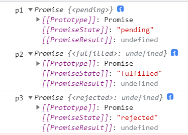
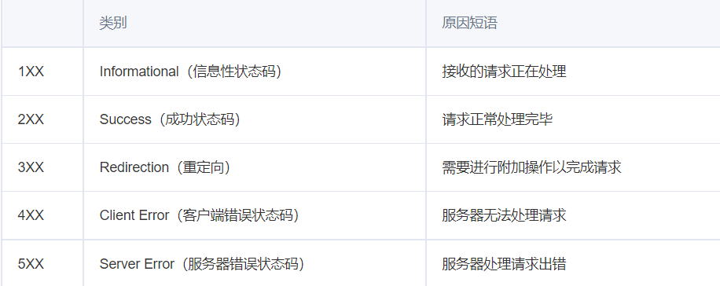

## Lego memorandum

### Gitlab

`username: cn8NanHu`
`p:  Welcome12345678`

### Lego login

`userName: lingcsy1983@aliyun.com`

`password:4510679560228883`

`code:20211234`

## useState,useEffect

函数组件代替 class 组件，函数组件还是会面临**两个问题**：

- 函数组件没有 state  ----`useState()`
- 函数组件没有生命周期  -----`useEffect()`

```react
const [n, setN] = React.useState(0);
const [n, setN] = React.useState(()=>{
	console.log('这里也可以是一个函数')	
})
//useState()返回一个数组，第一个是读，第二个是写
//useState()里的函数只会执行一次，即使组件再渲染
```

```react
useEffect(()=>{
  console.log('第一个参数是函数')
},[n])
// useEffect() 方法接收两个参数，第一个参数是函数，
// 第二个参数的设置决定useEffect()模拟的生命钩子
```

### useState()

#### state

State是一个组件的UI数据模型，是组件渲染时的数据依据，state是私有的，可以认为state是组件的`私有属性`

#### State 的更新是异步的

- 调用setState后，setState会把要修改的状态放入一个队列中（因而 组件的state并不会立即改变）；
- 之后React 会优化真正的执行时机，来优化性能，所以优化过程中有可能会将多个 setState 的状态修改合并为一次状态修改，因而state更新是异步的。
- 所以不要依赖当前的State，计算下个State。当真正执行状态修改时，依赖的this.state并不能保证是最新的State，因为React会把多次State的修改合并成一次，这时，this.state将还是这几次State修改前的State。
- 另外需要注意的是，同样不能依赖当前的Props计算下个状态，因为Props一般也是从父组件的State中获取，依然无法确定在组件状态更新时的值。

#### useState做了哪些事？

```react
 const Demo = ()=> {
      const [n,setN] = React.useState(0)
      return <div>
        {n}
        <button onClick={()=> {setN(n+1)}}>点我+1</button>
      </div>
    }
    const rootElement = document.getElementById("app")
    ReactDOM.render(<Demo />, rootElement);
```

首次渲染：

render()------得到Demo组件------调用Demo组件------得到虚拟div------创建真实的div

点击button后：

调用setN(n+1)------再次render()------得到Demo组件------调用Demo组件------得到虚拟div------使用DOM Diff对比------更新真实的div

### useEffect()

模拟生命周期

- 模拟 `componentDidMount`：

  *第一次渲染时*

  useEffect((）=> {console.log（'第一次渲染）}，[ ]）。第二个参数为**空数组**

- 模拟 `componentDidUpdate`：

  ​		*数据变更时调用*

  - useEffect((）=> {console.log（'任意属性变更）}。第二个参数为**空**（监听所有state）
  - useEffect((）=> {console.log（'n变了‘）}，[n]）。第二个参数为要组件上的**变量**。（监听这个变量）

- 模拟 `componentWillUnmount`：

  *组件将要销毁时*

  useEffect() 的第一个参数的返回的是函数时，会在组件要销毁时调用。

## Promise

promise是异步编程的一种解决方案

语法上：Promise是一个对象，可以获取异步操作的消息

本   意：承诺，一段时间给出一个结果

Promise有三种状态：

`pending(等待态)`    `fulfiled(成功态)`   `rejected(失败态)`

状态一旦改变，就不会再变

Promise实例创建后 会`立即执行`，无法中途取消

### 解决的问题

- `回调地狱`，代码难以维护， 常常第一个的函数的输出是第二个函数的输入这种现象
- promise可以支持多个`并发的请求`，获取并发请求中的数据
- 这个promise可以解决`异步`的问题，本身不能说promise是异步的

### 基本用法

`Promise`构造函数接受一个函数作为参数，该函数的两个参数分别是`resolve`和`reject`。它们是两个函数，由 JavaScript 引擎提供，不用自己部署。

`resolve`函数的作用是，将`Promise`对象的状态从“未完成”变为“成功”（即从 pending 变为 resolved），在异步操作成功时调用，并将异步操作的结果，作为参数传递出去

`reject`函数的作用是，将`Promise`对象的状态从“未完成”变为“失败”（即从 pending 变为 rejected），在异步操作失败时调用，并将异步操作报出的错误，作为参数传递出去。

```js
// pending
const p1 = new Promise((resolve, reject) => {});
console.log('p1', p1);
// pending -> resolved
const p2 = new Promise((resolve, reject) => {
  resolve();
});
console.log('p2', p2);
// pending -> reject
const p3 = new Promise((resolve, reject) => {
  reject();
});
console.log('p3', p3);
```

 

### Promise.prototype.then()

`then`方法可以接受两个回调函数作为参数。在状态变更后执行

- 第一个回调函数是`Promise`对象的状态变为`resolved`时调用
- 第二个回调函数是`Promise`对象的状态变为`rejected`时调用。
- 这两个函数都是可选的，不一定要提供。
- 它们都接受`Promise`对象传出的值作为参数。、
- `then`方法指定的回调函数是异步的

- `then`方法返回的是一个新的`Promise`实例。因此可以采用链式写法，即`then`方法后面再调用另一个`then`方法

### Promise.prototype.catch()

`Promise.prototype.catch()`方法是`.then(null, rejection)`或`.then(undefined, rejection)`的别名，用于指定发生错误时的回调函数。


```js
const p1 = Promise.resolve();
console.log('p1', p1);
// 没有抛出异常，promise.then/promise.catch 返回的resolved状态的promise
const res1 = p1.then(() => {
  console.log('p1 then');
});
setTimeout(() => {
  console.log('res1', res1);
});
// 抛出异常，promise.then/promise.catch 返回的rejected状态的promise
const res2 = p1.then(() => {
  throw new Error('err');
});
setTimeout(() => {
  console.log('res2', res2);
});
```

```js
const p = Promise.resolve();
p.then(() => {
  console.log(1);
  throw new Error();
 })
 .catch(() => {
  console.log(2);
 })
 .then(() => {
   console.log(3);
 });
//1
//2
//3
```


### Promise.prototype.finally()

`finally()`方法用于指定不管 Promise 对象最后状态是`resolved`还是`rejected`，都会执行的操作。

- `finally`方法的回调函数不接受任何参数，这意味着没有办法知道，前面的 Promise 状态到底是`fulfilled`还是`rejected`。

  这表明，`finally`方法里面的操作，应该是与状态无关的，不依赖于 Promise 的执行结果。

- `finally`本质上是`then`方法的特例。
- `finally`在promise对象为`pending`时不执行。

```js
promise.finally(()=>{
	//操作语句
})
//等同于
promise.then(
	(result)=>{ return result},
	(error)=>{ throw error}	
)
```


### Promise.all()

`Promise.all()`方法用于将多个 Promise 实例，包装成一个新的 Promise 实例。

- 

## HTTP请求状态码




## 挂载

*将组件渲染，并且构造 DOM 元素然后塞入页面的过程称为组件的挂载*


## Array

### forEach()

`forEach()` 方法对数组的每个元素执行一次给定的函数。

```js
const items = ['item1', 'item2', 'item3'];
const copy = [];

// before
for (let i=0; i<items.length; i++) {
  copy.push(items[i]);
}

// after
items.forEach(function(item){
  copy.push(item);
});
```


## 本地存储

### cookie

#### 使用方式


### localStorage


### sessionStorage


## TypeScript

### 简介

`TypeScript`是`JavaScript`的`超集`

TS 与 JS 的关系 如同 Less/Sass 与 css的关系

就像Less/Sass是对CSS进行扩展一样, TS也是对JS进行扩展

就像Less/Sass最终会转换成CSS一样, 我们编写好的TS代码最终也会换成JS

### 为什么需要TypeScript？

`JavaScript`是`弱类型`, 很多错误只有在运行时才会被发现

`TypeScript`提供了一套`静态检测机制`, 可以帮助我们在编译时就发现错误

#### 运行时 

所谓运行时就是代码跑起来了,被装载到`内存`中去了

#### 编译时

`编译`，就是编译器帮你把源代码翻译成机器能识别的代码，这时的错误就叫编译时错误,这个过程中做的啥类型检查也就叫编译时类型检查,或`静态类型检查`(所谓静态嘛就是没把真把代码放内存中运行起来,而只是把代码当作文本来扫描下)

### TypeScript特点

- 支持最新的JavaScript新特特性
- 支持代码静态检查
- 支持诸如C,C++,Java,Go等后端语言中的特性 (枚举、泛型、类型转换、命名空间、声明文件、类、接口等)

### 搭建环境

#### 安装最新版typescript

```git
npm i -g typescript
```

#### 安装ts-node

```
npm i -g ts-node
```

#### 创建一个 tsconfig.json 文件

```
tsc --init
```

**然后新建index.ts,输入相关练习代码，然后执行 ts-node index.ts**

**官方也提供了一个在线开发 TypeScript 的云环境——[Playground](https://link.juejin.cn/?target=https%3A%2F%2Fwww.typescriptlang.org%2Fzh%2Fplay)。**


### 基本数据类型

```tsx
//JS 原始数据类型
let str: string = "jack";
let num: number = 24;
let bool: boolean = false;
let u: undefined = undefined;
let n: null = null;
let big: bigint = 100n;
let sym: symbol = Symbol("me"); 
// JS 引用数据类型
let obj: object = {x: 1};
```

#### Tips：

默认情况下 `null` 和 `undefined` 是所有类型的子类型。 就是说你可以把 `null` 和 `undefined` 赋值给其他类型。

严格模式下 `"strictNullChecks":true` ，`null` 和 `undefined` 只能赋值给 `void` 和它们各自的类型。

类型不兼容 ts(2322)错误


### 其他类型


## git运作机制

### `.git` 文件夹创建

任意文件夹中，用 `git init` 命令初始化仓库，即可在此文件夹下创建 `.git` 文件夹（`.`打头为隐藏文件夹，所以平时可能看不到）。这个文件夹之外的部分叫做工作区（Working Directory），`.git` 文件夹我们称做 Git仓库 (Git Repository)。

### `.git` 结构

#### 1. 文件 COMMIT_EDITMSG


此文件是一个临时文件，存储最后一次提交的信息内容，`git commit` 命令之后打开的编辑器就是在编辑此文件，而你退出编辑器后，`git` 会把此文件内容写入 commit 记录。

实际应用： `git pull` 远程仓库后，新增了很多提交，淹没了本地提交记录，直接 `cat .git/COMMIT_EDITMSG` 就可以弄清楚最后工作的位置了

#### 2. 文件 HEAD

此文件**永远**存储当前位置指针，就像 linux 中的 `$PWD` 变量和命令提示符的箭头一样，永远指向当前位置，表明当前的工作位置。在 `git` 中 `HEAD` 永远指向当前正在工作的那个 `commit`。

