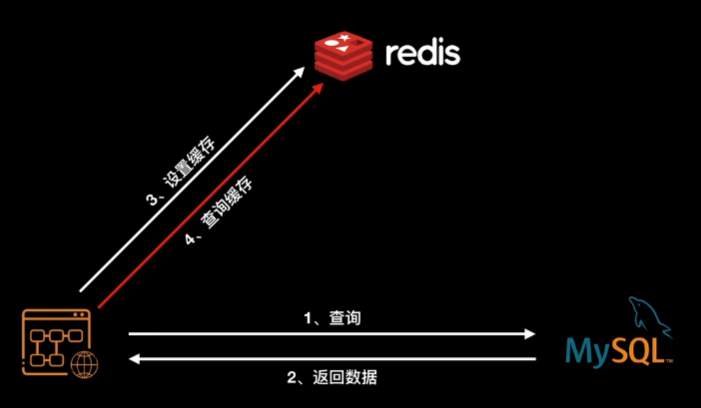
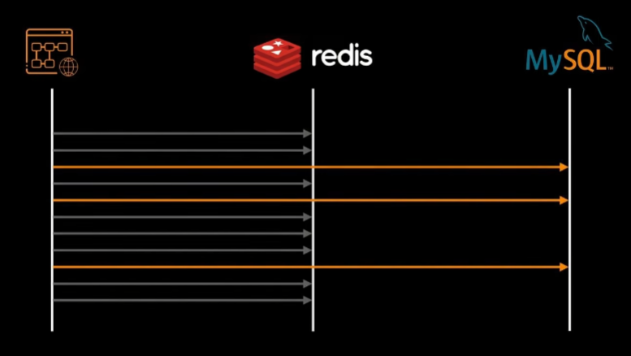
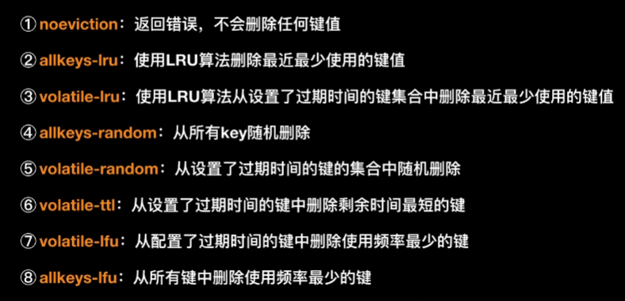

# Redis

## 简介

Redis是一个开源的**内存**中的数据结构存储系统，它可以用作：数据库、缓存和消息中间件。

Redis是用C语言开发的一个开源的高性能**键值对**(key-value)数据库，官方提供的数据是可以达到100000+的QPS（每秒内查询次数）。它存储的value类型比较丰富，也被称为结构化的NoSql数据库。

**NoSql（**Not Only SQL），不仅仅是SQL，泛指**非关系型数据库**。NoSql数据库并不是要取代关系型数据库，而是关系型数据库的补充。

## 背景

请求中含有大量读操作，并且经常都是重复查询一个东西，浪费了很多时间去进行磁盘I/O

参考CPU的三级缓存，诞生了redis这个缓存技术

## 发展

redis将登记的数据存入内存中，应用程序再次执行时，不再去执行慢如蜗牛的I/O操作

成果，为MySQL挡住了许多重复的查询操作

### 问题一

> 由于此时redis将数据存在内存中，随着程序的运行，缓存的数据越来越多，迟早会把内存占满

解决方案：

给缓存内容设置一个超时时间，具体设置多少时间由应用程序自己决定

redis负责将过期内容从内存中删除掉，及时腾出空间来`定期删除`

频率为 ： 次/100ms

但是由于数据量大，不可能每次都将所有数据扫描一遍，redis 采用的随机算法去`随机选择`部分数据删除。

### 问题二

> 但是**随机删除又存在问题**，就是可能会出现某些个运气比较好，每次都没有被随机算法选中。

于是针对这个情况，在原来 定期删除 的基础上，又加了一招：

那些逃脱随机选择算法的键值，一旦遇到查询请求，同时又发现超期的话，就会被删除。这种方式因为是被动式触发的，不查询就不会发生，因此也叫`惰性删除`

### 问题三

> 任然有部分键值，既逃脱了随机选择，又一直没有被查询，就没有被删除

对此，redis 提出了`八大内存淘汰策略`，如下：

缓存穿透