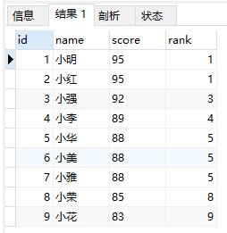
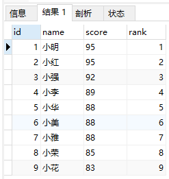

*2022/7/25  ~ 2022/7/28*

# SQL教程

SQL是结构化查询语言的缩写，用来访问和操作数据库系统。SQL语句既可以查询数据库中的数据，也可以添加、更新和删除数据库中的数据，还可以对数据库进行管理和维护操作。不同的数据库，都支持SQL，这样，我们通过学习SQL这一种语言，就可以操作各种不同的数据库。

## NoSQL

`NoSQL`数据库，也就是非SQL的数据库，包括`MongoDB`、`Cassandra`、`Dynamo`等等，它们都不是关系数据库

`NoSQL`数据库作为`SQL`数据库的补充，两者不是二选一的问题，而是`主从`关系。

## 关系

## 数据库

### 数据模型

数据库按照数据结构来组织、存储和管理数据，实际上，数据库一共有三种模型：

- 层次模型
- 网状模型
- 关系模型

为什么关系数据库获得了最广泛的应用？

因为相比层次模型和网状模型，关系模型理解和使用起来最简单。

关系数据库的关系模型是基于数学理论建立的。

### 数据类型

对于一个关系表，除了定义每一列的名称外，还需要定义每一列的数据类型。关系数据库支持的标准数据类型包括数值、字符串、时间等:

数值型：NUMBER

字符型：CHAR、VARCHAR

日期型：DATE、TIMESTAMP

说明：

1. 数值型均使用NUMBER类型。

2. 字符型使用CHAR、VARCHAR。

3. 对业务日期等精度要求不高的业务字段使用DATE类型，比如办理日期等。

针对金额字段,万元为单位，字段定义为Number(14,6) 。

## 关系模型

表的每一行称为记录（Record），记录是一个逻辑意义上的数据。

表的每一列称为字段（Column），同一个表的每一行记录都拥有相同的若干字段。

在关系数据库中，关系是通过*主键*和*外键*来维护的

### 主键

对于关系表，有个很重要的约束，就是任意两条记录不能重复。不能重复不是指两条记录不完全相同，而是指能够通过某个字段唯一区分出不同的记录，这个字段被称为`主键`。

选取主键的一个基本原则是：不使用任何业务相关的字段作为主键。

因此，身份证号、手机号、邮箱地址这些看上去可以唯一的字段，均*不可*用作主键。

作为主键最好是完全业务无关的字段，我们一般把这个字段命名为`id`。常见的可作为`id`字段的类型有：

1. 自增整数类型：数据库会在插入数据时自动为每一条记录分配一个自增整数，这样我们就完全不用担心主键重复，也不用自己预先生成主键；
2. 全局唯一GUID类型：使用一种全局唯一的字符串作为主键，类似`8f55d96b-8acc-4636-8cb8-76bf8abc2f57`。GUID算法通过网卡MAC地址、时间戳和随机数保证任意计算机在任意时间生成的字符串都是不同的，大部分编程语言都内置了GUID算法，可以自己预算出主键。

对于大部分应用来说，通常自增类型的主键就能满足需求。我们在`students`表中定义的主键也是`BIGINT NOT NULL AUTO_INCREMENT`类型。

#### 联合主键

关系数据库实际上还允许通过多个字段唯一标识记录，即两个或更多的字段都设置为主键，这种主键被称为联合主键。

对于联合主键，允许一列有重复，只要不是所有主键列都重复即可：

| id_num | id_type | other columns... |
| :----- | :------ | :--------------- |
| 1      | A       | ...              |
| 2      | A       | ...              |
| 2      | B       | ...              |

如果我们把上述表的`id_num`和`id_type`这两列作为联合主键，那么上面的3条记录都是允许的，因为没有两列主键组合起来是相同的。

没有必要的情况下，我们尽量不使用联合主键，因为它给关系表带来了复杂度的上升。

### 外键

一个班级可以有多个学生，在关系模型中，这两个表的关系可以称为“一对多”，即一个`classes`的记录可以对应多个`students`表的记录。

为了表达这种一对多的关系，我们需要在`students`表中加入一列`class_id`，让它的值与`classes`表的某条记录相对应：

| id   | class_id | name | other columns... |
| :--- | :------- | :--- | :--------------- |
| 1    | 1        | 小明 | ...              |
| 2    | 1        | 小红 | ...              |
| 5    | 2        | 小白 | ...              |

这样，我们就可以根据`class_id`这个列直接定位出一个`students`表的记录应该对应到`classes`的哪条记录。

例如：

- 小明的`class_id`是`1`，因此，对应的`classes`表的记录是`id=1`的一班；
- 小红的`class_id`是`1`，因此，对应的`classes`表的记录是`id=1`的一班；
- 小白的`class_id`是`2`，因此，对应的`classes`表的记录是`id=2`的二班。

在`students`表中，通过`class_id`的字段，可以把数据与另一张表关联起来，这种列称为`外键`

外键并不是通过列名实现的，而是通过定义外键约束实现的：

```sql
ALTER TABLE students
ADD CONSTRAINT fk_class_id
FOREIGN KEY (class_id)
REFERENCES classes (id);
```

其中，外键约束的名称`fk_class_id`可以任意，`FOREIGN KEY (class_id)`指定了`class_id`作为外键，`REFERENCES classes (id)`指定了这个外键将关联到`classes`表的`id`列（即`classes`表的主键）。

通过定义外键约束，关系数据库可以保证无法插入无效的数据。即如果`classes`表不存在`id=99`的记录，`students`表就无法插入`class_id=99`的记录。

由于外键约束会降低数据库的性能，大部分互联网应用程序为了追求速度，并不设置外键约束，而是仅靠应用程序自身来保证逻辑的正确性。这种情况下，`class_id`仅仅是一个普通的列，只是它起到了外键的作用而已。

要删除一个外键约束，也是通过`ALTER TABLE`实现的：

```sql
ALTER TABLE students
DROP FOREIGN KEY fk_class_id;
```

还有一些应用会把一个大表拆成两个一对一的表，目的是把经常读取和不经常读取的字段分开，以获得更高的性能。例如，把一个大的用户表分拆为用户基本信息表`user_info`和用户详细信息表`user_profiles`，大部分时候，只需要查询`user_info`表，并不需要查询`user_profiles`表，这样就提高了查询速度。

### 索引

在关系数据库中，如果有上万甚至上亿条记录，在查找记录的时候，想要获得非常快的速度，就需要使用索引。

索引是关系数据库中对某一列或多个列的值进行预排序的数据结构。通过使用索引，可以让数据库系统不必扫描整个表，而是直接定位到符合条件的记录，这样就大大加快了查询速度。

例如，对于`students`表：

| id   | class_id | name | gender | score |
| :--- | :------- | :--- | :----- | :---- |
| 1    | 1        | 小明 | M      | 90    |
| 2    | 1        | 小红 | F      | 95    |
| 3    | 1        | 小军 | M      | 88    |

如果要经常根据`score`列进行查询，就可以对`score`列创建索引：

```sql
ALTER TABLE students
ADD INDEX idx_score (score);
```

使用`ADD INDEX idx_score (score)`就创建了一个名称为`idx_score`，使用列`score`的索引。索引名称是任意的，索引如果有多列，可以在括号里依次写上，例如：

```sql
ALTER TABLE students
ADD INDEX idx_name_score (name, score);
```

索引的效率取决于索引列的值是否散列，即该列的值如果越互不相同，那么索引效率越高。反过来，如果记录的列存在大量相同的值，例如`gender`列，大约一半的记录值是`M`，另一半是`F`，因此，对该列创建索引就没有意义。

可以对一张表创建多个索引。索引的优点是提高了查询效率，缺点是在插入、更新和删除记录时，需要同时修改索引，因此，索引越多，插入、更新和删除记录的速度就越慢。

对于主键，关系数据库会自动对其创建主键索引。使用主键索引的效率是最高的，因为主键会保证绝对唯一。

#### 唯一索引

在设计关系数据表的时候，看上去唯一的列，例如身份证号、邮箱地址等，因为他们具有业务含义，因此不宜作为主键。

但是，这些列根据业务要求，又具有唯一性约束：即不能出现两条记录存储了同一个身份证号。这个时候，就可以给该列添加一个唯一索引。例如，我们假设`students`表的`name`不能重复：

```sql
ALTER TABLE students
ADD UNIQUE INDEX uni_name (name);
```

通过`UNIQUE`关键字我们就添加了一个唯一索引。

也可以只对某一列添加一个唯一约束而不创建唯一索引：

```sql
ALTER TABLE students
ADD CONSTRAINT uni_name UNIQUE (name);
```

这种情况下，`name`列没有索引，但仍然具有唯一性保证。


无论是否创建索引，对于用户和应用程序来说，使用关系数据库不会有任何区别。这里的意思是说，当我们在数据库中查询时，如果有相应的索引可用，数据库系统就会自动使用索引来提高查询效率，如果没有索引，查询也能正常执行，只是速度会变慢。因此，索引可以在使用数据库的过程中逐步优化。

## 查询数据

在关系数据库中，最常用的操作就是查询。

### 基本查询

要查询数据库表的数据，我们使用如下的SQL语句：

```sql
SELECT * FROM <表名>
```

`SELECT`语句其实并不要求一定要有`FROM`子句。

```sql
SELECT 100+200;
// 300
```

上述查询会直接计算出表达式的结果。虽然`SELECT`可以用作计算，但它并不是SQL的强项。但是，不带`FROM`子句的`SELECT`语句有一个有用的用途，就是用来判断当前到数据库的连接是否有效。许多检测工具会执行一条`SELECT 1;`来测试数据库连接。

### 条件查询

条件查询的语法是：

```sql
SELECT * FROM <表名> WHERE <条件表达式>
```

条件表达式可以用`<条件1> AND <条件2>`表达满足条件1并且满足条件2。例如，符合条件“分数在80分或以上”，并且还符合条件“男生”，把这两个条件写出来：

- 条件1：根据score列的数据判断：`score >= 80`；
- 条件2：根据gender列的数据判断：`gender = 'M'`，注意`gender`列存储的是字符串，需要用单引号括起来。

就可以写出`WHERE`条件：`score >= 80 AND gender = 'M'`：

第二种条件是`<条件1> OR <条件2>`，表示满足条件1或者满足条件2。

```sql
SELECT * FROM students WHERE score >= 80 OR gender = 'M';
```

第三种条件是`NOT <条件>`，表示“不符合该条件”的记录。

```sql
SELECT * FROM students WHERE NOT class_id = 2;
```

要组合三个或者更多的条件，就需要用小括号`()`表示如何进行条件运算。例如，编写一个复杂的条件：分数在80以下或者90以上，并且是男生：

```sql
SELECT * FROM students WHERE (score < 80 OR score > 90) AND gender = 'M';
```

如果不加括号，条件运算按照`NOT`、`AND`、`OR`的优先级进行，即`NOT`优先级最高，其次是`AND`，最后是`OR`。加上括号可以改变优先级。

### 投影查询

如果我们只希望返回某些列的数据，而不是所有列的数据，我们可以用`SELECT 列1, 列2, 列3 FROM ...`，让结果集仅包含指定列。这种操作称为投影查询。

```sql
SELECT id, score, name FROM students;
```

### 排序

我们使用SELECT查询时，细心的读者可能注意到，查询结果集通常是按照`id`排序的，也就是根据主键排序。这也是大部分数据库的做法。如果我们要根据其他条件排序怎么办？可以加上`ORDER BY`子句。例如按照成绩从低到高进行排序：

```sql
SELECT id, name, gender, score FROM students ORDER BY score;
```

如果要反过来，按照成绩从高到底排序，我们可以加上`DESC`表示“倒序”：

```sql
SELECT id, name, gender, score FROM students ORDER BY score DESC;
```

如果`score`列有相同的数据，要进一步排序，可以继续添加列名。例如，使用`ORDER BY score DESC, gender`表示先按`score`列倒序，如果有相同分数的，再按`gender`列排序：

```sql
SELECT id, name, gender, score FROM students ORDER BY score DESC, gender;
```

默认的排序规则是`ASC`：“升序”，即从小到大。`ASC`可以省略

如果有`WHERE`子句，那么`ORDER BY`子句要放到`WHERE`子句后面。例如，查询一班的学生成绩，并按照倒序排序：

```sql
SELECT id, name, gender, score
FROM students
WHERE class_id = 1
ORDER BY score DESC;
```

### 分页查询

使用SELECT查询时，如果结果集数据量很大，比如几万行数据，放在一个页面显示的话数据量太大，不如分页显示，每次显示100条。

要实现分页功能，实际上就是从结果集中显示第1~100条记录作为第1页，显示第101~200条记录作为第2页，以此类推。

因此，分页实际上就是从结果集中“截取”出第M~N条记录。这个查询可以通过`LIMIT <N-M> OFFSET <M>`子句实现。我们先把所有学生按照成绩从高到低进行排序：

```sql
SELECT id, name, gender, score FROM students ORDER BY score DESC;
```

现在，我们把结果集分页，每页3条记录。要获取第1页的记录，可以使用`LIMIT 3 OFFSET 0`：

```sql
SELECT id, name, gender, score
FROM students
ORDER BY score DESC
LIMIT 3 OFFSET 0;
```

如果要查询第2页，那么我们只需要“跳过”头3条记录，也就是对结果集从3号记录开始查询，把`OFFSET`设定为3：

```sql
SELECT id, name, gender, score
FROM students
ORDER BY score DESC
LIMIT 3 OFFSET 3;
```

类似的，查询第3页的时候，`OFFSET`应该设定为6:

查询第4页的时候，`OFFSET`应该设定为9:

#### 注意

`OFFSET`是可选的，如果只写`LIMIT 15`，那么相当于`LIMIT 15 OFFSET 0`。

使用`LIMIT <M> OFFSET <N>`分页时，随着`N`越来越大，查询效率也会越来越低。

### 聚合查询

对于统计总数、平均数这类计算，SQL提供了专门的聚合函数，使用聚合函数进行查询，就是聚合查询，它可以快速获得结果。

仍然以查询`students`表一共有多少条记录为例，我们可以使用SQL内置的`COUNT()`函数查询：

```sql
SELECT COUNT(*) FROM students;
```

`COUNT(*)`表示查询所有列的行数，要注意聚合的计算结果虽然是一个数字，但查询的结果仍然是一个二维表，只是这个二维表只有一行一列，并且列名是`COUNT(*)`。

通常，使用聚合查询时，我们应该给列名设置一个别名，便于处理结果：

```sql
SELECT COUNT(*) num FROM students;
```

`COUNT(*)`和`COUNT(id)`实际上是一样的效果。

| 函数 | 说明                                   |
| :--- | :------------------------------------- |
| SUM  | 计算某一列的合计值，该列必须为数值类型 |
| AVG  | 计算某一列的平均值，该列必须为数值类型 |
| MAX  | 计算某一列的最大值                     |
| MIN  | 计算某一列的最小值                     |

注意，`MAX()`和`MIN()`函数并不限于数值类型。如果是字符类型，`MAX()`和`MIN()`会返回排序最后和排序最前的字符。


要特别注意：如果聚合查询的`WHERE`条件没有匹配到任何行，`COUNT()`会返回0，而`SUM()`、`AVG()`、`MAX()`和`MIN()`会返回`NULL`：

```sql
SELECT AVG(score) average FROM students WHERE gender = 'X';
```

#### 分组

如果我们要统计一班的学生数量，我们知道，可以用`SELECT COUNT(*) num FROM students WHERE class_id = 1;`。如果要继续统计二班、三班的学生数量，难道必须不断修改`WHERE`条件来执行`SELECT`语句吗？

对于聚合查询，SQL还提供了“分组聚合”的功能。我们观察下面的聚合查询：

```sql
SELECT COUNT(*) num FROM students GROUP BY class_id;
```

| num  |
| :--- |
| 4    |
| 3    |
| 3    |

执行这个查询，`COUNT()`的结果不再是一个，而是3个，这是因为，`GROUP BY`子句指定了按`class_id`分组，因此，执行该`SELECT`语句时，会把`class_id`相同的列先分组，再分别计算，因此，得到了3行结果。

但是这3行结果分别是哪三个班级的，不好看出来，所以我们可以把`class_id`列也放入结果集中：

```sql
SELECT class_id, COUNT(*) num FROM students GROUP BY class_id;
```

| class_id | num  |
| :------- | :--- |
| 1        | 4    |
| 2        | 3    |
| 3        | 3    |

不出意外，执行这条查询我们会得到一个语法错误，因为在任意一个分组中，只有`class_id`都相同，`name`是不同的，SQL引擎不能把多个`name`的值放入一行记录中。因此，聚合查询的列中，只能放入分组的列。


### 多表查询

SELECT查询不但可以从一张表查询数据，还可以从多张表同时查询数据。查询多张表的语法是：`SELECT * FROM <表1> <表2>`。

例如，同时从`students`表和`classes`表的“乘积”，即查询数据，可以这么写：

```sql
SELECT * FROM students, classes;
```

| id   | class_id | name | gender | score | id   | name |
| :--- | :------- | :--- | :----- | :---- | :--- | :--- |
| 1    | 1        | 小明 | M      | 90    | 1    | 一班 |
| 1    | 1        | 小明 | M      | 90    | 2    | 二班 |
| 1    | 1        | 小明 | M      | 90    | 3    | 三班 |
| 1    | 1        | 小明 | M      | 90    | 4    | 四班 |
| 2    | 1        | 小红 | F      | 95    | 1    | 一班 |
| 2    | 1        | 小红 | F      | 95    | 2    | 二班 |
| 2    | 1        | 小红 | F      | 95    | 3    | 三班 |
| 2    | 1        | 小红 | F      | 95    | 4    | 四班 |
| 3    | 1        | 小军 | M      | 88    | 1    | 一班 |
| 3    | 1        | 小军 | M      | 88    | 2    | 二班 |
| 3    | 1        | 小军 | M      | 88    | 3    | 三班 |
| 3    | 1        | 小军 | M      | 88    | 4    | 四班 |
| 4    | 1        | 小米 | F      | 73    | 1    | 一班 |
| 4    | 1        | 小米 | F      | 73    | 2    | 二班 |
| 4    | 1        | 小米 | F      | 73    | 3    | 三班 |
| 4    | 1        | 小米 | F      | 73    | 4    | 四班 |
| 5    | 2        | 小白 | F      | 81    | 1    | 一班 |
| 5    | 2        | 小白 | F      | 81    | 2    | 二班 |
| 5    | 2        | 小白 | F      | 81    | 3    | 三班 |
| 5    | 2        | 小白 | F      | 81    | 4    | 四班 |
| 6    | 2        | 小兵 | M      | 55    | 1    | 一班 |
| 6    | 2        | 小兵 | M      | 55    | 2    | 二班 |
| 6    | 2        | 小兵 | M      | 55    | 3    | 三班 |
| 6    | 2        | 小兵 | M      | 55    | 4    | 四班 |
| 7    | 2        | 小林 | M      | 85    | 1    | 一班 |
| 7    | 2        | 小林 | M      | 85    | 2    | 二班 |
| 7    | 2        | 小林 | M      | 85    | 3    | 三班 |
| 7    | 2        | 小林 | M      | 85    | 4    | 四班 |
| 8    | 3        | 小新 | F      | 91    | 1    | 一班 |
| 8    | 3        | 小新 | F      | 91    | 2    | 二班 |
| 8    | 3        | 小新 | F      | 91    | 3    | 三班 |
| 8    | 3        | 小新 | F      | 91    | 4    | 四班 |
| 9    | 3        | 小王 | M      | 89    | 1    | 一班 |
| 9    | 3        | 小王 | M      | 89    | 2    | 二班 |
| 9    | 3        | 小王 | M      | 89    | 3    | 三班 |
| 9    | 3        | 小王 | M      | 89    | 4    | 四班 |
| 10   | 3        | 小丽 | F      | 88    | 1    | 一班 |
| 10   | 3        | 小丽 | F      | 88    | 2    | 二班 |
| 10   | 3        | 小丽 | F      | 88    | 3    | 三班 |
| 10   | 3        | 小丽 | F      | 88    | 4    | 四班 |

这种一次查询两个表的数据，查询的结果也是一个二维表，它是`students`表和`classes`表的“乘积”，即`students`表的每一行与`classes`表的每一行都两两拼在一起返回。结果集的列数是`students`表和`classes`表的列数之和，行数是`students`表和`classes`表的行数之积。

这种多表查询又称笛卡尔查询，使用笛卡尔查询时要非常小心，由于结果集是目标表的行数乘积，对两个各自有100行记录的表进行笛卡尔查询将返回1万条记录，对两个各自有1万行记录的表进行笛卡尔查询将返回1亿条记录。

你可能还注意到了，上述查询的结果集有两列`id`和两列`name`，两列`id`是因为其中一列是`students`表的`id`，而另一列是`classes`表的`id`，但是在结果集中，不好区分。两列`name`同理

要解决这个问题，我们仍然可以利用投影查询的“设置列的别名”来给两个表各自的`id`和`name`列起别名：

```sql
SELECT
    students.id sid,
    students.name,
    students.gender,
    students.score,
    classes.id cid,
    classes.name cname
FROM students, classes;
```

| sid  | name | gender | score | cid  | cname |
| :--- | :--- | :----- | :---- | :--- | :---- |
| 1    | 小明 | M      | 90    | 1    | 一班  |
| 1    | 小明 | M      | 90    | 2    | 二班  |
| 1    | 小明 | M      | 90    | 3    | 三班  |
| 1    | 小明 | M      | 90    | 4    | 四班  |
| 2    | 小红 | F      | 95    | 1    | 一班  |
| 2    | 小红 | F      | 95    | 2    | 二班  |
| 2    | 小红 | F      | 95    | 3    | 三班  |
| 2    | 小红 | F      | 95    | 4    | 四班  |
| 3    | 小军 | M      | 88    | 1    | 一班  |
| 3    | 小军 | M      | 88    | 2    | 二班  |
| 3    | 小军 | M      | 88    | 3    | 三班  |
| 3    | 小军 | M      | 88    | 4    | 四班  |
| 4    | 小米 | F      | 73    | 1    | 一班  |
| 4    | 小米 | F      | 73    | 2    | 二班  |
| 4    | 小米 | F      | 73    | 3    | 三班  |
| 4    | 小米 | F      | 73    | 4    | 四班  |
| 5    | 小白 | F      | 81    | 1    | 一班  |
| 5    | 小白 | F      | 81    | 2    | 二班  |
| 5    | 小白 | F      | 81    | 3    | 三班  |
| 5    | 小白 | F      | 81    | 4    | 四班  |
| 6    | 小兵 | M      | 55    | 1    | 一班  |
| 6    | 小兵 | M      | 55    | 2    | 二班  |
| 6    | 小兵 | M      | 55    | 3    | 三班  |
| 6    | 小兵 | M      | 55    | 4    | 四班  |
| 7    | 小林 | M      | 85    | 1    | 一班  |
| 7    | 小林 | M      | 85    | 2    | 二班  |
| 7    | 小林 | M      | 85    | 3    | 三班  |
| 7    | 小林 | M      | 85    | 4    | 四班  |
| 8    | 小新 | F      | 91    | 1    | 一班  |
| 8    | 小新 | F      | 91    | 2    | 二班  |
| 8    | 小新 | F      | 91    | 3    | 三班  |
| 8    | 小新 | F      | 91    | 4    | 四班  |
| 9    | 小王 | M      | 89    | 1    | 一班  |
| 9    | 小王 | M      | 89    | 2    | 二班  |
| 9    | 小王 | M      | 89    | 3    | 三班  |
| 9    | 小王 | M      | 89    | 4    | 四班  |
| 10   | 小丽 | F      | 88    | 1    | 一班  |
| 10   | 小丽 | F      | 88    | 2    | 二班  |
| 10   | 小丽 | F      | 88    | 3    | 三班  |
| 10   | 小丽 | F      | 88    | 4    | 四班  |

注意，多表查询时，要使用`表名.列名`这样的方式来引用列和设置别名，这样就避免了结果集的列名重复问题。但是，用`表名.列名`这种方式列举两个表的所有列实在是很麻烦，所以SQL还允许给表设置一个别名，让我们在投影查询中引用起来稍微简洁一点：

```sql
SELECT
    s.id sid,
    s.name,
    s.gender,
    s.score,
    c.id cid,
    c.name cname
FROM students s, classes c;
```


### 连接查询

连接查询是另一种类型的多表查询。连接查询对多个表进行JOIN运算，简单地说，就是先确定一个主表作为结果集，然后，把其他表的行有选择性地“连接”在主表结果集上。

例如，我们想要选出`students`表的所有学生信息，可以用一条简单的SELECT语句完成：

```sql
SELECT s.id, s.name, s.class_id, s.gender, s.score FROM students s;
```

| id   | name | class_id | gender | score |
| :--- | :--- | :------- | :----- | :---- |
| 1    | 小明 | 1        | M      | 90    |
| 2    | 小红 | 1        | F      | 95    |
| 3    | 小军 | 1        | M      | 88    |
| 4    | 小米 | 1        | F      | 73    |
| 5    | 小白 | 2        | F      | 81    |
| 6    | 小兵 | 2        | M      | 55    |
| 7    | 小林 | 2        | M      | 85    |
| 8    | 小新 | 3        | F      | 91    |
| 9    | 小王 | 3        | M      | 89    |
| 10   | 小丽 | 3        | F      | 88    |

但是，假设我们希望结果集同时包含所在班级的名称，上面的结果集只有`class_id`列，缺少对应班级的`name`列。

现在问题来了，存放班级名称的`name`列存储在`classes`表中，只有根据`students`表的`class_id`，找到`classes`表对应的行，再取出`name`列，就可以获得班级名称。

这时，连接查询就派上了用场。我们先使用最常用的一种内连接——`INNER JOIN`来实现：

```sql
SELECT s.id, s.name, s.class_id, c.name class_name, s.gender, s.score
FROM students s
INNER JOIN classes c
ON s.class_id = c.id;
```

| id   | name | class_id | class_name | gender | score |
| :--- | :--- | :------- | :--------- | :----- | :---- |
| 1    | 小明 | 1        | 一班       | M      | 90    |
| 2    | 小红 | 1        | 一班       | F      | 95    |
| 3    | 小军 | 1        | 一班       | M      | 88    |
| 4    | 小米 | 1        | 一班       | F      | 73    |
| 5    | 小白 | 2        | 二班       | F      | 81    |
| 6    | 小兵 | 2        | 二班       | M      | 55    |
| 7    | 小林 | 2        | 二班       | M      | 85    |
| 8    | 小新 | 3        | 三班       | F      | 91    |
| 9    | 小王 | 3        | 三班       | M      | 89    |
| 10   | 小丽 | 3        | 三班       | F      | 88    |

把内连接查询改成外连接查询

```sql
SELECT s.id, s.name, s.class_id, c.name class_name, s.gender, s.score
FROM students s
RIGHT OUTER JOIN classes c
ON s.class_id = c.id;
```

有RIGHT OUTER JOIN，就有LEFT OUTER JOIN，以及FULL OUTER JOIN。它们的区别是：

INNER JOIN只返回同时存在于两张表的行数据，由于`students`表的`class_id`包含1，2，3，`classes`表的`id`包含1，2，3，4，所以，INNER JOIN根据条件`s.class_id = c.id`返回的结果集仅包含1，2，3。

RIGHT OUTER JOIN返回右表都存在的行。如果某一行仅在右表存在，那么结果集就会以`NULL`填充剩下的字段。

`LEFT OUTER JOIN`则返回左表都存在的行。如果我们给students表增加一行，并添加class_id=5，由于classes表并不存在id=5的行，所以，LEFT OUTER JOIN的结果会增加一行，对应的`class_name`是`NULL`：

使用`FULL OUTER JOIN`，它会把两张表的所有记录全部选择出来，并且，自动把对方不存在的列填充为NULL：

对于这么多种JOIN查询，到底什么使用应该用哪种呢？其实我们用图来表示结果集就一目了然了。

假设查询语句是：

```
SELECT ... FROM tableA ??? JOIN tableB ON tableA.column1 = tableB.column2;
```

我们把tableA看作左表，把tableB看成右表，那么INNER JOIN是选出两张表都存在的记录：


LEFT OUTER JOIN是选出左表存在的记录：


RIGHT OUTER JOIN是选出右表存在的记录：


FULL OUTER JOIN则是选出左右表都存在的记录：


## 修改数据

关系数据库的基本操作就是增删改查，即CRUD：Create、Retrieve、Update、Delete

### INSERT

`INSERT`语句的基本语法是：

```sql
INSERT INTO <表名> (字段1, 字段2, ...) VALUES (值1, 值2, ...);
```

可以一次性添加多条记录，只需要在`VALUES`子句中指定多个记录值，每个记录是由`(...)`包含的一组值：

```sql
INSERT INTO students (class_id, name, gender, score) VALUES
  (1, '大宝', 'M', 87),
  (2, '二宝', 'M', 81);
```


### UPDATE

`UPDATE`语句的基本语法是：

```sql
UPDATE <表名> SET 字段1=值1, 字段2=值2, ... WHERE ...;
```

例如，我们想更新`students`表`id=1`的记录的`name`和`score`这两个字段，先写出`UPDATE students SET name='大牛', score=66`，然后在`WHERE`子句中写出需要更新的行的筛选条件`id=1`：

```sql
UPDATE students SET name='大牛', score=66 WHERE id=1;
```

注意到`UPDATE`语句的`WHERE`条件和`SELECT`语句的`WHERE`条件其实是一样的，因此完全可以一次更新多条记录

```sql
UPDATE students SET name='小牛', score=77 WHERE id>=5 AND id<=7;
```

在`UPDATE`语句中，更新字段时可以使用表达式。例如，把所有80分以下的同学的成绩加10分：

```sql
UPDATE students SET score=score+10 WHERE score<80;
```

如果`WHERE`条件没有匹配到任何记录，`UPDATE`语句不会报错，也不会有任何记录被更新。例如：

```sql
UPDATE students SET score=100 WHERE id=999;
```

最后，要特别小心的是，`UPDATE`语句可以没有`WHERE`条件，例如：

```sql
UPDATE students SET score=60;
```

这时，整个表的所有记录都会被更新。所以，在执行`UPDATE`语句时要非常小心，最好先用`SELECT`语句来测试`WHERE`条件是否筛选出了期望的记录集，然后再用`UPDATE`更新。

在使用MySQL这类真正的关系数据库时，`UPDATE`语句会返回更新的行数以及`WHERE`条件匹配的行数。

### DELETE

`DELETE`语句的基本语法是：

```sql
DELETE FROM <表名> WHERE ...;
```

例如，我们想删除`students`表中`id=1`的记录，就需要这么写：

```sql
DELETE FROM students WHERE id=1;
```

注意到`DELETE`语句的`WHERE`条件也是用来筛选需要删除的行，因此和`UPDATE`类似，`DELETE`语句也可以一次删除多条记录：

```sql
DELETE FROM students WHERE id>=5 AND id<=7;
```

如果`WHERE`条件没有匹配到任何记录，`DELETE`语句不会报错，也不会有任何记录被删除。例如

```sql
DELETE FROM students WHERE id=999;
```

最后，要特别小心的是，和`UPDATE`类似，不带`WHERE`条件的`DELETE`语句会删除整个表的数据：

```sql
DELETE FROM students;
```

这时，整个表的所有记录都会被删除。所以，在执行`DELETE`语句时也要非常小心，最好先用`SELECT`语句来测试`WHERE`条件是否筛选出了期望的记录集，然后再用`DELETE`删除。

在使用MySQL这类真正的关系数据库时，`DELETE`语句也会返回删除的行数以及`WHERE`条件匹配的行数。

## 事务

在执行SQL语句的时候，某些业务要求，一系列操作必须全部执行，而不能仅执行一部分。例如，一个转账操作：

```sql
-- 从id=1的账户给id=2的账户转账100元
-- 第一步：将id=1的A账户余额减去100
UPDATE accounts SET balance = balance - 100 WHERE id = 1;
-- 第二步：将id=2的B账户余额加上100
UPDATE accounts SET balance = balance + 100 WHERE id = 2;
```

这两条SQL语句必须全部执行，或者，由于某些原因，如果第一条语句成功，第二条语句失败，就必须全部撤销。

这种把多条语句作为一个整体进行操作的功能，被称为数据库*事务*。数据库事务可以确保该事务范围内的所有操作都可以全部成功或者全部失败。如果事务失败，那么效果就和没有执行这些SQL一样，不会对数据库数据有任何改动。


可见，数据库事务具有ACID这4个特性：

- A：Atomic，原子性，将所有SQL作为原子工作单元执行，要么全部执行，要么全部不执行；
- C：Consistent，一致性，事务完成后，所有数据的状态都是一致的，即A账户只要减去了100，B账户则必定加上了100；
- I：Isolation，隔离性，如果有多个事务并发执行，每个事务作出的修改必须与其他事务隔离；
- D：Duration，持久性，即事务完成后，对数据库数据的修改被持久化存储。

对于单条SQL语句，数据库系统自动将其作为一个事务执行，这种事务被称为*隐式事务*。


要手动把多条SQL语句作为一个事务执行，使用`BEGIN`开启一个事务，使用`COMMIT`提交一个事务，这种事务被称为*显式事务*，例如，把上述的转账操作作为一个显式事务：

```sql
BEGIN;
UPDATE accounts SET balance = balance - 100 WHERE id = 1;
UPDATE accounts SET balance = balance + 100 WHERE id = 2;
COMMIT;
```

很显然多条SQL语句要想作为一个事务执行，就必须使用显式事务。

`COMMIT`是指提交事务，即试图把事务内的所有SQL所做的修改永久保存。如果`COMMIT`语句执行失败了，整个事务也会失败。

有些时候，我们希望主动让事务失败，这时，可以用`ROLLBACK`回滚事务，整个事务会失败：

```sql
BEGIN;
UPDATE accounts SET balance = balance - 100 WHERE id = 1;
UPDATE accounts SET balance = balance + 100 WHERE id = 2;
ROLLBACK;
```

数据库事务是由数据库系统保证的，我们只需要根据业务逻辑使用它就可以。

### 隔离级别

对于两个并发执行的事务，如果涉及到操作同一条记录的时候，可能会发生问题。因为并发操作会带来数据的不一致性，包括脏读、不可重复读、幻读等。数据库系统提供了隔离级别来让我们有针对性地选择事务的隔离级别，避免数据不一致的问题。

SQL标准定义了4种隔离级别，分别对应可能出现的数据不一致的情况：

| Isolation Level  | 脏读（Dirty Read） | 不可重复读（Non Repeatable Read） | 幻读（Phantom Read） |
| :--------------- | :----------------- | :-------------------------------- | :------------------- |
| Read Uncommitted | Yes                | Yes                               | Yes                  |
| Read Committed   | -                  | Yes                               | Yes                  |
| Repeatable Read  | -                  | -                                 | Yes                  |
| Serializable     |                    |                                   |                      |

**脏读（读取未提交数据）**

**不可重复读（前后多次读取，数据内容不一致）**

**幻读（前后多次读取，数据总量不一致）**

### Read Uncommitted

Read Uncommitted是隔离级别最低的一种事务级别。在这种隔离级别下，一个事务会读到另一个事务更新后但未提交的数据，如果另一个事务回滚，那么当前事务读到的数据就是脏数据，这就是脏读（Dirty Read）。

我们来看一个例子。

首先，我们准备好`students`表的数据，该表仅一行记录：

```
mysql> select * from students;
+----+-------+
| id | name  |
+----+-------+
|  1 | Alice |
+----+-------+
1 row in set (0.00 sec)
```

然后，分别开启两个MySQL客户端连接，按顺序依次执行事务A和事务B：

| 时刻 | 事务A                                             | 事务B                                             |
| :--- | :------------------------------------------------ | :------------------------------------------------ |
| 1    | SET TRANSACTION ISOLATION LEVEL READ UNCOMMITTED; | SET TRANSACTION ISOLATION LEVEL READ UNCOMMITTED; |
| 2    | BEGIN;                                            | BEGIN;                                            |
| 3    | UPDATE students SET name = 'Bob' WHERE id = 1;    |                                                   |
| 4    |                                                   | SELECT * FROM students WHERE id = 1;              |
| 5    | ROLLBACK;                                         |                                                   |
| 6    |                                                   | SELECT * FROM students WHERE id = 1;              |
| 7    |                                                   | COMMIT;                                           |

当事务A执行完第3步时，它更新了`id=1`的记录，但并未提交，而事务B在第4步读取到的数据就是未提交的数据。

随后，事务A在第5步进行了回滚，事务B再次读取`id=1`的记录，发现和上一次读取到的数据不一致，这就是脏读。

可见，在Read Uncommitted隔离级别下，一个事务可能读取到另一个事务更新但未提交的数据，这个数据有可能是脏数据。

### Read Committed

在Read Committed隔离级别下，一个事务可能会遇到不可重复读（Non Repeatable Read）的问题。

不可重复读是指，在一个事务内，多次读同一数据，在这个事务还没有结束时，如果另一个事务恰好修改了这个数据，那么，在第一个事务中，两次读取的数据就可能不一致。

我们仍然先准备好`students`表的数据：

```
mysql> select * from students;
+----+-------+
| id | name  |
+----+-------+
|  1 | Alice |
+----+-------+
1 row in set (0.00 sec)
```

然后，分别开启两个MySQL客户端连接，按顺序依次执行事务A和事务B：

| 时刻 | 事务A                                           | 事务B                                           |
| :--- | :---------------------------------------------- | :---------------------------------------------- |
| 1    | SET TRANSACTION ISOLATION LEVEL READ COMMITTED; | SET TRANSACTION ISOLATION LEVEL READ COMMITTED; |
| 2    | BEGIN;                                          | BEGIN;                                          |
| 3    |                                                 | SELECT * FROM students WHERE id = 1; -- Alice   |
| 4    | UPDATE students SET name = 'Bob' WHERE id = 1;  |                                                 |
| 5    | COMMIT;                                         |                                                 |
| 6    |                                                 | SELECT * FROM students WHERE id = 1; -- Bob     |
| 7    |                                                 | COMMIT;                                         |

当事务B第一次执行第3步的查询时，得到的结果是`Alice`，随后，由于事务A在第4步更新了这条记录并提交，所以，事务B在第6步再次执行同样的查询时，得到的结果就变成了`Bob`，因此，在Read Committed隔离级别下，事务不可重复读同一条记录，因为很可能读到的结果不一致。

### Repeatable Read

在Repeatable Read隔离级别下，一个事务可能会遇到幻读（Phantom Read）的问题。

幻读是指，在一个事务中，第一次查询某条记录，发现没有，但是，当试图更新这条不存在的记录时，竟然能成功，并且，再次读取同一条记录，它就神奇地出现了。

我们仍然先准备好`students`表的数据：

```
mysql> select * from students;
+----+-------+
| id | name  |
+----+-------+
|  1 | Alice |
+----+-------+
1 row in set (0.00 sec)
```

然后，分别开启两个MySQL客户端连接，按顺序依次执行事务A和事务B：

| 时刻 | 事务A                                               | 事务B                                                        |
| :--- | :-------------------------------------------------- | :----------------------------------------------------------- |
| 1    | SET TRANSACTION ISOLATION LEVEL REPEATABLE READ;    | SET TRANSACTION ISOLATION LEVEL REPEATABLE READ;             |
| 2    | BEGIN;                                              | BEGIN;                                                       |
| 3    |                                                     | SELECT * FROM students WHERE id = 99; -- empty               |
| 4    | INSERT INTO students (id, name) VALUES (99, 'Bob'); |                                                              |
| 5    | COMMIT;                                             |                                                              |
| 6    |                                                     | SELECT * FROM students WHERE id = 99; -- empty               |
| 7    |                                                     | UPDATE students SET name = 'Alice' WHERE id = 99; -- 1 row affected |
| 8    |                                                     | SELECT * FROM students WHERE id = 99; -- Alice               |
| 9    |                                                     | COMMIT;                                                      |

事务B在第3步第一次读取`id=99`的记录时，读到的记录为空，说明不存在`id=99`的记录。随后，事务A在第4步插入了一条`id=99`的记录并提交。事务B在第6步再次读取`id=99`的记录时，读到的记录仍然为空，但是，事务B在第7步试图更新这条不存在的记录时，竟然成功了，并且，事务B在第8步再次读取`id=99`的记录时，记录出现了。

可见，幻读就是没有读到的记录，以为不存在，但其实是可以更新成功的，并且，更新成功后，再次读取，就出现了。

**关于第六时刻事务B查不到数据的理解：**

可重复读的事务B内查询与开始时刻一致（**快照**），但**本事务**内的更新操作会更新**快照**。因此第六次查询的与一开始的一致，为空，第七步在**本事务**内执行更新操作后就会重新生成一次查询。


### Serializable

Serializable是最严格的隔离级别。在Serializable隔离级别下，所有事务按照次序依次执行，因此，脏读、不可重复读、幻读都不会出现。

虽然Serializable隔离级别下的事务具有最高的安全性，但是，由于事务是串行执行，所以效率会大大下降，应用程序的性能会急剧降低。如果没有特别重要的情景，一般都不会使用Serializable隔离级别。

#### 默认隔离级别

如果没有指定隔离级别，数据库就会使用默认的隔离级别。在MySQL中，如果使用InnoDB，默认的隔离级别是Repeatable Read。


## SQL语法补充

### case ... when ...

```sql
UPDATE salary
SET sex = case sex
WHEN 'f' THEN "m"
ELSE 'f' END
```

### if 表达式

```sql
IF( expr1 , expr2 , expr3 )
```

expr1 的值为 TRUE，则返回值为 expr2 
expr1 的值为FALSE，则返回值为 expr3


### mod取余 

```sql
mod(id,2) = 1 
```

获得奇数id 


### delete 中的自连接

编写一个 SQL 删除语句来 删除 所有重复的电子邮件，只保留一个id最小的唯一电子邮件。

示例 1:

输入: 
Person 表:
+----+------------------+
| id | email            |
+----+------------------+
| 1  | john@example.com |
| 2  | bob@example.com  |
| 3  | john@example.com |
+----+------------------+
输出: 
+----+------------------+
| id | email            |
+----+------------------+
| 1  | john@example.com |
| 2  | bob@example.com  |
+----+------------------+
解释: john@example.com重复两次。我们保留最小的Id = 1。

```sql
delete p1 
from person p1, person p2
where p1.email = p2.email 
and p1.id > p2.id
```


### limit m,n

limit 2,1：跳过2条取出1条数据,即读取第3条数据

limit 2 offset 1：跳过1条取两条，即读取第2,3条


### rank() over(业务逻辑)

作用：查出指定条件后的进行排名，条件相同排名相同，排名间断不连续。

说明：例如学生排名，使用这个函数，成绩相同的两名是并列，下一位同学空出所占的名次。即：1 1 3 4 5 5 7

SELECT id, name, score, rank() over(ORDER BY score DESC) AS 'rank' FROM student 



### dense_rank() over(业务逻辑)

作用：查出指定条件后的进行排名，条件相同排名相同，排名间断不连续。

说明：和rank() over 的作用相同，区别在于dense_rank() over 排名是密集连续的。例如学生排名，使用这个函数，成绩相同的两名是并列，下一位同学接着下一个名次。即：1 1 2 3 4 5 5 6

SELECT id, name, score, dense_rank() over(ORDER BY score DESC) AS 'rank' FROM student 


### row_number() over(业务逻辑)

作用：查出指定条件后的进行排名，条件相同排名也不相同，排名间断不连续。

说明：这个函数不需要考虑是否并列，即使根据条件查询出来的数值相同也会进行连续排序。即：1 2 3 4 5 6

SELECT id, name, score, row_number() over(ORDER BY score DESC) AS 'rank' FROM student 


