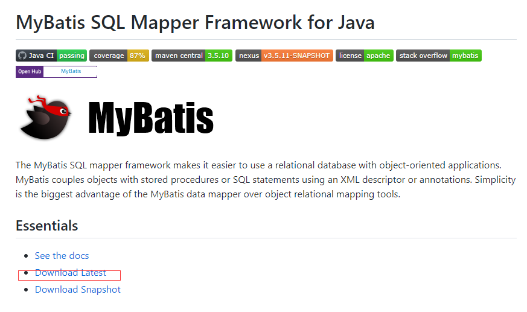
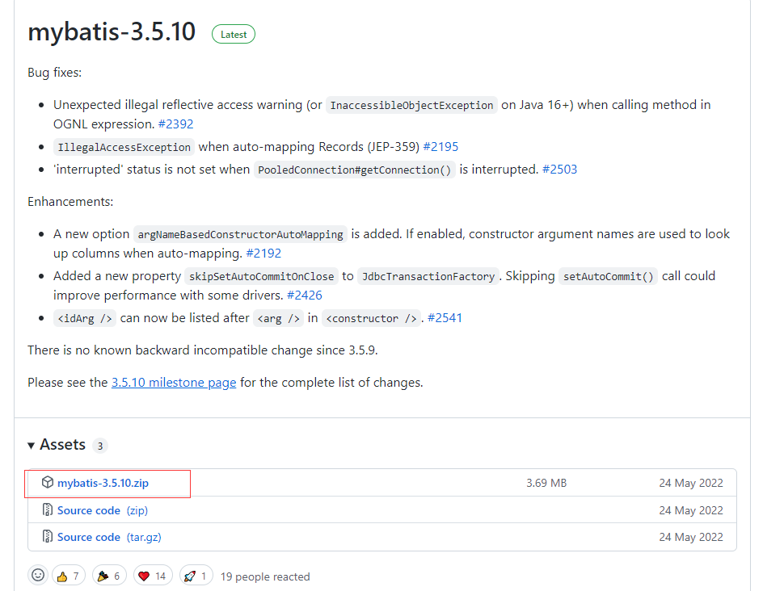

[SSM文档](SSM.assets/SSM整合.pdf)


# Spring

# SpringMVC

# Mybatis

iBatis3.X  -> Mybatis

开源于Github

持久层框架

包括 SQL Maps 和 Data Access Objects （DAO）


## 1、MyBatis简介

###  1.1、MyBatis历史

 MyBatis最初是Apache的一个开源项目iBatis, 2010年6月这个项目由Apache Software Foundation迁 移到了Google Code。随着开发团队转投Google Code旗下， iBatis3.x正式更名为MyBatis。代码于 2013年11月迁移到Github。 iBatis一词来源于“internet”和“abatis”的组合，是一个基于Java的持久层框架。 iBatis提供的持久层框架 包括SQL Maps和Data Access Objects（DAO）。

###  1.2、MyBatis特性

 1） MyBatis 是支持定制化 SQL、存储过程以及高级映射的优秀的持久层框架 2） MyBatis 避免了几乎所有的 JDBC 代码和手动设置参数以及获取结果集 3） MyBatis可以使用简单的XML或注解用于配置和原始映射，将接口和Java的POJO（Plain Old Java Objects，普通的Java对象）映射成数据库中的记录 4） MyBatis 是一个 半自动的ORM（Object Relation Mapping）框架

### 1.3、MyBatis下载

 MyBatis下载地址：https://github.com/mybatis/mybatis-3





### 1.4、和其它持久化层技术对比

- JDBC

  - SQL 夹杂在Java代码中耦合度高，导致硬编码内伤

  - 维护不易且实际开发需求中 SQL 有变化，频繁修改的情况多见

  - 代码冗长，开发效率低

- Hibernate 和 JPA

  - 操作简便，开发效率高

  - 程序中的长难复杂 SQL 需要绕过框架

  - 内部自动生产的 SQL，不容易做特殊优化

  - 基于全映射的全自动框架，大量字段的 POJO 进行部分映射时比较困难。

  - 反射操作太多，导致数据库性能下降

- MyBatis

  - 轻量级，性能出色

  - SQL 和 Java 编码分开，功能边界清晰。Java代码专注业务、SQL语句专注数据

  - 开发效率稍逊于HIbernate，但是完全能够

## 2、搭建MyBatis

### 2.1、开发环境

IDE：idea 2019.2
构建工具：maven 3.5.4
MySQL版本：MySQL 8
MyBatis版本：MyBatis 3.5.7

> MySQL不同版本的注意事项
>
> 1、驱动类driver-class-name
>
> MySQL 5版本使用jdbc5驱动，驱动类使用：com.mysql.jdbc.Driver
> MySQL 8版本使用jdbc8驱动，驱动类使用：com.mysql.cj.jdbc.Driver
>
> 2、连接地址url
>
> MySQL 5版本的url：
> jdbc:mysql://localhost:3306/ssm
> MySQL 8版本的url：
> jdbc:mysql://localhost:3306/ssm?serverTimezone=UTC
> 否则运行测试用例报告如下错误：
> java.sql.SQLException: The server time zone value '?D1ú±ê×?ê±??' is unrecognized or
> represents more


### 2.2、创建maven工程

1. 打包方式：jar

2. 引入依赖

```xml
<dependencies>
<!-- Mybatis核心 -->
    <dependency>
        <groupId>org.mybatis</groupId>
        <artifactId>mybatis</artifactId>
        <version>3.5.7</version>
    </dependency>
<!-- junit测试 -->
	<dependency>
        <groupId>junit</groupId>
        <artifactId>junit</artifactId>
        <version>4.12</version>
        <scope>test</scope>
    </dependency>
    <!-- MySQL驱动 -->
    <dependency>
        <groupId>mysql</groupId>
        <artifactId>mysql-connector-java</artifactId>
        <version>8.0.16</version>
    </dependency>
</dependencie>
```

### 2.3、创建MyBatis的核心配置文件

> 习惯上命名为mybatis-config.xml，这个文件名仅仅只是建议，并非强制要求。将来整合Spring
> 之后，这个配置文件可以省略，所以大家操作时可以直接复制、粘贴。
> 核心配置文件主要用于配置连接数据库的环境以及MyBatis的全局配置信息
> 核心配置文件存放的位置是src/main/resources目录下

```xml
<?xml version="1.0" encoding="UTF-8" ?>
<!DOCTYPE configuration
    PUBLIC "-//mybatis.org//DTD Config 3.0//EN"
    "http://mybatis.org/dtd/mybatis-3-config.dtd">
<configuration>
    <!--设置连接数据库的环境-->
    <environments default="development">
        <environment id="development">
            <transactionManager type="JDBC"/>
            <dataSource type="POOLED">
                <property name="driver" value="com.mysql.cj.jdbc.Driver"/>
                <property name="url" value="jdbc:mysql://localhost:3306/ssm?
                serverTimezone=UTC"/>
                <property name="username" value="root"/>
                <property name="password" value="123456"/>
            </dataSource>
        </environment>
    </environments>
<!--引入映射文件-->
    <mappers>
        <package name="mappers/UserMapper.xml"/>
    </mappers>
</configuration>
```

### 2.4、创建mapper接口

> MyBatis中的mapper接口相当于以前的dao。但是区别在于，mapper仅仅是接口，我们不需提供实现类

```java
public interface UserMapper {
    /**
     * 添加用户信息
     */
    int insertUser()
```

### 2.5、创建MyBatis的映射文件

相关概念：**ORM**（Object Relationship Mapping）对象关系映射。 

- 对象：Java的实体类对象 

- 关系：关系型数据库 

- 映射：二者之间的对应关系

| Java概念 | 数据库概念 |
| -------- | ---------- |
| 类       | 表         |
| 属性     | 字段/列    |
| 对象     | 记录/行    |

> 1、映射文件的命名规则：
>
> 表所对应的实体类的类名+Mapper.xml 
>
> 例如：表t_user，映射的实体类为User，所对应的映射文件为UserMapper.xml 
>
> 因此一个映射文件对应一个实体类，对应一张表的操作 
>
> MyBatis映射文件用于编写SQL，访问以及操作表中的数据 
>
> MyBatis映射文件存放的位置是src/main/resources/mappers目录下 
>
> 2、 MyBatis中可以面向接口操作数据，要保证两个一致： 
>
> a> mapper接口的全类名和映射文件的命名空间（namespace）保持一致 
>
> b> mapper接口中方法的方法名和映射文件中编写SQL的标签的id属性保持一致

```xml
?xml version="1.0" encoding="UTF-8" ?>
<!DOCTYPE mapper
    PUBLIC "-//mybatis.org//DTD Mapper 3.0//EN"
    "http://mybatis.org/dtd/mybatis-3-mapper.dtd">
<mapper namespace="com.atguigu.mybatis.mapper.UserMapper">
    <!--int insertUser();-->
    <insert id="insertUser">
        insert into t_user values(null,'admin','123456',23,'男','12345@qq.com')
    </insert>
</mapper>
```

### 2.6、通过junit测试功能

```java
//读取MyBatis的核心配置文件
InputStream is = Resources.getResourceAsStream("mybatis-config.xml");
//创建SqlSessionFactoryBuilder对象
SqlSessionFactoryBuilder sqlSessionFactoryBuilder = new
SqlSessionFactoryBuilder();
//通过核心配置文件所对应的字节输入流创建工厂类SqlSessionFactory，生产SqlSession对象
SqlSessionFactory sqlSessionFactory = sqlSessionFactoryBuilder.build(is);
//创建SqlSession对象，此时通过SqlSession对象所操作的sql都必须手动提交或回滚事务
//SqlSession sqlSession = sqlSessionFactory.openSession();
//创建SqlSession对象，此时通过SqlSession对象所操作的sql都会自动提交
SqlSession sqlSession = sqlSessionFactory.openSession(true);
//通过代理模式创建UserMapper接口的代理实现类对象
UserMapper userMapper = sqlSession.getMapper(UserMapper.class);
//调用UserMapper接口中的方法，就可以根据UserMapper的全类名匹配元素文件，通过调用的方法名匹配
映射文件中的SQL标签，并执行标签中的SQL语句
int result = userMapper.insertUser();
//sqlSession.commit();
System.out.println("结果："+result);
```


> - SqlSession：代表Java程序和数据库之间的会话。（HttpSession是Java程序和浏览器之间的 会话）
> - SqlSessionFactory：是“生产”SqlSession的“工厂”。
> -  工厂模式：如果创建某一个对象，使用的过程基本固定，那么我们就可以把创建这个对象的 相关代码封装到一个“工厂类”中，以后都使用这个工厂类来“生产”我们需要的对象。

### 2.7、加入log4j日志功能

1. 加入依赖

```xml
!-- log4j日志 -->
<dependency>
    <groupId>log4j</groupId>
    <artifactId>log4j</artifactId>
    <version>1.2.17</version>
</dependency>
```

2. 加入log4j的配置文件.

> log4j的配置文件名为log4j.xml，存放的位置是src/main/resources目录下

```xml
<?xml version="1.0" encoding="UTF-8" ?>
<!DOCTYPE log4j:configuration SYSTEM "log4j.dtd">
<log4j:configuration xmlns:log4j="http://jakarta.apache.org/log4j/">
    <appender name="STDOUT" class="org.apache.log4j.ConsoleAppender">
        <param name="Encoding" value="UTF-8" />
        <layout class="org.apache.log4j.PatternLayout">
            <param name="ConversionPattern" value="%-5p %d{MM-dd HH:mm:ss,SSS}
            %m (%F:%L) \n" />
        </layout>
    </appender>
    <logger name="java.sql">
        <level value="debug" />
    </logger>
    <logger name="org.apache.ibatis">
        <level value="info" />
    </logger>
    <root>
        <level value="debug" />
        <appender-ref ref="STDOUT" />
    </root>
</log4j:configuration>
```

> 日志的级别 FATAL(致命)>ERROR(错误)>WARN(警告)>INFO(信息)>DEBUG(调试) 从左到右打印的内容越来越详细

## 3、核心配置文件详解

> 核心配置文件中的标签必须按照固定的顺序： 
>
> properties?,settings?,typeAliases?,typeHandlers?,objectFactory?,objectWrapperFactory?,refl ectorFactory?,plugins?,environments?,databaseIdProvider?,mappers?

```xml
<?xml version="1.0" encoding="UTF-8" ?>
<!DOCTYPE configuration
    PUBLIC "-//mybatis.org//DTD Config 3.0//EN"
    "http://mybatis.org/dtd/mybatis-3-config.dtd">
<configuration>
    <!--
    MyBatis核心配置文件中，标签的顺序：
    properties?,settings?,typeAliases?,typeHandlers?,
    objectFactory?,objectWrapperFactory?,reflectorFactory?,
    plugins?,environments?,databaseIdProvider?,mappers?
    -->
    <!--引入properties文件-->
    <properties resource="jdbc.properties" />
    <!--设置类型别名-->
    <typeAliases>
        <!--
        typeAlias：设置某个类型的别名
        属性：
        type：设置需要设置别名的类型
        alias：设置某个类型的别名，若不设置该属性，那么该类型拥有默认的别名，即类名
        且不区分大小写
        -->
        <!--<typeAlias type="com.atguigu.mybatis.pojo.User"></typeAlias>-->
        <!--以包为单位，将包下所有的类型设置默认的类型别名，即类名且不区分大小写-->
        <package name="com.atguigu.mybatis.pojo"/>
    </typeAliases>
    <!--
    environments：配置多个连接数据库的环境
    属性：
    default：设置默认使用的环境的id
    -->
    <environments default="development">
        <!--
            environment：配置某个具体的环境
            属性：
                id：表示连接数据库的环境的唯一标识，不能重复
        -->
        <environment id="development">
            <!--
                transactionManager：设置事务管理方式
                属性：
                type="JDBC|MANAGED"
                JDBC：表示当前环境中，执行SQL时，使用的是JDBC中原生的事务管理方式，事
                务的提交或回滚需要手动处理
                MANAGED：被管理，例如Spring
            -->
            <transactionManager type="JDBC"/>
            <!--
            dataSource：配置数据源
            属性：
            type：设置数据源的类型
            type="POOLED|UNPOOLED|JNDI"
            POOLED：表示使用数据库连接池缓存数据库连接
            UNPOOLED：表示不使用数据库连接池
            JNDI：表示使用上下文中的数据源
            -->
            <dataSource type="POOLED">
                <!--设置连接数据库的驱动-->
                <property name="driver" value="${jdbc.driver}"/>
                <!--设置连接数据库的连接地址-->
                <property name="url" value="${jdbc.url}"/>
                <!--设置连接数据库的用户名-->
                <property name="username" value="${jdbc.username}"/>
                <!--设置连接数据库的密码-->
                <property name="password" value="${jdbc.password}"/>
            </dataSource>
        </environment>
        <environment id="test">
            <transactionManager type="JDBC"/>
            <dataSource type="POOLED">
                <property name="driver" value="com.mysql.cj.jdbc.Driver"/>
                <property name="url"
                value="jdbc:mysql://localhost:3306/ssmserverTimezone=UTC"/>
                <property name="username" value="root"/>
                <property name="password" value="123456"/>
            </dataSource>
        </environment>
    </environments>
    <!--引入映射文件-->
    <mappers>	
        <!--<mapper resource="mappers/UserMapper.xml"/>-->
        <!--
        以包为单位引入映射文件
        要求：
        1、mapper接口所在的包要和映射文件所在的包一致
        2、mapper接口要和映射文件的名字一致
        -->
     	<package name="com.atguigu.mybatis.mapper"/>
    </mappers>
```


## 4、MyBatis的增删改查

### 4.1、新增 

```xml
!--int insertUser();-->
<insert id="insertUser">
    insert into t_user values(null,'admin','123456',23,'男')
</insert>
```

### 4.2、删除 

```xml
<!--int deleteUser();-->
<delete id="deleteUser">
    delete from t_user where id = 7
</delete>
```

### 4.3、修改 

```xml
<!--int updateUser();-->
<update id="updateUser">
    update t_user set username='ybc',password='123' where id = 6
</update>
```

### 4.4、查询一个实体类对象 

```xml
<!--User getUserById();-->
<select id="getUserById" resultType="com.atguigu.mybatis.bean.User">
    select * from t_user where id = 2
</select>
```

### 4.5、查询list集合

```xml
<!--List<User> getUserList();-->
<select id="getUserList" resultType="com.atguigu.mybatis.bean.User">
    select * from t_user
</select>
```

>  注意： 
>
> 查询的标签select必须设置属性resultType或resultMap，用于设置实体类和数据库表的映射关系 
>
> resultType：自动映射，用于属性名和表中字段名一致的情况 
>
> resultMap：自定义映射，用于一对多或多对一或字段名和属性名不一致的情况

## 5、MyBatis获取参数值的两种方式

> MyBatis获取参数值的两种方式：${}和#{}
>
> ${}的本质就是字符串拼接，#{}的本质就是占位符赋值 
>
> ${}使用字符串拼接的方式拼接sql，若为字符串类型或日期类型的字段进行赋值时，需要手动加单引号；但是#{}使用占位符赋值的方式拼接sql，此时为字符串类型或日期类型的字段进行赋值时， 可以自动添加单引号


### 5.1、单个字面量类型的参数 

> 若mapper接口中的方法参数为单个的字面量类型 
>
> 此时可以使用${}和#{}以任意的名称获取参数的值，注意${}需要手动加单引号 

### 5.2、多个字面量类型的参数 

> 若mapper接口中的方法参数为多个时 
>
> 此时MyBatis会自动将这些参数放在一个map集合中，以arg0,arg1...为键，以参数为值；以 param1,param2...为键，以参数为值；因此只需要通过${}和#{}访问map集合的键就可以获取相 对应的值，注意${}需要手动加单引号

### 5.3、map集合类型的参数 

> 若mapper接口中的方法需要的参数为多个时
>
> 此时可以手动创建map集合，将这些数据放在 map中 只需要通过${}和#{}访问map集合的键就可以获取相对应的值，注意${}需要手动加单引号 

### 5.4、实体类类型的参数 

> 若mapper接口中的方法参数为实体类对象时 
>
> 此时可以使用${}和#{}，通过访问实体类对象中的属性名获取属性值，注意${}需要手动加单引号 

### 5.5、使用@Param标识参数 

> 可以通过@Param注解标识mapper接口中的方法参数
>
> 此时，会将这些参数放在map集合中，以@Param注解的value属性值为键，以参数为值；以 param1,param2...为键，以参数为值；只需要通过${}和#{}访问map集合的键就可以获取相对应 的值
>
>  注意${}需要手动加单引号


