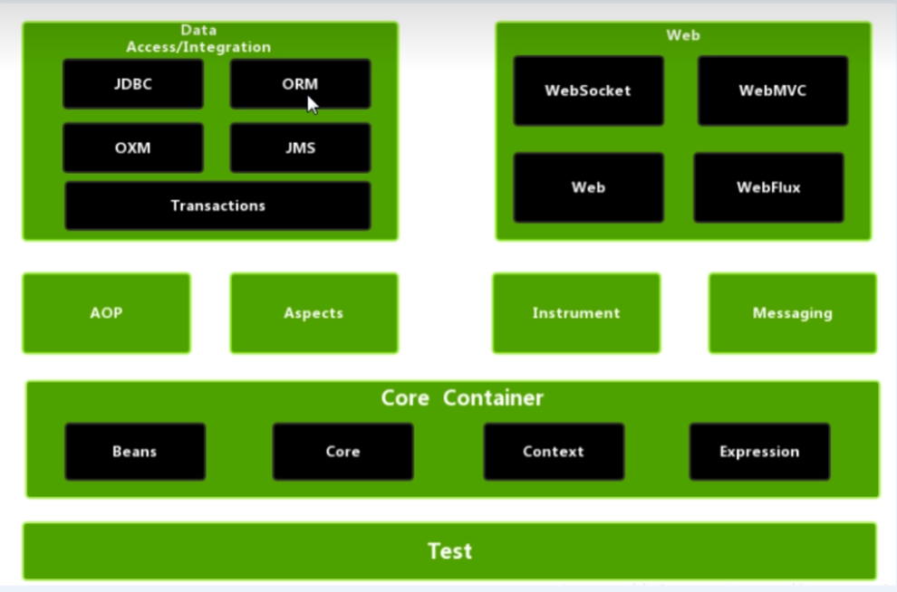

# Spring



Spring 是一个轻量级的 J2EE 开发框架。Spring 的核心是控制反转(**IOC**)和面向切面编程(**AOP**)。

Spring 主要有如下**优点**：

1.解耦，简化开发

2.AOP的支持

3.方便程序测试

4.方便集成各种框架

5.降低API开发难度

6.方便进行事务管理

7.利于学习设计模式，java源码

## IoC

把创建对象过程交给Spring进行管理

全称 Inversion of Control，意思是**控制反转**。它是 Spring 框架中的一种思想。

**控制反转就是将`对象的控制权`从程序中的代码`转移`到了 Spring 的工厂，通过 Spring 的工厂完成对象的创建以及赋值。**


也就是说之前是我们自己 new 对象、给对象中的成员变量赋值。现在是让 Spring 来帮助我们创建对象、给成员变量赋值。

### IOC底层原理

1.xml解析、工厂模式、反射


### xml方式Bean管理

#### 创建对象

1.在**spring配置文件**中，使用bean标签，标签里面添加对应实行，就可以实现对象创建。

**bean标签属性**

`id`: 唯一标识，或者说别名

`class`: 类的全路径

```xml
<bean id="user" class="com.company.User"></bean>
```

2.创建对象的时候，默认也是执行无参构造方法完成对象创建。

```java
 public void testAdd() {
        // 1.加载Spring配置文件
        ApplicationContext context = new ClassPathXmlApplicationContext("bean.xml");
        // 2.获取配置创建的对象
        User user = context.getBean("user", User.class);

        System.out.println(user);
        user.add();
    }
```


#### 注入属性

**无参** **set注入**

```xml
    <!--set方法注入属性-->
    <bean id="book" class="com.company.Book">
        <!--使用property完成属性注入-->
        <property name="bname" value="易筋经"></property>
        <property name="bauthor" value="达摩老祖"></property>
    </bean>
```


**有参构造注入属性**

```xml
    <bean id="order" class="com.company.Order">
        <constructor-arg name="oname" value="电脑"/>
        <constructor-arg name="address" value="china"/>
    </bean>
```


## DI

DI 全称 Dependency Injection，意思是**依赖注入**，它是 IOC 的具体实现。

依赖就是说我需要你，比如 Service 层依赖 Dao 层，注入就是**赋值**。

**依赖注入：使用 Spring 的工厂和配置文件为一个类的成员变量赋值。**


## AOP

不修改源代码进行功能增强

AOP: 全称 Producer Oriented Programing，即面向切面编程。

那啥是面向切面编程？其实说白了还是 Spring 的动态代理，通过代理类为原始类增加一些 额外功能（例如打印等）。

beans

core

context

expression

### AOP底层原理

#### 1.动态代理

- 有接口，使用

##### JDK动态代理

创建接口实现类 代理对象，增强类的方法

实现代码：

接口

```java
public interface UserDao {
    int add(int a, int b);
    String update(String id);
}
```

实现类

```java
public class UserDaoImpl implements UserDao {
    @Override
    public int add(int a, int b) {
        System.out.println("add方法执行了。。。。");
        return a + b;
    }

    @Override
    public String update(String id) {
        return id;
    }
}
```

具体实现

```java
public class JDKProxy {
    public static void main(String[] args) {
        // 创建接口实现类代理对象
        Class[] interfaces = {UserDao.class};
        UserDaoImpl userDao = new UserDaoImpl();
        UserDao dao = (UserDao) Proxy.newProxyInstance(JDKProxy.class.getClassLoader(), interfaces, new UserDaoProxy(userDao));
        int result = dao.add(1,2);
        System.out.println("result:"+result);
    }
}


class UserDaoProxy implements InvocationHandler {

    private Object obj;

    // 有参构造传递对象
    // 创建的谁的对象，就把谁传进来
    public UserDaoProxy(Object obj) {
        this.obj = obj;
    }

    // 增强的逻辑
    @Override
    public Object invoke(Object o, Method method, Object[] args) throws Throwable {

        // 方法之前
        System.out.println("方法之前执行。。。" + method.getName() + " : 传递的参数。。。" + Arrays.toString(args));

        // 倍增强的方法执行
        Object res = method.invoke(obj, args);

        // 方法之后执行
        System.out.println("方法之后执行。。。");
        return res;
    }
}
```

- 无接口，使用CGLIB动态代理

创建子类的代理对象，增强类的方法


### AOP术语

#### 1.连接点

类里面哪些方法可以被增强，这些方法就称为连接点

#### 2.切入点

实际真正被增强的的方法，成为切入点

切入点表达式

execution([权限修饰符] [返回类型] [类全路径] [方法名称] [参数列表])

e、g: 对com.company.BookDao类里面的add进行增强

execution(*com.company.BookDao.add(..))

#### 3.通知（增强）

1> 实际增强的逻辑部分称为通知（通知）

2> 通知有多种类型

​	i   前置通知

​	ii  后置通知

​	iii 环绕通知

​	iv  异常通知

​	v   最终通知  ‘finally’

#### 4.切面

是一个动作

1> 把通知应用到切入点的过程


### AspectJ

Spring框架一般都是基于AspectJ实现AOP的操作

**1.什么是AspectJ**

AspectJ不是Spring组成部分，它是独立AOP框架，一般把AspJ和Spring一起使用，进行AOP操作

**2.基于AspectJ实现AOP操作**

​	1> 基于xml配置文件实现

​	2> 基于注解方式实现（使用）

**3.在项目工程里面引入AOP相关依赖**


## 应用

### JdbcTemplate

**什么是JdbcTemplate？**

Spring框架对JDBC进行封装后产生的一套模板，使用JdbcTemplate可以很方便实现对数据库的操作


# SpringMVC

Servlet...

# SpringBoot

