# Vue面经

## Vue优缺点

### 优点

#### 渐进式

通俗点讲就是，你想用啥就学啥

一开始不需要你完全掌握它的全部功能特性，可以后续逐步增加功能。没有多做职责之外的事情

#### 组件化

##### 为什么要做组件化？

传统开发方式`效率低`以及`维护成本高`的主要原因在于很多时候是将一个系统做成了整块应用，而且往往随着业务的增长或者变更，系统的复杂度会呈现指数级的增长，经常出现的情况就是一个小小的改动或者一个小功能的增加可能会引起整体逻辑的修改，造成牵一发而动全身

##### 组件化的意义：

不相互依赖，可以相互交互，任意组合，高度解耦，自由拆卸，自由组装，重复利用，分层独立化。

##### 组件的使用场景

在系统业务复杂的情况下将其拆分成数个组件，提升开发效率，降低维护成本

#### 轻量级


虚拟dom

响应式

单页面路由

数据与视图分开


### 缺点

单页面不利于seo

不支持IE8以下版本

首屏加载时间长


# Vue2.x

## vue router

### 动态路由

### 编程式导航


# Vue3


**2020 年 9 月，Vue 3.0 正式发布，这一版本为什么要重头开始写？亦或说重构之后的 Vue 3 解决了此前哪些必须解决的问题？**

**尤雨溪：**重写的主要原因一个是类型系统，一个是内部逻辑分层。Vue 2 项目先基于 JavaScript，中期加入了 Flow 做类型检查，导致类型覆盖不完整。Flow 本身又破坏性更新频繁，工具链支持也不理想，所以决定转为用 TypeScript 重写。Vue 2 的内部逻辑分层不够清晰，对于长期维护是一个负担，这也是一个不重写就很难彻底改善的问题。

## vue-cli

单页面应用 (SPA) 


## Vite

`vite`是尤雨溪团队开发的新一代的前端构建工具，意图取代**webpack**

### `vite`优点：

- 无需打包，快速的冷服务器启动
- 即时热模块更换（HMR，热更新）
- 真正的按需编译

### 与`webpack`对比

#### `webpack`

是一开始是`入口文件`，然后`分析路由`，然后`模块`，最后进行`打包`，然后告诉你，服务器准备好了（默认8080）

#### 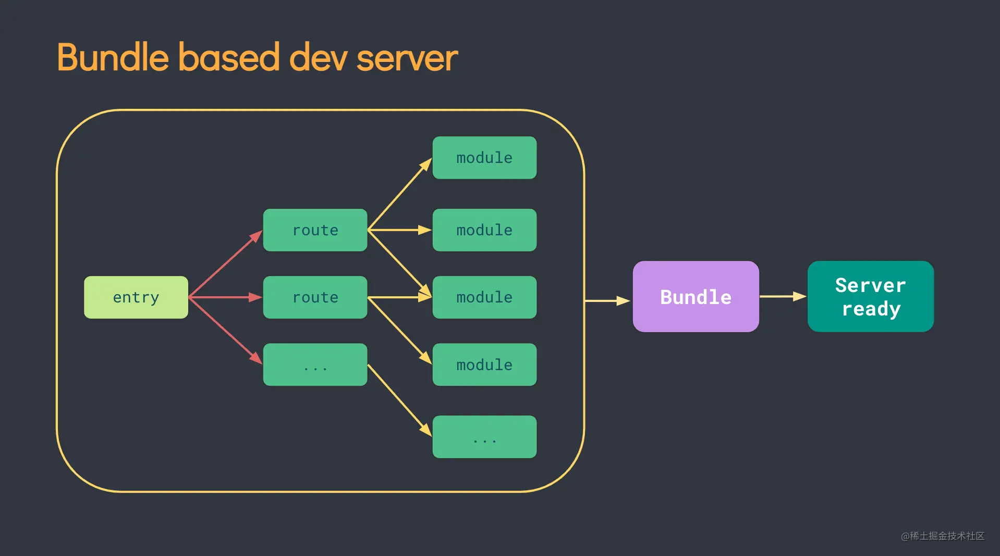`vite`

一开始是先告诉你服务器准备完成，然后等你发送HTTP请求，然后是入口文件，`Dynamic import`（动态导入）`code split point`（代码分割）

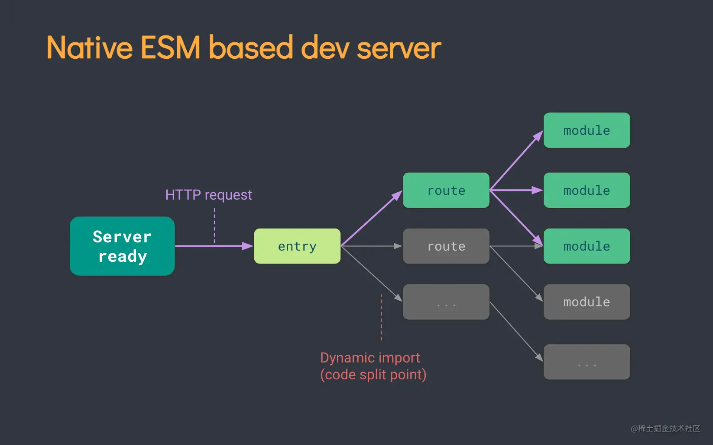


### 使用

使用npm

```
# npm 7+，需要加上额外的双短横线
$ npm init vite@latest <project-name> -- --template vue
```

使用yarn

```
$ yarn create vite <project-name> --template vue
```


## Vetur报组件未导出

**解决办法：**


**1) 更换支持ts的语法高亮插件 \**Volar \*\*以取代 \*\*Vetur \*\*(推荐此方法)\*\*\*\*\*\**\***


**2) 不用 \**script setup \*\*语法糖，改用 \*\*Options API \*\*写法(不建议)\*\*\*\*\*\**\***

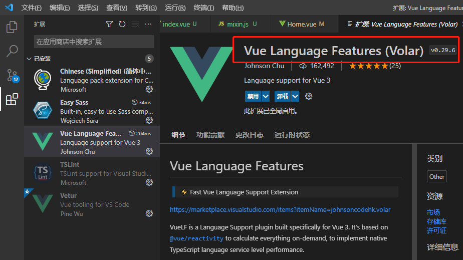


## vue3 变化

### 打开方式

不是 `serve` 变成了`dev`

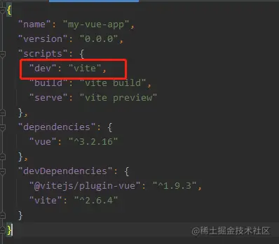


### main.js

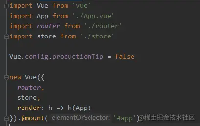

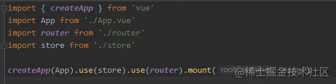引入的不是vue构造函数，而是`createApp`工厂函数然而，创建实例对象其实就相当于vue2中的`vm`，`mount（'#app'）`就相当于`$mount('#app')`，并且vue2的写法在vue3不能兼容


现在我们进入App组件，你会发现什么不一样的地方，他`没有了根标签`，在vue2的时候，我们都是在div根标签里面写东西，所以在vue3里面可以没有根标签

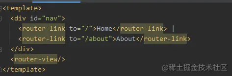


## 常用组合式API

### Composition API

和 Options API 的区别？

`Composition API` 也叫**组合式 API**，它主要就是为了解决 Vue2 中 Options API 的问题。

一是在 Vue2 中只能固定用 `data`、`computed`、`methods` 等选项组织代码，在组件越来越复杂的时候，一个功能相关的属性和方法就会在文件上中下到处都有，很分散，变越来越难维护

二是 Vue2 中虽然可以用 `minxin` 来做逻辑的提取复用，但是 minxin 里的属性和方法名会和组件内部的命名冲突，还有当引入多个 minxin 的时候，我们使用的属性或方法是来于哪个 minxin 也不清楚

而 `Composition API` 刚才就解决了这两个问题，可以让我们自由的组织代码，同一功能相关的全部放在一起，代码有更好的可读性更便于维护，单独提取出来也不会造成命名冲突，所以也有更好的可扩展性

### setup()

#### 定义

setup函数是 `Composition API`（组合API）的`入口`

#### 执行时机

setup `执行时机`是在 `beforeCreate` 之前执行，详细的可以看后面生命周期讲解。

```js
export default defineComponent({
  beforeCreate() {
    console.log("----beforeCreate----");
  },
  created() {
    console.log("----created----");
  },
  setup() {
    console.log("----setup----");
  },
});

```

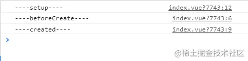

#### 使用方式

使用`setup`时，它接受两个参数：

1. props: 组件传入的属性
2. context


*// 方法* 

`setup(props, context) { return { name:'沐华' } } `

*// 语法糖* 

`<script setup> ... </script>`


在setup函数中定义的变量和方法最后都是需要 `return` 出去的 不然无法再模板中使用

```vue
<script>
 export default {
  name: 'App',
  setup(){
   let name = '流星'
   let age = 18
   //方法
   function say(){
    console.log(`我叫${name},今年${age}岁`)
   }

   //返回一个对象
   return {
    name,
    age,
    say
   }
  }
 }
</script>
```


这里兼容vue2的写法如：`data，methods...`，并且在vue2中可以读取到vue3里的配置但是vue3里面不能读取到vue2的配置，所以，vue3和vue2不要混用，如果有重名那么优先`setup`

#### 语法糖

##### 组件

```vue
<template>
  <div>
    <Foo />
  </div>
</template>

<!-- 在script标签上添加setup属性，以使用 script setup 语法 -->
<script setup>
  import Foo from './components/Foo.vue'
</script>
```

##### 属性和方法

```vue
<template>
  <div>
    <Foo />
    <h2 @click="increment">{{ count }}</h2>
  </div>
</template>

<script setup>
  import { ref } from 'vue'
  import Foo from './components/Foo.vue'

  const count = ref(0)
  const increment = () => count.value++
</script>
```

上述案例会被编译为

```vue
<template>
  <div>
    <Foo />
    <h2 @click="increment">{{ count }}</h2>
  </div>
</template>

<script>
    // 导入的模块会被抽离到模块级别
    import { ref } from 'vue'
    import Foo from './components/Foo.vue'

    export default {
      setup() {
        const count = ref(0)
        const increment = () => count.value++

        // 这是一个返回h函数的render函数
        // 因为被编译到了setup函数中，所以可以直接访问顶层定义的属性和方法
        return () => ([
          h(Foo, null, ''),
          h('h2', {
            count,
            onClick: increment
          }, count)
        ])
      }
    }
</script>
```


##### props和emit


##### slots 和 attrs


##### 顶层await


##### 与普通 script 一起使用


### ref与reactive

#### ref


#### reactive


# 阅读官方文档


## 基础

### property

#### methods

Vue 自动为 `methods` 绑定 `this`，以便于它始终指向组件实例。这将确保方法在用作事件监听或回调时保持正确的 `this` 指向。在定义 `methods` 时应避免使用箭头函数，因为这会阻止 Vue 绑定恰当的 `this` 指向。


### 事件处理

#### 多事件处理

```vue
<!-- 这两个 one() 和 two() 将执行按钮点击事件 -->
<button @click="one($event), two($event)">
  Submit
</button>
```

```vue
// ...
methods: {
  one(event) {
    // 第一个事件处理器逻辑...
  },
  two(event) {
   // 第二个事件处理器逻辑...
  }
}
```

#### 事件修饰符

```vue
<!-- 阻止单击事件继续冒泡 -->
<a @click.stop="doThis"></a>

<!-- 提交事件不再重载页面 -->
<form @submit.prevent="onSubmit"></form>

<!-- 修饰符可以串联 -->
<a @click.stop.prevent="doThat"></a>

<!-- 只有修饰符 -->
<form @submit.prevent></form>

<!-- 添加事件监听器时使用事件捕获模式 -->
<!-- 即内部元素触发的事件先在此处理，然后才交由内部元素进行处理 -->
<div @click.capture="doThis">...</div>

<!-- 只当在 event.target 是当前元素自身时触发处理函数 -->
<!-- 即事件不是从内部元素触发的 -->
<div @click.self="doThat">...</div>
```

> 使用修饰符时，顺序很重要；相应的代码会以同样的顺序产生。因此，用 `v-on:click.prevent.self` 会阻止所有的点击，
>
> 而 `v-on:click.self.prevent` 只会阻止对元素自身的点击。

```vue
<!-- 点击事件将只会触发一次 -->
<a @click.once="doThis"></a>
```


#### 按键修饰符


Vue 为最常用的键提供了别名：

- `.enter`
- `.tab`
- `.delete` (捕获“删除”和“退格”键)
- `.esc`
- `.space`
- `.up`
- `.down`
- `.left`
- `.right`

#### 系统修饰键

可以用如下修饰符来实现仅在按下相应按键时才触发鼠标或键盘事件的监听器。

- `.ctrl`
- `.alt`
- `.shift`
- `.meta`   在 Mac 系统键盘上，meta 对应 command 键 (⌘)。在 Windows 系统键盘 meta 对应 Windows 徽标键 (⊞)

```vue
<!-- Alt + Enter -->
<input @keyup.alt.enter="clear" />

<!-- Ctrl + Click -->
<div @click.ctrl="doSomething">Do something</div>
```


##### .exact

```vue
<!-- 即使 Alt 或 Shift 被一同按下时也会触发 -->
<button @click.ctrl="onClick">A</button>

<!-- 有且只有 Ctrl 被按下的时候才触发 -->
<button @click.ctrl.exact="onCtrlClick">A</button>

<!-- 没有任何系统修饰符被按下的时候才触发 -->
<button @click.exact="onClick">A</button>
```


##### 鼠标按钮修饰符

- `.left`
- `.right`
- `.middle`

这些修饰符会限制处理函数仅响应特定的鼠标按钮。

### 表单输入绑定

你可以用 v-model 指令在表单 `<input>`、`<textarea>` 及 `<select>` 元素上创建双向数据绑定。它会根据控件类型自动选取正确的方法来更新元素。尽管有些神奇，但 `v-model` 本质上不过是`语法糖`。它负责监听用户的输入事件来更新数据，并在某种极端场景下进行一些特殊处理。

> `v-model` 会忽略所有表单元素的 `value`、`checked`、`selected` attribute 的初始值。
>
> 它将始终将当前活动实例的数据作为数据来源。你应该通过 JavaScript 在组件的 `data` 选项中声明初始值。


### 组件基础

#### 全局组件

```js
// 创建一个Vue 应用
const app = Vue.createApp({})

// 定义一个名为 button-counter 的新全局组件
app.component('button-counter', {
  data() {
    return {
      count: 0
    }
  },
  template: `
    <button @click="count++">
      You clicked me {{ count }} times.
    </button>`
})
```

#### 局部组件

```js
const ComponentA = {
  /* ... */
}
const ComponentB = {
  /* ... */
}

const app = Vue.createApp({
  components: {
    'component-a': ComponentA,
    'component-b': ComponentB
  }
})
```

#### prop

##### 传静态值

```vue
    <div id="blog-post-demo">
      <blog-post title="My journey with Vue"></blog-post>
      <blog-post title="Blogging with Vue"></blog-post>
      <blog-post title="Why Vue is so fun"></blog-post>
    </div>
    <script>
      const app = Vue.createApp({})

      app.component('blog-post', {
        props: ['title'],
        template: `<h4>{{ title }}</h4>`,
      })

      app.mount('#blog-post-demo')
    </script>
```


#### 监听子组件事件

父级组件可以像处理原生 DOM 事件一样通过 `v-on` 或 `@` 监听子组件实例的任意事件：

```vue
<blog-post ... @enlarge-text="postFontSize += 0.1"></blog-post>
```

子组件： 将$emit(要触发的事件名) 这个触发事件的操作  绑定在子组件的一个事件中

```vue
<button @click="$emit('enlargeText')">
  Enlarge text
</button>
```

##### 示例：

```vue
    <div id="blog-post-demo">
      <div :style="{ fontSize: postFontSize + 'px' }">
        <blog-post
          title="My journey with Vue"
          @enlarge-text="print(),postFontSize+=1"
        ></blog-post>
      </div>
    </div>
    <script>
      const app = Vue.createApp({
        data() {
          return {
            postFontSize: 20,
          }
        },
        methods: {
          print() {
            console.log('click')
          },
        },
      })
      app.component('blog-post', {
        props: ['title'],
        template: `
          <div class="blog-post">
            <h4>{{ title }}</h4>
            <button @click="$emit('enlargeText')">
              Enlarge text
            </button>
          </div>
        `,
      })

      app.mount('#blog-post-demo')
    </script>
```


##### 子组件用事件抛出一个值

有的时候用一个事件来抛出一个特定的值是非常有用的。例如我们可能想让 `<blog-post>` 组件决定它的文本要放大多少。这时可以使用 `$emit` 的第二个参数来提供这个值

```vue
<button @click="$emit('enlargeText', 0.1)">
  Enlarge text
</button>
```

然后当在父级组件监听这个事件的时候，我们可以通过 `$event` 访问到被抛出的这个值：

```html
<blog-post ... @enlarge-text="postFontSize += $event"></blog-post>
```

或者，如果这个事件处理函数是一个方法：

```html
<blog-post ... @enlarge-text="onEnlargeText"></blog-post>
```

那么这个值将会作为第一个参数传入这个方法：

```js
methods: {
  onEnlargeText(enlargeAmount) {
    this.postFontSize += enlargeAmount
  }
}
```

**tips**

`@enlarge-text="onEnlargeText"`   只有单个事件的时候可以这样简写


##### 在组件上使用 v-model

自定义事件也可以用于创建支持 `v-model` 的自定义输入组件。记住：

```html
<input v-model="searchText" />
```

等价于：

```html
<input :value="searchText" @input="searchText = $event.target.value" />
```

示例

```html
    <div id="app">
      <!-- <input v-model="searchText" /> -->
      <input :value="searchText" @input="func" />
        <!-- @input  表单内容变化时调用 -->
      {{searchText}}
    </div>

    <script>
      const app = Vue.createApp({
        data() {
          return {
            searchText: '',
            text: 123,
          }
        },
        methods: {
          func() {
            console.log(event);
            this.searchText = event.target.value
          },
        },
      }).mount('#app')
    </script>
```


当用在组件上时，`v-model` 则会这样：

示例

```html
    <div id="app">
      <custom-input
        :model-value="searchText"
        @update:model-value="searchText = $event"
      ></custom-input>

      {{searchText}}
    </div>

    <script>
      const app = Vue.createApp({
        data() {
          return {
            searchText: '',
          }
        },
      })
      app.component('custom-input', {
        props: ['modelValue'],
        emits: ['update:modelValue'],
        template: `
          <input
            :value = "modelValue"
            @input ="$emit('update:modelValue',$event.target.value)"
          />
        `,
      })
      app.mount('#app')
    </script>
```


在该组件中实现 `v-model` 的另一种方法是使用 `computed` property 的功能来定义 getter 和 setter。`get` 方法应返回 `modelValue` property，`set` 方法应该触发相应的事件。

```html
    <div id="app">
      <diy-input
        :model-value="searchText"
        @update:model-value="searchText = $event"
      ></diy-input>
      {{searchText}}
    </div>
    <script>
      const app = Vue.createApp({
        data() {
          return {
            searchText: '123132',
          }
        },
      })
      // 用computed实现
      app.component('diy-input', {
        props: ['modelValue'],
        emits: ['update:modelValue'],
        template: `
          <input v-model="value">
        `,
        computed: {
          value: {
            get() {
              return this.modelValue
            },
            set(value) {
              this.$emit('update:modelValue', value)
            },
          },
        },
      })
      app.mount('#app')
    </script>
```


#### 插槽slot

这可以通过使用 Vue 的自定义 `<slot>` 元素来实现：

```js
    <div id="app">
      <comp> this is myself </comp>
    </div>
    <script>
      const app = Vue.createApp({})
      app.component('comp', {
        template: `
          <slot></slot>
          <div>self</div>
        `,
      })
      app.mount('#app')
    </script>
```

如你所见，我们使用 `<slot>` 作为我们想要插入内容的占位符——就这么简单！


#### 动态组件

通过 Vue 的 `<component>` 元素加一个特殊的 `is` attribute 来实现：

```html
<!-- 组件会在 `currentTabComponent` 改变时改变 -->
<component :is="currentTabComponent"></component>
```

##### 示例：

```html
    <div id="app">
      <div v-for="(item,index) in compList" :key="index" @click="comp = item">{{item}}</div>
      <component :is="theComp"></component>
    </div>
    <script>
      const app = Vue.createApp({
        data() {
          return {
            comp: 'comp-1',
            compList: ['comp-1', 'comp-2', 'comp-3'],
          }
        },
        computed: {
          theComp() {
            return this.comp
          },
        },
      })
      app.component('comp-1', {
        template: `<div>this is first</div>`,
      })
      app.component('comp-2', {
        template: `<div>this is second</div>`,
      })
      app.component('comp-3', {
        template: `<div>this is third</div>`,
      })
      app.mount('#app')
    </script>
```


#### 元素位置受限

有些 HTML 元素，诸如 `<ul>`、`<ol>`、`<table>` 和 `<select>`，对于哪些元素可以出现在其内部是有严格限制的。而有些元素，诸如 `<li>`、`<tr>` 和 `<option>`，只能出现在其它某些特定的元素内部。

这会导致我们使用这些有约束条件的元素时遇到一些问题。例如：

```html
    <div id="app">
      <table 
        style="width: 100px; 
               height: 100px; 
               background-color: skyblue">
        <comp></comp>
      </table>
    </div>
    <script>
      const app = Vue.createApp({})
      app.component('comp', {
        template: `
      <div>123123</div>
      <div>123123</div>`,
      })
      app.mount('#app')
    </script>
```

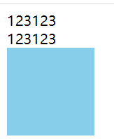

这个自定义组件 `<comp>` 会被作为无效的内容提升到外部，并导致最终渲染结果出错。我们可以使用特殊的 [`is` attribute](https://v3.cn.vuejs.org/api/special-attributes.html#is) 作为一个变通的办法：

`is="vue:组件名"`

```html
<table>
  <tr is="vue:blog-post-row"></tr>
</table>
```

> TIP
>
> 当它用于原生 HTML 元素时，`is` 的值必须以 `vue:` 开头，才可以被解释为 Vue 组件。这是避免和原生[自定义元素](https://html.spec.whatwg.org/multipage/custom-elements.html#custom-elements-customized-builtin-example)混淆。

##### 示例

```html
    <div id="app">
      <table 
        style="width: 100px; 
               height: 100px; 
               background-color: skyblue;
               opacity: 0.5;">
        <!-- <comp></comp> -->
        <tr is="vue:comp"></tr>
      </table>
    </div>
    <script>
      const app = Vue.createApp({})
      app.component('comp', {
        template: `
      <div>123123</div>
      <div>123123</div>`,
      })
      app.mount('#app')
    </script>
```

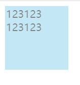

#### 大小写不敏感

另外，HTML attribute 名不区分大小写，因此浏览器将所有大写字符解释为小写。这意味着当你在 DOM 模板中使用时，驼峰 prop 名称和 event 处理器参数需要使用它们的 kebab-cased (横线字符分隔) 等效值：

```js
//  在 JavaScript 中是驼峰式

app.component('blog-post', {
  props: ['postTitle'],
  template: `
    <h3>{{ postTitle }}</h3>
  `
})
```

```html
<!-- 在 HTML 中则是横线字符分割 -->

<blog-post post-title="hello!"></blog-post>
```


## 深入组件


### 组件注册

#### 全局注册

```js
Vue.createApp({...}).component('my-component-name', {
  // ... 选项 ...
})
```

#### 局部注册

```js
const ComponentA = {
  /* ... */
}

const app = Vue.createApp({
  components: {
    'component-a': ComponentA,
  }
})
```


如果你通过 Babel 和 webpack 使用 ES2015 模块，那么代码看起来像这样：

```js
import ComponentA from './ComponentA.vue'

export default {
  components: {
    ComponentA
  }
  // ...
}
```

注意在 ES2015+ 中，在对象中放一个类似 `ComponentA` 的变量名其实是 `ComponentA: ComponentA` 的缩写，即这个变量名同时是：

- 用在模板中的自定义元素的名称
- 包含了这个组件选项的变量名


### Props

#### 类型限制

你可以以对象形式列出 prop，这些 property 的名称和值分别是 prop 各自的名称和类型：

```js
props: {
  title: String,
  likes: Number,
  isPublished: Boolean,
  commentIds: Array,
  author: Object,
  callback: Function,
  contactsPromise: Promise // 或任何其他构造函数
}
```

#### 传递静态或动态的 Prop

目前为止，你已经知道了可以像这样给 prop 传入一个静态的值：

```html
<blog-post title="My journey with Vue"></blog-post>
```


你也知道 prop 可以通过 `v-bind` 或简写 `:` 动态赋值，例如：

```html
<!-- 动态赋予一个变量的值 -->
<blog-post :title="post.title"></blog-post>

<!-- 动态赋予一个复杂表达式的值 -->
<blog-post :title="post.title + ' by ' + post.author.name"></blog-post>
```

在上述两个示例中，我们传入的值都是字符串类型的，但实际上*任何*类型的值都可以传给一个 prop。

##### 传入数字

```html
<!-- 这是一个 JavaScript 表达式而不是一个字符串。             -->
<blog-post :likes="42"></blog-post>
```

##### 传入布尔值

```html
<!-- 即便 `false` 是静态的，我们仍需通过 `v-bind` 来告诉 Vue  -->
<!-- 这是一个 JavaScript 表达式而不是一个字符串。             -->
<blog-post :is-published="false"></blog-post>
```


#### 单向数据流

所有的 prop 都使得其父子 prop 之间形成了一个**单向下行绑定**：父级 prop 的更新会向下流动到子组件中，但是反过来则不行。这样会防止从子组件意外变更父级组件的状态，从而导致你的应用的数据流向难以理解。

另外，每次父级组件发生变更时，子组件中所有的 prop 都将会刷新为最新的值。这意味着你**不**应该在一个子组件内部改变 prop。如果你这样做了，Vue 会在浏览器的控制台中发出警告。

这里有两种常见的试图变更一个 prop 的情形：

1. **这个 prop 用来传递一个初始值；这个子组件接下来希望将其作为一个本地的 prop 数据来使用**。在这种情况下，最好定义一个本地的 data property 并将这个 prop 作为其初始值：

```js
props: ['initialCounter'],
data() {
  return {
    counter: this.initialCounter
  }
}
```

2. **这个 prop 以一种原始的值传入且需要进行转换**。在这种情况下，最好使用这个 prop 的值来定义一个计算属性：

```js
props: ['size'],
computed: {
  normalizedSize() {
    return this.size.trim().toLowerCase()
  }
}
```


> 警告
>
> 注意在 JavaScript 中对象和数组是通过引用传入的，所以对于一个数组或对象类型的 prop 来说，在子组件中改变这个对象或数组本身**将会**影响到父组件的状态，且 Vue 无法为此向你发出警告。作为一个通用规则，应该避免修改任何 prop，包括对象和数组，因为这种做法无视了单向数据绑定，且可能会导致意料之外的结果。


#### Prop验证

```js
app.component('my-component', {
  props: {
    // 基础的类型检查 (`null` 和 `undefined` 值会通过任何类型验证)
    propA: Number,
    // 多个可能的类型
    propB: [String, Number],
    // 必填的字符串
    propC: {
      type: String,
      required: true
    },
    // 带有默认值的数字
    propD: {
      type: Number,
      default: 100
    },
    // 带有默认值的对象
    propE: {
      type: Object,
      // 对象或数组的默认值必须从一个工厂函数返回
      default() {
        return { message: 'hello' }
      }
    },
    // 自定义验证函数
    propF: {
      validator(value) {
        // 这个值必须与下列字符串中的其中一个相匹配
        return ['success', 'warning', 'danger'].includes(value)
      }
    },
    // 具有默认值的函数
    propG: {
      type: Function,
      // 与对象或数组的默认值不同，这不是一个工厂函数——这是一个用作默认值的函数
      default() {
        return 'Default function'
      }
    }
  }
})
```

> **Tips**
>
> 注意 prop 会在一个组件实例创建**之前**进行验证，所以实例的 property (如 `data`、`computed` 等) 在 `default` 或 `validator` 函数中是不可用的。


##### 类型检查

###### 使用自定义类型

此外，`type` 还可以是一个自定义的构造函数，并且通过 `instanceof` 来进行检查确认。例如，给定下列现成的构造函数：

```js
function Person(firstName, lastName) {
  this.firstName = firstName
  this.lastName = lastName
}
```

你可以使用：

```js
app.component('blog-post', {
  props: {
    author: Person
  }
})
```

来验证 `author` prop 的值是否是通过 `new Person` 创建的

### 非prop的Attribute

一个非 prop 的 attribute 是指传向一个组件，但是该组件并没有相应 [props](https://v3.cn.vuejs.org/guide/component-props.html) 或 [emits](https://v3.cn.vuejs.org/guide/component-custom-events.html#定义自定义事件) 定义的 attribute。

常见的示例包括 `class`、`style` 和 `id` attribute。可以通过 `$attrs` property 访问那些 attribute。

#### $attrs

```html
// 父组件
 <son id="911"></son>
```

```js
// 子组件
  created() {
    console.log(this.$attrs.id)
  },
```

> 父子组件 生命周期顺序为
>
> beforeCreate(父) -> created(父) -> beforeMount(父) -> beforeCreate(子) -> created(子) -> beforeMount(子) -> mounted(子) -> mounted(父)

#### Attribute继承

当组件返回单个根节点时，非 prop 的 attribute 将自动添加到根节点的 attribute 中。

##### 示例

```html
// 子组件中
<template>
  <div class="a">
    <div class="b">
      <div class="c">ddddd</div>
    </div>
  </div>
</template>
```

如果我们需要通过 `data-status` attribute 定义 `<date-picker>` 组件的状态，它将应用于根节点 (即 `div.date-picker`)。

```html
<!-- 具有非 prop 的 attribute 的 son 组件-->
<son id="911"></son>

<!-- 渲染后的 date-picker 组件 -->
 <div class="a" id="911">
    <div class="b">
      <div class="c">ddddd</div>
    </div>
 </div>
```


##### 应用在 Select标签  示例

```htmL
<son @change="showSelected"></son>
```

```js
methods: {
    showSelected(event) {
      alert('you select ' + event.target)
      console.log(event)
      console.log(event.target)
      console.log(event.target.selectedIndex)
      console.log(event.target.options)
      console.log(event.target.options[event.target.selectedIndex].innerText)
    },
  },
```

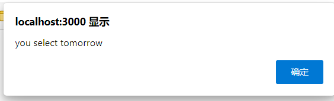


