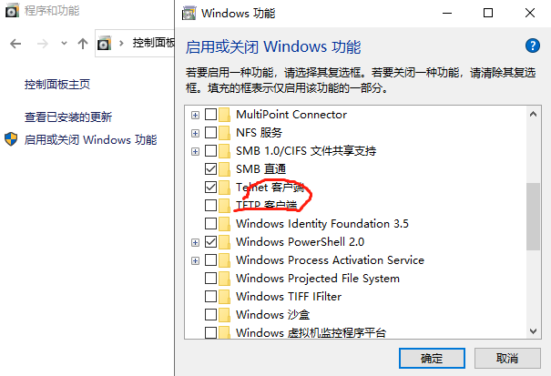
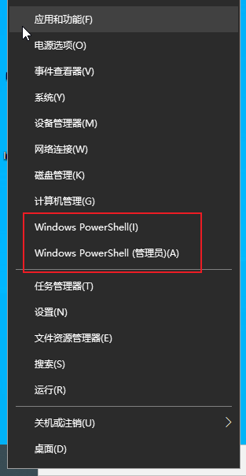
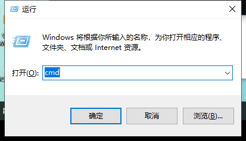

# linux命令

## 网络通讯

### telnet



Linux telnet命令用于远端登入。

执行telnet指令开启终端机阶段作业，并登入远端主机。


```
 telnet localhost 8888
```


### netstat


```
netstat -ano
// 显示所有连接中的socket（显示PID）
```


### tasklist

```
tasklist|findstr "1360"
// idea64.exe                    1360 Console                   19  1,132,320 K
```


# DOS命令

## 命令提示符打开方式

- 桌面左下角，单击右键




- win + r ，输入cmd



- 在任意的文件夹下面，按住shift键 + 鼠标右键点击，在此处打开命令行窗口


- 资源管理器地址栏 前面 加上cmd路径


## 常用DOS命令

- 盘符切换

- 查看当前目录下的所有文件dir#切换目录  

  - **cd** change directorycd ..

  - **cd..**

- 清理屏幕  
  - **cls**(clear screen)

- 退出终端      
  - **exit**

- 查看电脑的ip   
  - **ipconfig**

- 打开应用

  - **calc**

  - **mspaint**

  - **notepad**

- ping命令    
  - **ping** www.baidu . com

- 文件操作
  - **md**  创建文件夹
  - **rd**  删除文件夹
  - **cd>**  创建文件
  - **del**  删除文件
