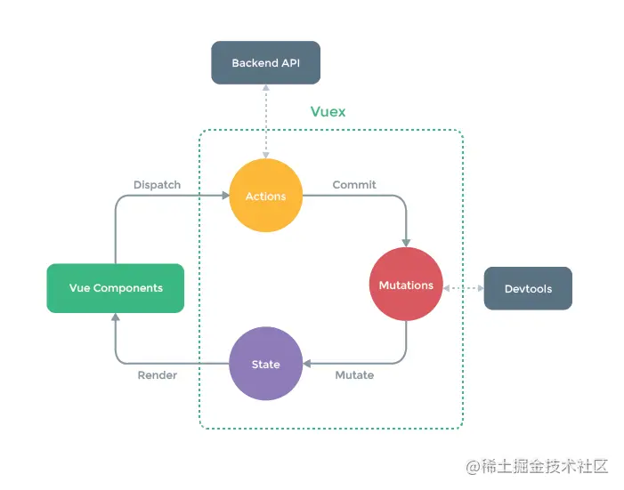
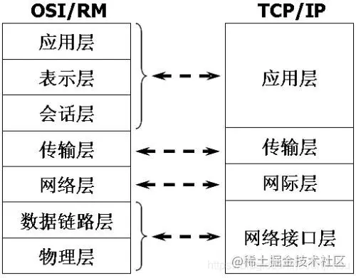

# 八股文


## HTML、CSS相关


### html5新特性、语义化

**语义化**：

语义化意味着顾名思义，HTML5的语义化指的是合理正确的使用语义化的标签来创建页面结构，如 
header,footer,nav，从标签上即可以直观的知道这个标签的作用，而不是滥用div。

- 语义化标签 ： header nav main article section aside footer

**优点**：

- 代码结构清晰，易于阅读，利于开发和维护
- 方便其他设备解析（如屏幕阅读器）根据语义渲染网页。
- 有利于搜索引擎优化（SEO），搜索引擎爬虫会根据不同的标签来赋予不同的权重

### 浏览器渲染机制、重绘、重排

网页生成过程：

- `HTML`被HTML解析器解析成`DOM` 树
- `css`则被css解析器解析成`CSSOM `树
- 结合`DOM`树和`CSSOM`树，生成一棵渲染树(`Render Tree`)
- 生成布局（`flow`），即将所有渲染树的所有节点进行平面合成
- 将布局绘制（`paint`）在屏幕上


# 面试题

## 1. 圣杯和双飞翼实现方式的区别?

答：共同点：

1. 都使用了float
2. 中间部分在文档前面，为了优先加载

区别：

- 圣杯：

左、中、右三个盒子在一个同一个盒子中，设置外侧盒子的`padding`，从而留出两侧盒子位置

- 双飞翼：

左、中、右三个盒子同级，在中间盒子里放一个小盒子，设置小盒子的`margin`，从而留出两侧盒子位置


**圣杯**：

```html
<header id="header">我这里是头部</header>
    <div class="box">
        <div class="column">我是自适应的,要写在前面优先渲染</div>
        <div class="left" >左边：我是固定的</div>
        <div class="right" >右边：我是固定的</div>
    </div>
<footer class="footer">footer</footer>
```

```css
#header{
    width: 100%;
    background-color: cyan;
}
.box{
    height: 200px;
    width: 100%;
    background-color:darkorange;
    padding-left: 200px;/*这两行是特点*/
    padding-right: 300px;
    box-sizing: border-box;/*盒子问题 content-box 标准盒子模型 和border-box怪异盒子模型*/
}
.footer{
    clear: both;  /*如果不清除浮动的话会跟着lfet right 他们一起上移*/
    width: 100%; 
    background-color: darkgray;
}
.column{
    width: 100%;
    background-color:slateblue;
}
.left{
    width: 200px;
    background-color: violet;
    margin-left: -100%; /*注意marign 的用法他的值市根据父元素定的*/
    left: -200px;
} 
.right{
width: 300px;
background-color: yellow;
margin-right: -300px;
}
.left,.right,.column{ 
    height:  200px;
    float: left;
    position: relative;/*特点*/
}
body{
    margin: 0;
}
```

**双飞翼**：

```html
<header>我这里是头部</header>
    <div class="container">
        <div class="box">/*特点*/
            <div class="center">这里是中间</div>
        </div>
        <div class="left">这是左边:</div>
        <div class="right">这是右边:</div>
    </div>
<footer>这里是尾页</footer>

```

```css
header{
    width: 100%;
    height: 50px;
    background-color: thistle;
    text-align: center;
}
.container{

}
.box{
    width: 100%;/* 要是包裹它的盒子设置宽度 不然盒子无法包裹住展开*/
    float: left;
}
.center{
    height: 300px;
    background-color: darkkhaki;
    margin:0 100px 0 200px; /*特点*/
}
.left{
    background-color: rgb(218, 142, 211);
    width: 200px;
    margin-left: -100%; 
    float: left;
}
.right{
    background-color:rgb(150, 176, 231);
    width: 150px;
    margin-left: -150px; 
    float: left;
}

footer{ width: 100%;
        height: 50px;
        background-color: wheat;
        text-align: center;
        clear: both;
}
.right,.left{
    text-align: center;
    height: 300px;
    line-height: 300px;
}body{
    padding: 0;
    margin: 0;
}

```


## 2.元素居中的方式

1.使用`margin`进行固定长度的偏移

```css
margin:0 auto;/*水平居中*/
```

2.使用绝对定位并进行偏移

```css
/*关键样式代码*/
#father{
         position:relative;
       }
   #son{
         position: absolute;
         left:50%;
         margin-left: -50px;
         top:50%;
         margin-top: -50px;
        }
        
 /*优化代码（使用css样式中的计算公式）*/
#son{
        position: absolute;
        left:calc(50% - 50px);
        top:calc(50% - 50px);
     	}

```

3.使用绝对定位并`margin`自适应进行居中

```css
/*关键样式代码*/
#father{
         position:relative;
       }
   #son{
         position: absolute;
         left: 0;
         top: 0;
         right: 0;
         bottom: 0;
         margin:auto;
        }
```

4.使用`table-cell`进行居中显示

```css
/*关键样式代码*/
 #father{
            display: table-cell;
            vertical-align: middle;
        }
    #son{
            margin: 0 auto;
        }
```

5.使用css3弹性盒子来实现居中

```css
#father{ 
    display: flex; 
    justify-content: center; 
    align-items: center; 
}
```

## 3.讲讲闭包以及在项目中的使用场景

闭包可以理解为定义在一个函数内部的函数

它可以实现变量私有化但同时容易造成内存泄漏

使用场景主要有返回值、函数赋值、自执行函数、迭代器等等

## 4.讲讲promise以及在项目中的使用场景

ECMAscript 6 原生提供了Promise对象

promise对象代表了未来将要发生的事件，用来传递异步操作的消息。


**Promise对象有以下两个特点**


1.**对象的状态不受外界影响**。`Promise`对象代表一个异步操作，有三种状态：

- `pending`: 初始状态，不是成功或失败状态。
- `fulfilled`: 意味着操作成功完成。
- `rejected`: 意味着操作失败。

只有异步操作的结果可以决定当前是哪一种状态，任何其他操作都无法改变这个状态。这也是Promise这个名字的由来，他的英语意思就是[承诺]，表示其他手段无法改变。


2。**一旦状态改变，就不会在变，任何时候都可以得到这个结果**。`Promise`对象的状态改变，只有两种可能：从`Pending`变为`Resolved`和从`Pending`变为`Rejected`。只要这两种情况发生，状态就凝固了，不会再变了，会一直保持这个结果。就算已经发生了，你再对Promise对象添加回调函数，也会立即得到这个结果。这与事件(`Event`)完全不同，事件的特点是，如果你错过了它，再去监听，是得不到结果的。


**Promise优缺点**

有了`Promise`对象，就可以将异步操作以同步操作的流程表达出来，避免了层层嵌套的回调函数（回调地狱）。此外，`Promise`对象提供统一的接口，使得控制异步更加容易操作。

`Promise`也有一些缺点。

首先，无法取消 Promise ，一旦新建它就会立即执行，无法中途取消。

其次，如果不设置回调函数，`Promise`内部跑出的错误，不会反应到外部。

第三，当处于Pending状态时，无法得知目前进展到哪一个阶段（刚刚开始还是即将完成）。


## 5.谈谈Promise.all()方法，Promise.race方法以及使用

- Promise.all可以将多个Promise实例包装成一个新的Promise实例。同时，成功和失败的返回值是不同的，成功的时候返回的是一个结果数组，而失败的时候则返回最先被reject失败状态的值。（Promise.all 方法的参数不一定是数组，但是必须具有 iterator 接口，且返回的每个成员都是 Promise 实例。）
- 顾名思义，Promse.race就是赛跑的意思，意思就是说，Promise.race([p1, p2, p3])里面哪个结果获得的快，就返回那个结果，不管结果本身是成功状态还是失败状态。

`Promise.all`可以比作接力跑，必须都成功才能胜利

`Promise.race`可以比作短跑，谁跑的快睡就胜利

### 使用场景

在前端开发请求数据的过程中，偶尔会遇到发送多个请求并根据请求顺序获取和使用数据的场景，使用Promise.all毫无疑问可以解决这个问题。

Promise.race则是在拼手速抢东西就可用到


## 6.谈谈你理解的Vue

`Vue`是个渐进式的轻量框架     

渐进式代表的含义是：主张最少。

每个框架都不可避免会有自己的一些特点，从而会对使用者有一定的要求，这些要求就是主张，主张有强有弱，它的强势程度会影响在业务开发中的使用方式。


比如说，`Angular`，它两个版本都是强主张的，如果你用它，必须接受以下东西：

- 必须使用它的模块机制- 必须使用它的依赖注入
- 必须使用它的特殊形式定义组件（这一点每个视图框架都有，难以避免）

所以Angular是带有比较强的排它性的，如果你的应用不是从头开始，而是要不断考虑是否跟其他东西集成，这些主张会带来一些困扰。

比如`React`，它也有一定程度的主张，它的主张主要是函数式编程的理念，比如说，你需要知道什么是副作用，什么是纯函数，如何隔离副作用。它的侵入性看似没有Angular那么强，主要因为它是软性侵入。


Vue可能有些方面是不如`React`，不如`Angular`，但它是渐进的，没有强主张，

你可以在原有大系统的上面，把一两个组件改用它实现，当`jQuery`用；

也可以整个用它全家桶开发，当`Angular`用；

还可以用它的视图，搭配你自己设计的整个下层用。

你可以在底层数据逻辑的地方用OO和设计模式的那套理念，也可以函数式，都可以，

它只是个轻量视图而已，只做了自己该做的事，没有做不该做的事，仅此而已。

 渐进式的含义，我的理解是：没有多做职责之外的事。

## 7.关于Vue的组件传值有哪些？

1. 子组件props接受父组件传值，向父组件传值时需要使用 `vue` 中的` $on` 和 `$emit`

   

2. `eventBus`创建一个Vue的实例，让各个组件共用同一个事件机制。

   传递数据方，通过一个事件触发`eventBus.emit` ( 方 法 名 ， 传 递 的 数 据 ) 。 接 收 数 据 方 ， 通 过 `mounted( )` 触 发 `eventBus.emit`(方法名，传递的数据)。 接收数据方，通过mounted(){}触发eventBus.emit(方法名，传递的数据)。接收数据方，通过`mounted()`触发`eventBus.on(方法名，function(接收数据的参数){用该组件的数据接收传递过来的数据})`

   

3. `provide和inject`

provide 可以在祖先组件中指定我们想要**提供**给后代组件的数据或方法，而在任何后代组件中，我们都可以使用 inject 来接收 provide **提供**的数据或方法。


## 8.谈谈provide和inject

**成****对****出现**：`provide和inject`是成对出现的

**作用**：用于父组件向子孙组件传递数据

**使用方法**：`provide`在父组件中返回要传给下级的数据，`inject`在需要使用这个数据的子辈组件或者孙辈等下级组件中注入数据。

*举个官网的🌰：*

```js
// 父级组件提供 'foo'
var Provider = {
  provide: {
    foo: 'bar'
  },
  // ...
}

// 子组件注入 'foo'
var Child = {
  inject: ['foo'],
  created () {
    console.log(this.foo) // => "bar"
  }
  // ...
}
```


**使用场景**：由于`vue`有`$parent`属性可以让子组件访问父组件。但孙组件想要访问祖先组件就比较困难。通过`provide/inject`可以轻松实现跨级访问父组件的数据

`provider/inject`：简单的来说就是在父组件中通过`provider`来提供变量，然后在子组件中通过`inject`来注入变量


**需要注意的是这里不论子组件有多深，只要调用了inject那么就可以注入provider中的数据。而不是局限于只能从当前父组件的prop属性来获取数据。**

## 9.说说Vuex

`Vuex` 是一个专为 `Vue.js `应用程序开发的**状态管理模式 + 库**。它采用集中式存储管理应用的所有组件的状态，并以相应的规则保证状态以一种可预测的方式发生变化。

`Vuex` 可以帮助我们管理共享状态，并附带了更多的概念和框架。这需要对短期和长期效益进行权衡。

如果您不打算开发大型单页应用，使用 Vuex 可能是繁琐冗余的。确实是如此——如果您的应用够简单，您最好不要使用 Vuex。一个简单的 [store 模式](https://link.juejin.cn?target=https%3A%2F%2Fv3.cn.vuejs.org%2Fguide%2Fstate-management.html%23%E4%BB%8E%E9%9B%B6%E6%89%93%E9%80%A0%E7%AE%80%E5%8D%95%E7%8A%B6%E6%80%81%E7%AE%A1%E7%90%86)就足够您所需了。但是，如果您需要构建一个中大型单页应用，您很可能会考虑如何更好地在组件外部管理状态，Vuex 将会成为自然而然的选择。




`store`注入 vue的实例组件的方式，是通过`vue`的 `mixin`机制，借助`vue`组件的生命周期 钩子 beforeCreate 完成的。即 每个`vue`组件实例化过程中，会在` beforeCreate` 钩子前调用 `vuexInit` 方法。


## 10.路由守卫有哪些？

路由守卫又称导航守卫，指是路由跳转前、中、后过程中的一些钩子函数。

官方解释是`vue-router`提供的导航守卫，要通过跳转或取消的方式来守卫导航。路由守卫分为三种，全局路由、组件内路由，路由独享

**全局**路由钩子函数有：beforeEach、beforeResolve、afterEach（参数中没有next）

**组件内**路由的钩子函数有：beforeRouterEnter、beforeRouteUpdate、beforeRouteLeave

路由**独享**的钩子函数有：beforeEnter

## 11.箭头函数与普通函数的区别

- 箭头函数是匿名函数，不能作为构造函数，不能使用new
- 箭头函数不绑定`arguments`，取而代之用`rest`参数...解决

- 箭头函数不绑定`this`，会捕获其所在的上下文的this值，作为自己的this值
- 箭头函数通过 `call() 或 apply()` 方法调用一个函数时，只传入了一个参数，对 this 并没有影响。
- 箭头函数没有原型属性
- 箭头函数不能当做`Generator`函数,不能使用`yield`关键字


#### arguments

类数组对象	

当我们在js中在调用一个函数的时候，我们经常会给这个函数传递一些参数，js把传入到这个函数的全部参数存储在一个叫做arguments的东西里面

#### **类数组对象**

所谓的类数组对象:

> 拥有一个 length 属性和若干索引属性的对象

举个例子：

```js
var array = ['name', 'age', 'sex'];

var arrayLike = {
    0: 'name',
    1: 'age',
    2: 'sex',
    length: 3
}
```

即便如此，为什么叫做类数组对象呢？

那让我们从读写、获取长度、遍历三个方面看看这两个对象。

##### **读写**

```js
console.log(array[0]); // name
console.log(arrayLike[0]); // name

array[0] = 'new name';
arrayLike[0] = 'new name';
```

##### **长度**

```js
console.log(array.length); // 3
console.log(arrayLike.length); // 3
```

##### **遍历**

```js
for(var i = 0, len = array.length; i < len; i++) {
   ……
}
for(var i = 0, len = arrayLike.length; i < len; i++) {
    ……
}
```

是不是很像？

那类数组对象可以使用数组的方法吗？比如：

```js
arrayLike.push('4');
```

然而上述代码会报错: arrayLike.push is not a function

所以终归还是类数组呐……

##### 调用数组方法

如果类数组就是任性的想用数组的方法怎么办呢？

既然无法直接调用，我们可以用 Function.call 间接调用：

```js
var arrayLike = {0: 'name', 1: 'age', 2: 'sex', length: 3 }

Array.prototype.join.call(arrayLike, '&'); // name&age&sex

Array.prototype.slice.call(arrayLike, 0); // ["name", "age", "sex"] 
// slice可以做到类数组转数组

Array.prototype.map.call(arrayLike, function(item){
    return item.toUpperCase();
}); 
// ["NAME", "AGE", "SEX"]
```

###### slice

**定义：**

返回一个新的数组对象，这一对象是一个由 `begin` 和 `end` 决定的原数组的**浅拷贝**（包括 `begin`，不包括`end`）。原始数组不会被改变。

关于深浅拷贝，可以看看我这篇[**面试如何写出一个满意的深拷贝(适合初级前端)**](https://juejin.cn/post/6844904205937803277)

**语法:**

```js
arr.slice([begin[, end]])
```

**参数:**

```js
 begin (可选)
 1. 提取起始处的索引（从 0 开始），从该索引开始提取原数组元素。
 2. 如果该参数为负数，则表示从原数组中的倒数第几个元素开始提取
 3. slice(-2) 表示提取原数组中的倒数第二个元素到最后一个元素（包含最后一个元素）
 4. 如果省略 begin，则 slice 从索引 0 开始。
 5. 如果 begin 大于原数组的长度，则会返回空数组。	
 
 end   (可选)
 1.	 slice(1,4) 会提取原数组中从第二个元素开始一直到第四个元素的所有元素 （索引为 1, 2, 3的元素）
 2. 如果该参数为负数， 则它表示在原数组中的倒数第几个元素结束抽取。
 3. 如果 end 被省略，则 slice 会一直提取到原数组末尾。
 4. 如果 end 大于数组的长度，slice 也会一直提取到原数组末尾。
```

**用法：**

返回现有数组的一部分

```js
var fruits = ['Banana', 'Orange', 'Lemon', 'Apple', 'Mango'];
var citrus = fruits.slice(1, 3);

// fruits contains ['Banana', 'Orange', 'Lemon', 'Apple', 'Mango']
// citrus contains ['Orange','Lemon']
```

当数组中存在引用类型的值时，浅拷贝的是引用类型地址

```js
// 使用 slice 方法从 myCar 中创建一个 newCar。
var myHonda = { color: 'red', wheels: 4, engine: { cylinders: 4, size: 2.2 } };
var myCar = [myHonda, 2, "cherry condition", "purchased 1997"];
var newCar = myCar.slice(0, 2);
newCar[0].color = 'blue';
console.log(myHonda.color)  // bule
```

类数组对象转换为数组

```js
function list() {
  return Array.prototype.slice.call(arguments);
}

var list1 = list(1, 2, 3); // [1, 2, 3]
//你也可以简单的使用 [].slice.call(arguments) 来代替
```


## 类数组转对象

在上面的例子中已经提到了一种类数组转数组的方法，再补充三个：

```
var arrayLike = {0: 'name', 1: 'age', 2: 'sex', length: 3 }
// 1. slice
Array.prototype.slice.call(arrayLike); // ["name", "age", "sex"] 
// 2. splice
Array.prototype.splice.call(arrayLike, 0); // ["name", "age", "sex"] 
// 3. ES6 Array.from
Array.from(arrayLike); // ["name", "age", "sex"] 
// 4. apply
Array.prototype.concat.apply([], arrayLike)
```

那么为什么会讲到类数组对象呢？以及类数组有什么应用吗？

要说到类数组对象，Arguments 对象就是一个类数组对象。在客户端 JavaScript 中，一些 DOM 方法(document.getElementsByTagName()等)也返回类数组对象。


###### map()

map() 方法返回一个新数组，数组中的元素为原始数组元素调用函数处理后的值。

## 12.Git常用指令

- 检出仓库：$ git clone
- 查看远程仓库：$ git [remote](https://link.juejin.cn?target=https%3A%2F%2Fso.csdn.net%2Fso%2Fsearch%3Fq%3Dremote%26spm%3D1001.2101.3001.7020) -v
- 添加远程仓库：$ git remote [add](https://link.juejin.cn?target=https%3A%2F%2Fso.csdn.net%2Fso%2Fsearch%3Fq%3Dadd%26spm%3D1001.2101.3001.7020) [name] [url]
- 删除远程仓库：$ git remote rm [name]
- 修改远程仓库：$ git remote set-url --push [name] [newUrl]
- 拉取远程仓库：$ git pull [remoteName] [localBranchName]
- 推送远程仓库：$ git push [remoteName] [localBranchName]

 

- *如果想把本地的某个分支test提交到远程仓库，并作为远程仓库的master分支，或者作为另外一个名叫test的分支，如下：

$git push origin test:master     // 提交本地test分支作为远程的master分支

$git push origin test:test        // 提交本地test分支作为远程的test分支

- 查看本地分支：$ git branch
- 查看远程分支：$ git branch -r
- 创建本地分支：$ git branch [name] ----注意新分支创建后不会自动切换为当前分支
- 切换分支：$ git checkout [name]
- 创建新分支并立即切换到新分支：$ git checkout -b [name]
- 删除分支：$ git branch -d [name] ---- -d选项只能删除已经参与了合并的分支，对于未有合并的分支是无法删除的。如果想强制删除一个分支，可以使用-D选项
- 合并分支：$ git merge [name] ----将名称为[name]的分支与当前分支合并
- 创建远程分支(本地分支push到远程)：$ git push origin [name]
- 删除远程分支：gitpushorigin:heads/[name] 或 git push origin :heads/[name] 或 gitpushorigin:heads/[name] 或 gitpush origin :[name]

## 13.Git代码回滚

- git reset --hard HEAD^ 回退到上个版本
- git reset --hard HEAD~3 回退到前3次提交之前，以此类推，回退到n次提交之前
- git reset --hard commit_id 退到/进到，指定commit的哈希码（这次提交之前或之后的提交都会回滚）

## 14.axios怎么去做请求拦截

```js
// 请求拦截器
instance.interceptors.request.use(req=>{}, err=>{});
// 响应拦截器
instance.interceptors.reponse.use(req=>{}, err=>{});
复制代码
```

1. 请求拦截器

```js
// use(两个参数)
axios.interceptors.request.use(req => {
    // 在发送请求前要做的事儿
    ...
    return req
}, err => {
    // 在请求错误时要做的事儿
    ...
    // 该返回的数据则是axios.catch(err)中接收的数据
    return Promise.reject(err)
})
复制代码
```

1. 响应拦截器

```js
// use(两个参数)
axios.interceptors.reponse.use(res => {
    // 请求成功对响应数据做处理
    ...
    // 该返回的数据则是axios.then(res)中接收的数据
    return res
}, err => {
    // 在请求错误时要做的事儿
    ...
    // 该返回的数据则是axios.catch(err)中接收的数据
    return Promise.reject(err)
})
复制代码
```

## 15.关于OSI七层模型和TCp四层模型

`OSI`分层：应用层、表示层、会话层、传输层、网络层、数据链路层、物理层

`TCP/IP`模型：应用层、传输层、网络层、网络接口层

应用层协议(常用)：`HTTP、RTSP、FTP`

传输层协议：`TCP、UDP`




