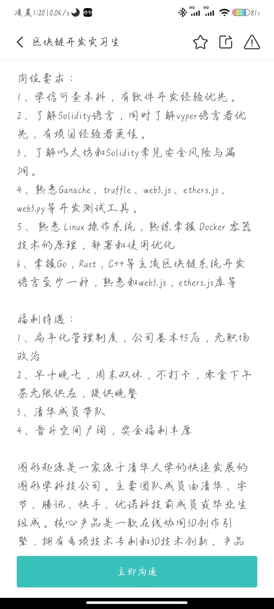
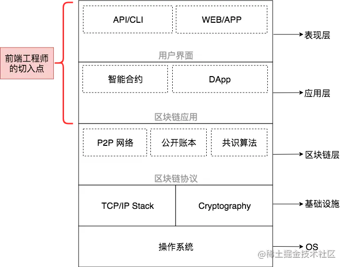

区块链前端开发
以太坊
智能合约      算法
EVM
虚拟机
web3js   golang   框架

掌握
 solidity     vyper
以太坊
Ganache  truffle  web3.js  ethers.js  web3.py
linux    Docker

MetaMask 助记词
1.parrot
2.alien
3.neck
4.need
5.employ
6.certain
7.host
8.mystery
9.powder
10.raccoon
11.stumble
12.sniff

中本聪
比特币白皮书

法定货币 价值受央行控制   稳定
BTC完全受市场影响      极不稳定

BTC  平台  交易所   黑客攻击    不安全

点对点  

silk road    犯罪交易

BTC 的所有权是匿名的       
但是BTC的交易记录不是匿名的，他将永远保存在区块链上

BTC的耗能

BTC的速度
每十分钟产生一个新的区块
目前每个区块容量是1M，如果记录每一项交易所占的容量是250B，理论上BTC网络每秒吃能处理约7笔交易

BTC  P2P

区块链  去中心的分布式数据库    计算机记账技术

=>解决了中心化系统数据易被篡改、交易不透明、易被攻击等问题

BTC运行规则

矿工的报酬：第一个区块的诞生奖励50个BTC，10min可以计算出一个新的区块，但是后续每算出一个区块奖励减半，BTC最小单位一聪，故BTC数量有限，为2100万枚。

+ 当前区块的手续费

多矿工共同计算呢：工作量证明，最先算出者得奖

ICO： 一种加密电子货币的筹资方式

以太坊： 区块链应用平台   

以太坊币：ETH    每秒13笔交易    2022/03/26

EVM： 以太坊虚拟机

